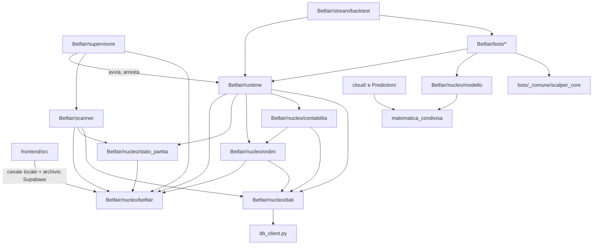
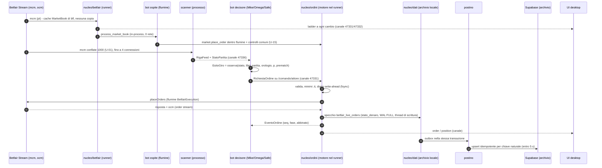
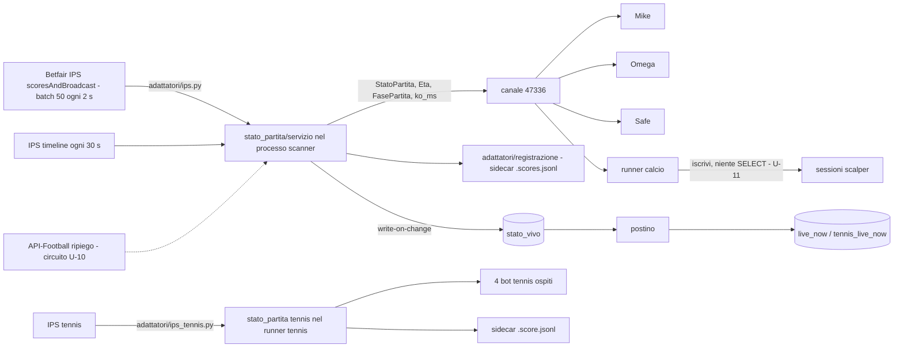
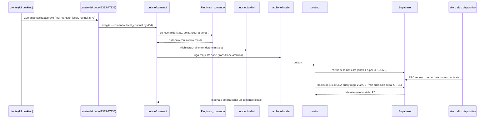
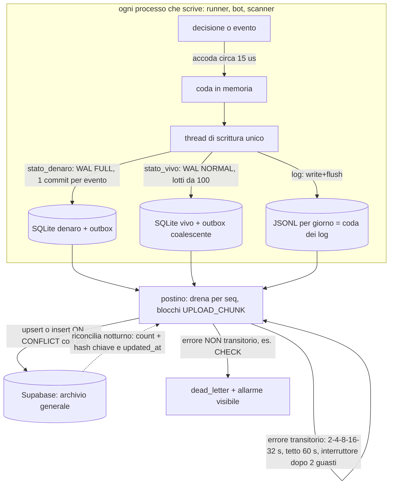
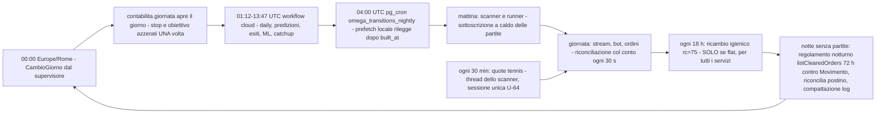

# 04 - ARCHITETTURA OBIETTIVO (08/10/2026)

Autore: delegato di SINTESI (Opus 5.5) del piano di architettura. Solo documento: nessun codice toccato, nessun commit.
Fonti (tutte gia' accettate dal coordinatore e verificate a campione contro il codice, `CRONOSTORIA.md` blocco 08/10):
`00_INVENTARIO.md` (00), `01_FUNZIONALITA.md` (01, 970 voci), `02_COMPETITOR.md` (02), `07_MISURE_OGGI.md` (07), le 15 schede in
`03_SCHEDE_COMPONENTI/` (citate con la lettera: A, B, C, D, E1, E2, E3, E4, E5, F, G, H, I, J, K, e la sezione: «C §4.2»),
`PIANO_OTTIMIZZAZIONE_GLOBALE_2026-10-02.md` (P0210), `AUDIT_2026-10-08/SPECIFICHE_CANTIERI_CLOUD_2026-10-08.md` (CANT, cantieri 11 e 15),
`PROCESSO_STANDARD_BOT.md` (PSB §6, §7). Ogni `file:riga` e' quello gia' citato nelle schede; dove l'ho riletto io lo dico
(sezione 12). Le regole valgono su tutto: la logica di trading e' INTOCCABILE (si sposta, non si cambia); paper e live non si
sommano; calcio e tennis non si mischiano; i bot li accende solo l'utente; il guscio sostituisce UN componente alla volta con
parita' dimostrata (brief §0, §8, §9).

Il documento risponde a §6 punto 5 del brief: componenti, contratti con i tipi, flussi, processi, dati, motivazioni ancorate alle
schede. Il «come ci si arriva» e' `05_PIANO_DI_MIGRAZIONE.md`.

---------------------------------------------------------------------------------------------------

## 0. In una pagina

1. **Undici componenti, una cartella ciascuno, un contratto tipato, un `COSA_FA.md`** (sezione 2). Il criterio di accettazione
   del brief §9.1 («per sostituire X tocco solo la cartella di X e i suoi test di contratto») oggi fallisce ovunque: per cambiare
   la strada di un ordine si toccano almeno 24 file Python (C §4.7), per sostituire Mike almeno 6 aree fuori dalla sua cartella
   (D §4.6, E1 §8), per sostituire Omega 12 aree, tre delle quali sono altri bot (E2 §4.5). Domani: una cartella (sezione 9).
2. **Il percorso Betfair -> decisione -> ordine non attraversa mai la rete verso il DB** (brief §9.3). Oggi lo attraversa per i
   tre bot a polling (Mike, Omega, Safe: feed letto dal DB, RPC empiriche sincrone nel ciclo, `insert_trade` con id restituito
   dal cloud: G §3.1, D §1.5, E2 difetto 8) e per la strada S2 degli ordini (coda DB p50 492 / p99 26.636 ms, 07 §3.2).
   Domani: stato vivo in memoria + archivio locale (SQLite WAL FULL per il denaro, NORMAL a lotti per lo stato vivo, JSONL con
   flush per i diari: G §4.1 sui numeri di 07 §6) e un **postino** asincrono, idempotente e con ripresa verso Supabase, che resta
   l'archivio generale (sezione 6).
3. **Due livelli di contratto per i bot, non una funzione** (D §4.1-4.2): `Plugin` (ciclo di vita, parametri, stato, diario,
   uscite) + `Decisore` (Mike, Omega, Safe: decisione pura sul giro) oppure `OspiteFlumine` (scalper e 4 bot tennis: le classi
   flumine di oggi, invariate). La firma `osserva(book, stato_partita, orologio)` del brief §4 NON regge (sette fatti, D §4.1).
4. **Una porta degli ordini** (C §4): oggi 7 strade e 9 riconciliazioni; domani `nucleo/ordini/` con un motore, un
   riconciliatore, una definizione dei minimi .it, un writer dello specchio; i bot flumine restano nel loro flumine con i
   controlli comuni (decisione U-15).
5. **Processi: da 18 Python permanenti + 1 job ogni 30 min a 8 + le sessioni scalper a richiesta** (I §4.1). Non 3-4 (ipotesi
   di D §7): i bot restano isolati per il guasto (sezione 5, contraddizione 2). Le connessioni stream si contano per stream, non
   per processo: 10/10 nel caso peggiore oggi (A §1.3) e non scendono fondendo lo scanner col runner (A §4.1 punto 2).
6. **UI generata dal contratto**: manifesti dei bot (parametri, fasi, testi dei `kind`) generati dal Python come oggi
   `replayBotCatalogo.ts` (J §4.1-4.2), uno stato per bot (`StatoBot`), la plancia a evento dal canale locale.
7. **Righe: l'80% in meno NON e' dimostrato.** Con le stime delle schede, senza doppi conteggi, il calo sicuro e' ~39.600 righe
   su 381.554 di codice vivo (**-10,4%**); con tutte le decisioni dell'utente accolte ~66.900 (**-17,5%**). Gli strati attorno ai
   bot scendono molto (runtime -59%, dati -63%, guscio di Mike -73%, punteggi -52%), la strategia resta identica per regola
   (sezione 10). Il guadagno vero e' strutturale: una copia invece di 3-6 per ogni concetto, 0 rete nel percorso critico,
   un punto da toccare per componente.

---------------------------------------------------------------------------------------------------

## 1. Le ipotesi di §4 del brief contro il codice (brief §9.6: «fidati solo del codice»)

| # | Ipotesi del brief §4 | Verdetto | Prova |
|---|---|---|---|
| 1 | «Una sola connessione stream per sport» | **SMENTITA** | 200 mercati per sottoscrizione (`sottoscrizione_a_caldo.py:40`), caso del 26/09 (`frammenti_mercato.py:1-9`): il calcio apre fino a 3 connessioni (`RUNNER_CALCIO_STREAM_CONNS`, `frammenti_mercato.py:88`), lo scanner fino a 4 (`safe_strategy/stream.py:81`). A §4.1 punto 2 |
| 2 | «Calcio e tennis con lo stesso codice, sport come parametro» | **VERA in parte** | le differenze sono dati (campi, depth, tetto, `config_stream.py:90` vs `tennis_runner.py:119`), ma il testo uguale fra i due runner e' 9,1%/7,6% (A D2, `a_gemelle_connessione_output.txt`): si unisce il CODICE in un `GestoreFlussi` con due profili, non le connessioni |
| 3 | «Scanner e runner sulla stessa cache» | **SMENTITA** | flumine fonde due strategie solo se coincidono filtro, campi, timeout e `conflate_ms` (`flumine/streams/streams.py:110-121`); lo scanner chiede conflate 1000, depth 1, EX_BEST_OFFERS (`safe_strategy/stream.py:66,271-276`), il runner conflate 0, depth 10, EX_ALL_OFFERS (`config_stream.py:87,90`). A §4.1 punto 3 |
| 4 | «Cache dei mercati senza copie» | **VERA per il runner** | oggi fino a 11 copie del book, 6 nostre (A §1.5, D4); in un processo basta `market.market_book` di flumine/bfl; restano 2 (cache bfl + payload del canale), A §7 |
| 5 | «Ladder servito ai consumatori locali senza rete» | **GIA' VERA** dal 23/09 | canale 47331 a 200 ms (`ladder_canale.py:103-105`); difetti residui: polling e `upsert_live_ladder` nello stesso thread (`runner.py:743-755`), A D5 |
| 6 | «Nessuna chiamata di rete fra il messaggio e la decisione» | **FALSA oggi per Mike/Omega/Safe** | feed letto dal DB o dal canale 47336 con fusione col DB (`scan_feed.py`, D-014), RPC empiriche nel ciclo (`omega_service.py:1432,1444,1556,1565`, G-035), `insert_trade` sincrono (`mike/db.py:175-181`). Vera per scalper e tennis (book nello stesso processo, D §1.1) |
| 7 | «Contratto `osserva(book, stato_partita, orologio) -> decisioni`» | **NON REGGE come scritto** | stato proprio e parametri vivi (`mike/engine.py:3089`), dossier all'armamento (`service.py:4159`), cache empiriche dentro la selezione (`omega_service.py:1397`), Safe valuta tutte le partite insieme (`safe_strategy/engine.py:2112`), scalper e tennis piazzano dentro il callback (`tennis_runner.py:893-925`), esiti d'ordine e comandi sono eventi. D §4.1 (sette fatti) |
| 8 | «Le 5 copie di servizio/engine/db/certificazione diventano una» | **PARZIALE** | il runtime si scrive una volta (S+M 11.582 -> ~4.760, D §4.4), ma le 5 famiglie di esecuzione sono diverse (polling vs tick, D §1.1); gli adattatori del banco sono «stesso ruolo, codice diverso» (somiglianza 0,04-0,18, H D1) |
| 9 | «Stato vivo in SQLite locale (WAL)» | **VERA con due regimi** | WAL FULL per il denaro (0 persi su 500 al crash, ACID allo spegnimento per documentazione), WAL NORMAL a lotti per lo stato ri-derivabile, JSONL con flush per i diari (07 §6, §6.1; G §4.1) |
| 10 | «Processi: pochi» | **8, non 3-4** | isolamento del guasto sui soldi: ~63 dict globali di cache in mike/safe-bot/omega condividerebbero un GIL (I §4.1); D §6 rischio (d) dice lo stesso per il tennis |
| 11 | «-80% di righe» | **NON DIMOSTRATO** | sezione 10: -10,4% sicuro, -17,5% con tutte le decisioni; la strategia (~31.200 righe) e le viste (~17.800) non scendono |
| 12 | «`money_management.py` = money management» | **SMENTITA** | e' il «Quant Fund» su Google Sheets, non usato dai bot e riscritto ogni lunedi' dal workflow (`weekly_poisson_calibration.yml:43,60`; F perimetro, K punto 7) |
| 13 | «55 tabelle», «read_book 17 copie», «271.857 righe backend» | **SMENTITE nei numeri** | 89 tabelle toccate (00 §0); `read_book` 2-3 definizioni in produzione (00 §0, coordinatore 15:35); backend 193.914 per `Betfair/`+radice (00 §1.7) |
| 14 | «UI: pannelli e parametri generati dal contratto» | **REALIZZABILE, gia' provata** | `replayBotCatalogo.ts` (11.099 righe) e' gia' generato dal registro (`applica_bot.py:365,375`), con test rosso se disallineato (J §3.2) |
| 15 | «Banco: un adattatore solo» | **VERA, ma righe -6%** | un ponte sul contratto D (H §4.2); il banco e' in gran parte condotta e scenari per bot (H §4.5: 42.836 -> ~40.127) |

---------------------------------------------------------------------------------------------------

## 2. I componenti e l'albero delle cartelle

### 2.1 Nomi armonizzati (le schede divergono: scelgo e motivo)

| Concetto | Nomi proposti dalle schede | Nome scelto | Perche' |
|---|---|---|---|
| Connessione Betfair, cache, ladder, canali (A) | `nucleo_betfair/` (A §4.1), `nucleo/mercato_betfair` (E2 §4.1) | **`Betfair/nucleo/betfair/`** | tutti i componenti condivisi stanno sotto `Betfair/nucleo/` (lo propongono B ed E2); `omega_market.py` (OMK, 1.794 righe, usato da 3 bot e dal banco) si spezza fra qui (sessione/REST/letture, 959 righe) e `ordini/` (834), E2 §4.4, decisione U-33 |
| Stato partita e punteggi (B) | `Betfair/nucleo/stato_partita/` (B §4.1) | **`Betfair/nucleo/stato_partita/`** | invariato |
| Porta ordini e riconciliazione (C) | `ordini/` (C §4.1), `porta_ordini/` (E3 §4.1), `nucleo/contabilita_ordine` (E2 §4.1, per la parte ordini) | **`Betfair/nucleo/ordini/`** | il contratto di C e' il piu' completo (tipi, esecutori, riconciliatore); E3 e E2 lo citano |
| Denaro: regolamento, giornata, stop, commissione, green (F) | `contabilita/` (F §4.1), `nucleo/contabilita_ordine` (E2 §4.1, per regolamento) | **`Betfair/nucleo/contabilita/`** | F lo chiede esplicitamente al coordinatore (F §4.1). La «contabilita' dell'ordine» di E2 (esposizione, fill, riconciliazione di `omega_engine.py:338-790`) va in `ordini/riconciliazione.py` (C); il regolamento (`omega_engine.py:791-852`, `omega_service.py:4971-5424`) va in `contabilita/` (F perimetro). Un solo nome per un solo concetto |
| Strato dati locale + cloud + postino (G) | `dati/` (G §4.2, §4.5) | **`Betfair/nucleo/dati/`** | invariato; `db_client.py` (radice, 410 righe) resta dov'e' come client unico condiviso col cloud (lo usano 12 file della catena backfill, G §1.1 punto 2) e `dati/cloud.py` lo avvolge |
| Matematica dei modelli (Poisson, devig, goal timing, Dixon-Coles) | `matematica_condivisa/` (K §4.1), `nucleo/modello_gol` (E2 §4.1), `modello/` (G §4.4) | **`matematica_condivisa/`** (radice) + **`Betfair/nucleo/modello/`** | le funzioni pure di `value_engine/` e `tactical_engine/dixon_coles.py` le importano sia i bot (`omega_model.py:261,720-721`, `live_engine_pro.py:26`) sia il cloud (`Prediction/`, `tactical_engine/serving.py`, K punto 4): stanno alla radice per non far importare `Betfair/` dal cloud. I modelli dei bot (`omega_model.py` + `omega_empirical.py` 1.431 righe, E2 §4.4; lettori dell'Atlante `hazard_atlas.py`, `atlante_v4.py`, E4 D3) vanno in `Betfair/nucleo/modello/` |
| Runtime dei bot (D) | `runtime/` (D §4.2), `bot_runtime/` (E3 §4.1) | **`Betfair/runtime/`** | D e' la scheda proprietaria; E3 lo cita come «(D)» |
| Bot | `bots/<nome>/` (E1, E2, E3, E4, E5) | **`Betfair/bots/<nome>/`** con `mike/`, `omega/`, `safe/`, `scalper_calcio/`, `tennis/` | concordano tutte |
| Libreria comune scalper calcio+tennis | `scalper_core/` (E4 §4.1) | **`Betfair/bots/_comune/scalper_core/`** | e' codice di strategia condiviso fra due bot (19 funzioni identiche, E4 §3.1): sta coi bot, non nel nucleo |
| Scanner del feed | `scanner/` (E3 §4.1) | **`Betfair/scanner/`** | e' un produttore di fatti per 4 consumatori, non un bot (`registro_bot.py:410-413` lo dichiara NON_BOT) |
| Banco (H) | resta `Betfair/stream/backtest/` con `nucleo/` interno (H §4.1) | **`Betfair/stream/backtest/`** (percorso INVARIATO) | il punto d'ingresso unico `python -m Betfair.stream.backtest.certifica` e' una regola dell'utente (`CLAUDE.md`, brief standard); cambiarne il percorso cambierebbe un comando. Dentro: `nucleo/{mercato,motore,scanner,porta_flumine}.py`, `adattatore.py`, `ombra.py`, `cassetta.py`, `congela.py` |
| Supervisione e h24 (I) | `supervisore/` (I §4.6) | **`Betfair/supervisore/`** | e' Python (sostituisce `watchdog.py` e la parte di `main.js:229-575`); `desktop/` resta solo finestra, server statico, SSO |
| Frontend | `frontend/src/nucleo/` (J §4.2), `frontend/src/bots/<nome>/` (E1 §4.1, J §4.5), `frontend/src/contabilita/` (F §4.1) | **le tre, come proposte** | concordano; i manifesti generati in `frontend/src/nucleo/manifesti/` |
| Cloud (raccoglitori, motori ML) | `cloud/` con `cloud/motori/` (K §4.1) | **`cloud/`** (spostamento ULTIMO, solo con decisione U-79) | K stesso lo dichiara fuori dalla sua scheda; i workflow puntano a percorsi di radice (`.github/workflows/*.yml`): spostarli e' rischio senza guadagno sui bot |
| Codice archiviato | `archivio/` con `INDICE.md` (K §4) | **`archivio/`** | `git mv` conserva la storia (K §6 punto 5) |

Tre collisioni di nomi di TIPO risolte (le schede usano lo stesso nome per cose diverse):
- `Fase`: D §4.2 (ciclo di vita del bot: ARMATO, PRE_PARTITA, ..., REGOLATO), B §4.2 (fase della partita: pre, 1t, intervallo...),
  C §4.2 (fase dell'ordine: accettato, parziale...). Domani: **`FaseBot`**, **`FasePartita`**, **`FaseOrdine`**.
- `Esito`: D §4.2 (stato nuovo + intenti del bot) e B §4.2 (`flusso_prezzi.Esito`, condizione 11 dei prezzi vivi). Domani:
  **`EsitoGiro`** (D) e **`EsitoFlusso`** (B, la classe di oggi `flusso_prezzi.py:218` rinominata solo nel contratto, alias).
- `Banco`: J §4.2 chiama `Banco` lo stato della Control Room («IL BANCO DELL...», `ControlRoom.tsx:173`), H e' il banco di
  certificazione. Domani: **`Plancia`** (UI) e «banco» resta solo per H.
- `Quadro` (D §4.2) e `StatoPartita` (B §4.2) sono lo stesso concetto (B lo dichiara «allineato a Quadro di D che lo
  contiene»): domani c'e' SOLO **`StatoPartita`** (piu' ricco: eta' in tre parti, fonte, set tennis); `Libro` (D) e' il
  `MarketBook` di betfairlightweight (A §4.1: «nessuna copia nostra del book»), con un `Protocol` di sola lettura per il banco.

### 2.2 L'albero (domani)

```
matematica_condivisa/            goal_timing, devig, poisson_total, dixon_coles (K §4.1; firme invariate)
Betfair/
  nucleo/
    betfair/        (A)  COSA_FA.md, contratto.py, sessione.py, rest.py, flusso.py, profili.py, salute.py,
                         registro_raw.py, ladder.py, canale.py (= local_channel.py), lettori_canale.py, tests_contratto/
    stato_partita/  (B)  COSA_FA.md, contratto.py, servizio.py, freschezza.py (solo le ETA', vedi contraddizione 4),
                         adattatori/{ips.py, ips_tennis.py, api_football.py, registrazione.py, canale.py}, test_contratto.py
    ordini/         (C)  COSA_FA.md, contratto.py, porta.py, motore.py, controlli.py, minimi.py, esecutori/{betfair,paper,banco}.py,
                         riconciliazione.py, specchio.py, heartbeat.py (spento, U-17), adattatori_sport/{calcio,tennis}.py, tests/
    contabilita/    (F)  COSA_FA.md, contratto.py, conto.py, regolamento.py, attribuzione.py, commissione.py, giornata.py,
                         green.py, politiche/{mike,omega,safe}.py, tests/
    dati/           (G)  COSA_FA.md, contratto.py, archivio.py, postino.py, registro.py, riconcilia.py, cache_cloud.py, cloud.py, tests/
    modello/             omega_model + omega_empirical (E2 §4.4), lettori dell'Atlante (E4 D3), live_engine* (G-039)
  runtime/          (D)  COSA_FA.md, contratto.py, cicli.py, controllo.py, comandi.py, persistenza.py, diario.py, battito.py,
                         arresto.py, avvio.py, lock.py, registro.py (= registro_bot esteso), ospite_flumine.py, test_plugin_contratto.py
  scanner/          (E3) COSA_FA.md, contratto.py (RigaFeed), servizio.py, selezione.py, payload.py, pubblica.py, tests/
  bots/
    _comune/scalper_core/  (E4 §4.1) prezzi.py, flusso.py, slot.py, motore_maker.py
    mike/           (E1) COSA_FA.md, strategia/{engine,feed,dossier,regole_di_conto}.py, parametri.py, plugin.py, banco/, tests/
    omega/          (E2) COSA_FA.md, strategia/{v3,uscita,selezione,catena_lambda,ingresso_v3,sizing}.py, legacy_v2_v1/ (U-29),
                         missioni/, parametri.py, plugin.py, banco/, tests/
    safe/           (E3) COSA_FA.md, strategia/{engine,exits,risk,veto,selezione,pressure}.py, opportunita/, parametri.py, plugin.py, banco/, tests/
    scalper_calcio/ (E4) COSA_FA.md, catalogo_parametri.py, maker.py, sniper.py, theta.py, media_under.py, plugin.py, banco.py, tests/
    tennis/         (E5) COSA_FA.md, catalogo_parametri.json, pro/, flb/, swing/, scalper/, guscio/, punteggio/, replay/, banco/, tests/
  supervisore/      (I)  COSA_FA.md, contratto.py, registro.py, ambiente.py, arresto.py, log.py, salute.py, tests_contratto/
  monitor/          (P0210 fase 0) contatori in memoria, riga ogni 30 s in `monitor_metrics` (via postino)
  stream/backtest/  (H)  percorso INVARIATO; dentro: nucleo/, adattatore.py, ombra.py, cassetta.py, congela.py, COSA_FA.md
desktop/            (I)  main.js (~330 righe: finestra, server statico 47330, SSO, popout, avvio del supervisore), preload.js, bootstrap.js
frontend/src/
  nucleo/           (J)  contratto.ts (GENERATO), manifesti/<bot>.ts (GENERATI), useBot.ts, statoBot.ts, usePlancia.ts, canale.ts
  bots/<nome>/           solo le viste specifiche (MikeMatchCard, MissionPanel, radar Safe, ScalperPanel, TennisBotPanel)
  contabilita/      (F)  selettori su `Giornata` (nessuna somma lato client)
cloud/              (K)  workflow -> script -> tabelle (spostamento ultimo, U-79); Telegram bot/ resta com'e'
archivio/           (K)  INDICE.md + i lotti L1..L6
```

### 2.3 Regola delle dipendenze (chi puo' importare chi)



Regole (test di contratto «import vietati», blocco 7 della fase 1 di P0210): (1) nessun file fuori da `nucleo/betfair/` importa
`betfairlightweight` per sessione/REST (le classi flumine dei bot ospiti restano: le usano per piazzare, D §4.1 fatto 5);
(2) nessun file fuori da `nucleo/dati/` e `db_client.py` importa `supabase`; (3) nessun bot importa un altro bot (oggi Mike importa
Omega `mike/service.py:146-149`, Safe importa Omega `bot_service.py:302`, Mike importa lo scalper `mike/engine.py:33`: D difetto 4,
E1 D10, E2 difetto 1); (4) la strategia non importa ne' `runtime/` ne' `dati/` (resta pura: E2 §4.2 «prerequisiti di purezza»);
(5) solo `stream/backtest/nucleo/porta_flumine.py` importa le API private di flumine (70 righe di import in 14 file oggi, H §4.6).

### 2.4 Lo schema del `COSA_FA.md` (uguale per ogni cartella, brief §9.1)

1. Scopo in tre righe. 2. Entrate (tipi del contratto, eventi consumati). 3. Uscite (tipi, eventi esposti). 4. Dipendenze ammesse
(sezione 2.3). 5. Funzionalita' coperte: intervalli di `01_FUNZIONALITA.md` (es. `A-001..A-006`) con il test che ne prova ognuna.
6. Interruttore (`ARCH_<COMPONENTE>=vecchio|ombra|nuovo`, sezione 8). 7. Come si sostituisce (i file del contratto e i test da
far passare). 8. Come si prova da solo (comando del test di contratto, finti con chiavi e tipi del vero, PSB §7 n.27).
9. Misure (latenza, richieste al cloud/min, memoria) con lo strumento. 10. Voci di PSB §6/§7 che il componente deve provare.

---------------------------------------------------------------------------------------------------

## 3. I contratti con i tipi

Sono la sintesi armonizzata dei contratti delle schede; il dettaglio di ogni campo e' nella scheda citata. Tutti i tipi sono
`dataclass(frozen=True)` o `Protocol`; i nomi dei campi che finiscono nel DB restano IDENTICI alle colonne di oggi (F §4.1:
«chiavi identiche a quelle DB gia' scritte»; G §4.3). Nessun campo nuovo di strategia (C §4.2).

### 3.1 Tipi comuni (`Betfair/runtime/contratto.py`, re-esportati dal nucleo)

```python
Sport = Literal["calcio", "tennis"]
Modo = Literal["paper", "live"]                       # MAI sommati: chiave di ogni aggregato (PSB §7 n.21)
UsciteModo = Literal["MANUALE", "AUTOMATICO"]          # di serie e dopo ogni riavvio MANUALE (cond. 4-bis; D §4.2)

@dataclass(frozen=True)
class Orologio:                                        # un solo orologio (D §4.2): nel banco e' il tempo di mercato (CANT 7 RB-3)
    mono_ms: int                                       # monotono locale
    publish_ms: int | None                             # pt Betfair del book che ha svegliato il giro
    rx_ms: int | None                                  # ricezione locale (oggi non registrata: 07 §1.3, §2.4 punto 1)
```

### 3.2 A - Connessione Betfair (`Betfair/nucleo/betfair/contratto.py`, A §4.1)

```python
from betfairlightweight.resources import MarketBook    # il book E' quello della libreria: nessuna copia nostra

@dataclass(frozen=True)
class ProfiloFlusso:                                   # UN profilo = una politica di sottoscrizione
    nome: Literal["runner_calcio", "runner_tennis", "scansione", "scalper_partita"]
    campi: tuple[str, ...]                             # EX_ALL_OFFERS... (calcio) / EX_BEST_OFFERS (tennis, scanner)
    ladder_levels: int                                 # 10 | 1
    conflate_ms: int | None                            # None (runner) | 1000 (scanner, decisione U-01)
    heartbeat_ms: int | None                           # None oggi sul runner (decide Betfair) | 5000 scanner (U-02)
    mercati_per_connessione: int                       # 180, mai > 200
    connessioni_max: int                               # 3 calcio | 1 tennis | 4 scanner
    riserva_connessioni: int                           # 1 (frammenti_mercato.py:90)
    registra_raw: bool

class FlussoMercato(Protocol):
    def imposta_mercati(self, mercati: Iterable[str]) -> set[str]: ...          # restituisce i «persi» (oggi manutenzione())
    def aggiungi_consumatore(self, cb: Callable[[MarketBook], None], *, mercati: set[str] | None = None) -> None: ...
    def book(self, market_id: str) -> MarketBook | None: ...
    def stato(self) -> Mapping[str, object]: ...                                # battito, connessioni, connectionsAvailable
    def stato_flusso(self, market_id: str) -> Literal["vivo", "muto", "assente"]: ...

class Sessione(Protocol):                              # UNA per processo: il custode di oggi (auth.py:156-286)
    def client(self) -> "betfairlightweight.APIClient": ...
    def rinnova_se_serve(self) -> None: ...            # keepAlive < 20 min .it (02 §3.3), backoff, relogin
class Ladder(Protocol):
    def push_a_ogni_cambio(self, market_id: str) -> None: ...                   # guidato dall'evento (A P3), non 200 ms di polling
    def snapshot(self, market_id: str) -> dict: ...                             # STESSO schema JSON `ladder` di oggi
# eventi esposti: book_aggiornato(MarketBook), flusso_muto(id), sessione_rifatta(), capacita_cambiata(n), mercato_chiuso(id)
# eventi consumati: imposta_mercati (auto-follow/follow), ordini_vivi() -> set[str] (da C, protegge i mercati con soldi)
```

### 3.3 B - Stato della partita (`Betfair/nucleo/stato_partita/contratto.py`, B §4.2)

```python
FasePartita = Literal["pre", "1t", "intervallo", "2t", "supplementari", "finita", "sconosciuta"]

@dataclass(frozen=True)
class Eta:                                             # le tre eta' che oggi si confondono (B §3.2)
    riga_s: float | None; punteggio_s: float | None; scanner_s: float | None    # punteggio_s = riga + ritardo IPS (scan_feed.py:506)

@dataclass(frozen=True)
class TennisSet:
    sets: tuple[int, int]; games: tuple[int, int]; punto: tuple[str, str]
    servizio: Literal["home", "away"] | None; pressione: bool                   # pressures() resta strategia (tennis_score.py:75-111)

@dataclass(frozen=True)
class StatoPartita:                                    # sostituisce Quadro (D) e ScoreSnapshot/TennisScore come TIPO d'ingresso
    event_id: str; sport: Sport; in_gioco: bool; fase: FasePartita
    minuto: int | None; tempo: int | None              # calcolati UNA volta (oggi 9 punti, B §3.3)
    gol: tuple[int, int] | None; rossi: tuple[int, int] | None
    corner: tuple[int, int] | None; gialli: tuple[int, int] | None
    set_game: TennisSet | None
    ko_ms: int | None                                  # _ko_epoch_ms unico (oggi 4 copie, 91 righe, B §3.3)
    fonte: Literal["ips_scanner", "ips_diretto", "api_football", "registrazione"]   # la verita' (oggi source mente, B §3.7)
    eta: Eta
    prezzi_vivi: "EsitoFlusso"                         # cond. 11, NON separabile dallo stato (flusso_prezzi.valuta)
    grezzo: Mapping[str, Any]                          # score_raw invariato (audit)

class StatoPartitaService(Protocol):
    def stato(self, event_id: str) -> StatoPartita | None: ...
    def segui(self, event_ids: Iterable[str]) -> None: ...
    def iscrivi(self, cb: Callable[[StatoPartita], None]) -> Callable[[], None]: ...   # sveglia, niente SELECT
class FonteStato(Protocol):                            # adattatore sostituibile (oggi ScoreProvider, base.py:46)
    nome: str
    def leggi(self, event_ids: Sequence[str]) -> Mapping[str, Mapping[str, Any]]: ...
# eventi esposti: StatoCambiato(prima, dopo), GolSegnato, FaseCambiata, FlussoInterrotto/Ripreso
```

### 3.4 C - Porta degli ordini (`Betfair/nucleo/ordini/contratto.py`, C §4.2)

```python
Azione = Literal["place", "cancel", "replace"]        # greenup/dutch/cashout = compositori sopra la porta
Persistenza = Literal["LAPSE", "PERSIST", "MARKET_ON_CLOSE"]
FaseOrdine = Literal["accettato", "parcheggiato", "ridotto", "parziale", "abbinato",
                     "scaduto", "annullato", "rifiutato", "ignoto"]

@dataclass(frozen=True)
class RichiestaOrdine:                                 # i campi di valida_comando (motore_ordini.py:391-475) + 2 estensioni
    ref: str                                           # deterministico dalla riga del bot, <= 32 caratteri (dedup 60 s, 02 §3.4)
    attore: str                                        # "safe" | "omega" | "mike" | "desktop" | "risk" | "scalper" | ...
    sport: Sport; modo: Modo                           # il modo della RIGA, mai del servizio (PSB §7 n.25)
    azione: Azione; market_id: str; selection_id: int; handicap: float = 0.0
    lato: Literal["back", "lay"] | None = None; prezzo: float | None = None; importo: float | None = None
    persistenza: Persistenza = "LAPSE"; time_in_force: Literal["FILL_OR_KILL"] | None = None
    riduce_esposizione: bool = False                   # verificata dal motore, mai creduta
    bet_id: str | None = None; riduzione: float | None = None; nuovo_prezzo: float | None = None
    creato_ms: int = 0; origine: Mapping[str, Any] | None = None

@dataclass(frozen=True)
class Ack: ref: str; accettato: bool; seq: int | None; motivo: str | None
@dataclass(frozen=True)
class EventoOrdine:
    ref: str; seq: int; fase: FaseOrdine; bet_id: str | None
    abbinato: float; residuo: float; prezzo_medio: float | None
    codice_errore: str | None; esito_ms: int | None
    punta_050: Mapping | None; portata_al_minimo: Mapping | None; tradotto: Mapping | None

class PortaOrdini(Protocol):
    def invia(self, r: RichiestaOrdine) -> Ack: ...
    def eventi(self, attore: str, da_seq: int = 0) -> Iterator[EventoOrdine]: ...
    def stato(self, ref: str) -> "StatoOrdine | None": ...                      # dal diario/blotter, idempotente
    def posizione(self, market_id: str, selection_id: int | None = None) -> "PosizioneConto": ...
class Esecutore(Protocol):                             # EsecutoreBetfair (flumine live), EsecutorePaper (SimulatedExecution), EsecutoreBanco
    def place(self, r: RichiestaOrdine) -> EventoOrdine: ...
    def cancel(self, r: RichiestaOrdine) -> EventoOrdine: ...
    def replace(self, r: RichiestaOrdine) -> EventoOrdine: ...
```

Resta nostro (flumine non lo ha, C §4.5; 02 §4.2 «non conosce le regole italiane»): place-and-trim sotto il minimo .it, equivalente
sull'altra selezione, diario write-ahead con fsync, canale con `seq/da_seq`, specchio nel DB, «il conto vince», Heartbeat API.

### 3.5 D - Runtime e plugin (`Betfair/runtime/contratto.py`, D §4.2)

```python
class FaseBot(str, Enum):
    ARMATO = "armato"; PRE_PARTITA = "pre_partita"; IN_GIOCO = "in_gioco"; INTERVALLO = "intervallo"
    SOSPESO = "sospeso"; FINE_GIOCO = "fine_gioco"; MERCATO_CHIUSO = "mercato_chiuso"; REGOLATO = "regolato"
    DATO_MANCANTE = "dato_mancante"

@dataclass(frozen=True)
class Parametri:                                       # uno schema SOLO, dal catalogo del bot (= parametri_modificabili del registro)
    modo: Modo; uscite: UsciteModo; valori: Mapping[str, Any]
@dataclass(frozen=True)
class Intento:                                         # cio' che il bot vuole; il runtime lo esegue dalla porta unica (C)
    tipo: Literal["piazza", "annulla", "chiudi", "proponi_uscita", "diario", "allarme"]
    dati: Mapping[str, Any]; ref: str | None = None
@dataclass(frozen=True)
class EsitoGiro:
    stato: Any; intenti: Sequence[Intento] = ()
@dataclass(frozen=True)
class Cadenza:
    modo: Literal["tick", "giro"]; periodo_s: float; riposo_s: float; sveglia_su_prezzo: bool; minimo_s: float

class Prematch(Protocol):                              # dati del cloud in sola lettura, cache locale con TTL (G §4.4)
    def dossier(self, event_id: str) -> Mapping[str, Any] | None: ...
    def tabella_empirica(self, chiave: str) -> Any | None: ...

class Plugin(Protocol):                                # livello 1, identico per tutti i bot
    nome: str; sport: Sport
    def catalogo_parametri(self) -> Sequence["CampoParametro"]: ...            # genera UI, registro, catalogo del banco (3.10)
    def uscite_di_serie(self) -> UsciteModo: ...                                # MANUALE
    def chiave_uscite(self) -> str: ...                                          # mappa verso la chiave nativa (5 forme oggi, D §1.7)
    def arma(self, event_id: str, prematch: Prematch, stato: Any | None) -> Any: ...   # nuovo o RICOSTRUITO dal salvato
    def su_fase(self, stato: Any, fase: FaseBot, orologio: Orologio) -> EsitoGiro: ...
    def su_comando(self, stato: Any, comando: Mapping[str, Any], p: Parametri) -> EsitoGiro: ...
    def su_esito_ordine(self, stato: Any, ordine: EventoOrdine, orologio: Orologio) -> EsitoGiro: ...
    def cadenza(self) -> Cadenza: ...

class Decisore(Plugin, Protocol):                      # livello 2a: Mike, Omega, Safe
    def osserva(self, stato: Any, libri: Mapping[str, MarketBook], partita: StatoPartita,
                orologio: Orologio, p: Parametri, prematch: Prematch) -> EsitoGiro: ...
    def fine_giro(self, stati: Mapping[str, Any], p: Parametri, orologio: Orologio) -> Mapping[str, EsitoGiro]: ...  # Safe, stop, tetti

class OspiteFlumine(Plugin, Protocol):                 # livello 2b: scalper (maker, sniper, theta, media under) e 4 bot tennis
    def strategie(self, event_id: str, p: Parametri) -> Sequence[Any]: ...      # le classi flumine ESISTENTI, invariate
    def applica_parametri_vivi(self, strategie: Sequence[Any], p: Parametri) -> None: ...
```

Per Mike e Omega e Safe i `libri` sono, finche' l'utente non decide altro, le righe dello scanner proiettate a `MarketBook`
(conflate 1000: U-01) arrivate dal canale 47336, non lo stream del runner (E1 §4.2: «il feed del riquadro resta l'ingresso dati»).
Il runtime unico ha i moduli `cicli`, `controllo` (UNA politica per «controllo illeggibile», U-19), `comandi`, `persistenza`,
`diario`, `battito` (stesse chiavi di `stats` per tutti), `arresto`, `avvio` (guardia `APP_BOOT_ID`, uscite MANUALI), `lock`,
`registro` (D §4.2).

### 3.6 F - Contabilita' (`Betfair/nucleo/contabilita/contratto.py`, F §4.1)

```python
Fonte = Literal["mike", "omega", "safe_calcio", "scalper", "tennis", "manuale_sito", "manuale_app"]
@dataclass(frozen=True)
class Movimento:                                       # un ordine REGOLATO (o simulato): l'unita' contabile
    bet_id: str; market_id: str; event_id: str | None; sport: Literal["calcio", "tennis", "altro"]; modalita: Modo
    fonte: Fonte; posizione_di: Fonte                  # regola del 04/10 (per_posizione)
    lordo: Decimal; commissione: Decimal | None        # None = commissione non letta -> niente netto finto (PSB §7 n.21)
    netto: Decimal | None; regolato_at: datetime; partita_at: datetime | None; ciclo_bot: int | None   # cantiere 10
@dataclass(frozen=True)
class Regolamento:
    market_id: str; lordo: Decimal; commissione: Decimal | None; ordini: int; fonte: Literal["cleared", "simulato"]
@dataclass(frozen=True)
class Giornata:                                        # LA giornata, in un posto solo (oggi 4 definizioni, F D3; 11 file con Europe/Rome, I)
    giorno: date; modalita: Modo
    per_fonte: Mapping[Fonte, "Quota"]; per_posizione: Mapping[Fonte, "Quota"]; per_sport: Mapping[str, "Quota"]
    lordo: Decimal; commissione: Decimal; netto: Decimal; stop: "StopStato"; obiettivo: "Obiettivo | None"; letto_at: datetime
class Contabilita(Protocol):
    def registra_regolati(self, gruppi: Sequence[Regolamento], ordini: Sequence["OrdineRegolato"]) -> Sequence[Movimento]: ...
    def giornata(self, giorno: date, modalita: Modo) -> Giornata: ...
    def stop(self, giorno: date) -> "StopStato": ...                    # base lorda come OGGI finche' l'utente non decide (U-48)
    def commissione(self, ordini, gruppi) -> Mapping[str, Decimal | None]: ...   # = commissioni_per_ordine, UNICA
    def green(self, w: Decimal, l: Decimal, prezzo: Decimal, **kw) -> "PianoGreen": ...  # = compute_greenup (greenup.py:118), UNICA
# esposti: MovimentoRegolato, GiornataAggiornata, StopScattato, ContoLetto; consumati: OrdineAbbinato/Regolato (C), CambioGiorno (I)
```

### 3.7 G - Dati, archivio locale, postino (`Betfair/nucleo/dati/contratto.py`, G §4.2, §4.5)

```python
class Archivio(Protocol):                              # memoria + SQLite/JSONL, MAI la rete
    def leggi(self, tabella: str, chiave: Mapping[str, Any]) -> Mapping[str, Any] | None: ...
    def scrivi(self, tabella: str, riga: Mapping[str, Any]) -> None: ...        # accoda al thread di scrittura + outbox, stessa transazione
    def transizione(self, tabella: str, chiave: Mapping[str, Any], da: str, a: str) -> bool: ...   # claim atomico
class Cloud(Protocol):                                 # UN client, UN timeout per profilo, UNA politica di ritento (db_client.py)
    def leggi(self, tabella: str, filtri: Mapping[str, Any], *, cache_s: float = 0.0) -> list[Mapping]: ...
    def rpc(self, nome: str, args: Mapping[str, Any], *, cache_s: float = 0.0) -> Any: ...
class Postino(Protocol):
    def accoda(self, tabella: str, op: Literal["upsert", "insert", "patch", "delete"], chiave: str | None,
               riga: Mapping[str, Any], *, coalesce: bool = False) -> int: ...  # seq locale, stessa transazione dello stato
    def stato(self) -> "StatoPostino": ...             # in_coda, eta_max_s, per_tabella, ultimo_errore, offline_da
    def drena(self, max_righe: int = 200) -> "EsitoDrenaggio": ...
    def riconcilia(self, tabella: str, da_ts: datetime) -> "RapportoRiconciliazione": ...
@dataclass(frozen=True)
class SpecTabella:                                     # UNA riga del registro per tabella: un bot nuovo non scrive un nuovo *_db.py
    nome: str; chiave_naturale: tuple[str, ...]; natura: Literal["SV", "CMD", "ARC", "STA", "CFG"]
    regime: Literal["stato_denaro", "stato_vivo", "log", "cache", "cloud"]; ritardo_max_s: float; coalesce: bool
# esposti: dati.postino_offline(da), dati.dead_letter(tabella, riga, errore), dati.riconciliazione(rapporto)
```

### 3.8 H - Banco: scenario e cassetta d'ombra (`Betfair/stream/backtest/`, H §4.2-4.4)

```python
Guasto = Literal["esiti_ignoti", "rifiuto_betfair", "feed_stantio", "riavvio", "chiusura_parziale",
                 "prezzo_migliore", "mercato_annullato", "sospensione_lunga", "timeout_dopo_accettazione"]
@dataclass(frozen=True)
class Scenario:                                        # sostituisce SCENARI_DESCRITTI + TRASPORTO_OBBLIGATO + SCENARI_APPLICABILI/SCARTATI
    nome: str; descrizione: str; parametri: Mapping[str, Any] = field(default_factory=dict)   # solo chiavi del catalogo del Plugin
    guasti: Sequence[Guasto] = (); trasporto: Literal["coda", "canale"] | None = None
    in_ui: bool = True; motivo_non_in_ui: str = ""
class BancoDelBot(Protocol):
    plugin: Plugin
    def scenari(self) -> Sequence[Scenario]: ...
    def controlli(self) -> "ModuloControlli": ...      # i controlli di condotta di oggi (11.691 righe), invariati
    def sport(self) -> Sport: ...
    def spec(self) -> str: ...
@dataclass(frozen=True)
class VoceCassetta:                                    # JSON Lines canonico, chiavi ordinate, nessuna conversione dei float
    kind: Literal["decisione", "ordine", "fill", "conto", "riga_db", "referto"]
    ms: int; chiave: str; dati: Mapping[str, Any]
@dataclass(frozen=True)
class Divergenza:
    livello: str; ms: int; chiave: str; vecchio: Any; nuovo: Any; regola: str   # fa uscire `certifica` con codice != 0
# tolleranze: ZERO, salvo le 3 normalizzazioni dichiarate in TOLLERANZE.md (tempi; hash del codice; id d'orologio) - U-59
```

### 3.9 I - Supervisore (`Betfair/supervisore/contratto.py`, I §4.2)

```python
@dataclass(frozen=True)
class Servizio:
    nome: str; modulo: str; argv: tuple[str, ...] = (); lock_porta: int | None = None
    arresto_s: float = 25.0; a_richiesta: bool = False; battito_tabella: str | None = None
class Supervisore(Protocol):
    def avvia(self, servizi: list[Servizio]) -> None: ...
    def stato(self) -> Mapping[str, "StatoServizio"]: ...    # pid, uptime, riavvii/h, ultimo rc, esito
    def arresto_ordinato(self, nome: str | None) -> Mapping[str, "EsitoArresto"]: ...
    def riavvia(self, nome: str, *, solo_se_flat: bool = True) -> bool: ...
# eventi: servizio_caduto(nome, rc, uptime), servizio_riavviato(nome, n), tetto_esaurito(nome)
# classify_exit e next_backoff (watchdog.py:73-102) restano IDENTICHE; tetto 5 riavvii/ora resta (watchdog.py:105)
```

### 3.10 UI - schema dei parametri e stato (`frontend/src/nucleo/contratto.ts`, GENERATO dal Python; J §4.2)

Il pannello dei parametri NON si scrive a mano: si genera dal `Plugin.catalogo_parametri()` come oggi `replayBotCatalogo.ts`
(`applica_bot.py:365,375`), e `ParamsSheetBase` (`trading/ParamsSheetBase.tsx:84`, gia' guidato da uno schema) lo disegna.

```ts
export type CampoParametro = {                         // UNA riga per parametro: Python e' la sola fonte (oggi 3-5 copie, J §3.2)
  chiave: string; tipo: 'number' | 'boolean' | 'select' | 'text' | 'choice' | 'uscite';
  etichetta: string; gruppo: string; hint?: string; serie: unknown; min?: number; max?: number; passo?: number;
  opzioni?: { valore: string; etichetta: string }[]; in_ui: boolean;          // tennis: oggi 29 visibili su 147 (E5 D4)
  strategia?: string;                                                           // scalper: maker | sniper | theta | media
};
export interface ManifestoBot { id: string; sport: 'calcio' | 'tennis'; etichetta: string; parametri: CampoParametro[];
  fasi: string[]; kind_diario: Record<string, string>; uscite_di_serie: 'MANUALE' | 'AUTOMATICO' }
export interface StatoBot { id: string; servizio: { vivo: boolean; battito_ms: number | null; errore: string | null };
  controllo: { acceso: boolean; modo: 'paper' | 'live'; uscite: 'MANUALE' | 'AUTOMATICO'; parametri: Record<string, unknown> };
  giornata: GiornataBot; partite: PartitaBot[]; diario: VoceDiario[]; richieste: RichiestaBot[]; proposte: PropostaUscita[] }
export interface Plancia { aggiornato_ms: number; bots: StatoBot[]; conto: ContoBetfair; giornata: Giornata;
  freno: Freno; runner: Record<'calcio' | 'tennis', StatoRunner>; scanner: StatoScanner }
export type Comando = { t: 'bot.accendi'; bot: string; modo: 'paper' | 'live'; parametri?: Record<string, unknown> }
  | { t: 'bot.ferma'; bot: string } | { t: 'bot.parametri'; bot: string; parametri: Record<string, unknown> }
  | { t: 'bot.uscite'; bot: string; uscite: 'MANUALE' | 'AUTOMATICO' } | { t: 'uscita.approva' | 'uscita.ignora'; bot: string; id: string }
  | { t: 'ordine'; richiesta: RichiestaOrdine } | { t: 'cashout'; ambito: 'partita' | 'evento'; id: string };
export interface Nucleo { plancia(): Plancia;
  sottoscrivi(topic: 'plancia' | `bot:${string}` | `ladder:${string}`, cb: (e: unknown) => void): () => void;
  comando(c: Comando): Promise<unknown>;               // MAI ritentato (money-critical), come localChannel.ts:73
  archivio: ArchivioApi }                              // Supabase: storico, journal, report, analytics, replay (useQuery)
```

### 3.11 Gli eventi fra componenti (chi pubblica, chi ascolta, su che via)

| Evento | Produttore | Consumatori | Via (oggi esistente) |
|---|---|---|---|
| `book_aggiornato` | A (runner calcio/tennis, sessione scalper) | bot ospiti, ladder, contabilita' (MTM) | in-process (callback flumine) |
| `ladder` | A | UI | canale 47331/47332 (`local_channel.py`) |
| `scan_calcio`/`scan_tennis` (`RigaFeed`) | scanner | Mike, Omega, Safe, runner calcio, UI | canale 47336 (`canale_scan.py:312`) |
| `StatoCambiato` | B (nel processo scanner per il calcio, nel runner tennis per il tennis) | bot, UI, registrazione | canale 47336 / in-process |
| `RichiestaOrdine` / `Ack` | bot, desktop, risk | C | in-process o `/comando/<attore>` su 47331/47332 |
| `EventoOrdine` (`esito`) | C | bot (`su_esito_ordine`), F, UI | canale (oggi `esiti_ordini_canale.py`, spento di serie) |
| `MovimentoRegolato`, `GiornataAggiornata` | F | bot (stop, obiettivo), UI | canale 47331 topic `conto` (`esiti_ordini_canale.py` `TOPIC_CONTO`) |
| `Comando` (UI -> bot) | UI | runtime/comandi | canale del bot (47333-47338) con `sveglia` (`local_channel.py:404`) |
| `CambioGiorno` | supervisore (I) | F, runtime, bot | canale del supervisore (nuovo topic sul canale esistente) |
| `postino_offline`, `dead_letter` | G | I (salute), UI | `monitor_metrics` + allarme |

---------------------------------------------------------------------------------------------------

## 4. I flussi (mermaid)

### 4.1 Stream -> cache -> bot -> ordini -> specchio -> UI

Due strade per le decisioni, perche' due famiglie di bot esistono davvero (D §1.1): (a) **bot ospiti** nel processo che possiede
lo stream (4 bot tennis nel runner tennis, scalper nella sessione-processo della partita): decidono a ogni tick dentro flumine;
(b) **bot decisori** in processi propri (Mike, Omega, Safe): ricevono le righe dello scanner dal canale 47336 e gli esiti dalla
porta; non leggono piu' il DB per decidere (oggi si': D-014, G §3.1).



Cosa cambia rispetto a oggi, passo per passo: (2) il ladder si pubblica a ogni cambio e il DB va su un thread a parte (oggi poll
200 ms e upsert nello stesso thread, `runner.py:743-755`, A P3); (6) lo scanner pubblica sul canale e la riga cloud passa dal
postino (oggi upsert `safe_strategy_scan` 65,4 POST/min riletto dai bot, E3 §3.2); (7) Omega non chiama RPC nel giro (prefetch,
G §4.4); (8) una strada sola (oggi 7, C §1.1); (13) il bot riceve l'esito dall'evento (oggi poll dello specchio fino a 20 s per
Omega, C §7); (15-16) il cloud riceve la riga dopo, mai prima della decisione (oggi `insert_trade` sincrono con id restituito,
`mike/db.py:175-181`).

### 4.2 Punteggi e stato della partita



Il minuto, la fase e il `ko_ms` si calcolano UNA volta nel servizio (oggi in 9 punti e 4 copie di `_ko_epoch_ms`, B §3.3); la
regola della condizione 11 (`flusso_prezzi.valuta`, `flusso_prezzi.py:218`) resta il nucleo invariato; le soglie per bot restano
dove sono (contraddizione 4). Ritardo obiettivo del punteggio: entro 8,6 s per tutti, misurato in ogni referto (`eta.punteggio_s`);
oggi tetto da costanti 8,6 s (calcio), ~29-34 s (scalper), ~10,6 s (tennis), B §7.

### 4.3 Comandi dell'utente



Autorita' della configurazione: locale per i comandi dalla UI desktop, cloud come mirror; il backstop dal cloud resta se l'utente
comanda da un dispositivo senza PC (U-51; oggi la UI scrive sul cloud con RPC `*_activate` e i bot rileggono, G decisione 2). Il
kill switch (`get_live_settings`, oggi 119,9/min dal runner, 07 §4.2) diventa cache in memoria aggiornata da un thread a 1 s fuori
dal ciclo; con cloud irraggiungibile: ultimo valore noto + allarme (proposta di G, decisione U-52).

### 4.4 Il postino verso il cloud



Riuso, non riscrittura: la classificazione dei guasti di rete e l'interruttore esistono (`db_client.py:117,228`); la riduzione del
blocco su 57014 esiste (`stream/db.py:26-37,579-628`); il diario ordini JSONL+fsync esiste (`motore_ordini.py:20-30`). Il postino
vive DENTRO i processi esistenti (nessun processo nuovo: G §6, regola dell'utente). Un errore non transitorio non diventa mai un
warning (PSB §7 n.18).

### 4.5 Riavvio con ricostruzione (oggi vale solo per il runner calcio, `runner.py:2501-2530`; I §4.3)

```mermaid
sequenceDiagram
  participant SUP as supervisore
  participant S as servizio (runner o bot)
  participant AV as runtime/avvio
  participant AR as archivio locale
  participant DI as diario ordini (fsync)
  participant BF as Betfair REST
  participant PL as Plugin
  SUP->>S: avvia (stesso APP_BOOT_ID dopo un crash, nuovo dopo il riavvio dell'app)
  S->>AV: guardia d'avvio: boot id cambiato vuol dire bot fermo, uscite MANUALI (avvio_app.py:54-100)
  AV->>AR: stato per partita, posizioni, ordini in volo (customerOrderRef)
  AV->>DI: ultime voci non confermate
  AV->>BF: listCurrentOrders e listClearedOrders (il conto vince, reconcile_worker.py:42)
  Note over AV: finche' la ricostruzione non e' completa: SOLO annulli (runner.py:2688-2700)
  AV->>PL: arma(event_id, prematch, stato_salvato) per ogni partita
  PL-->>AV: stato ricostruito (stesse chiavi del ctx di oggi, E1 §6 rischio c)
  AV->>S: ciclo normale; uscite MANUALI fino a ordine dell'utente
```

Prova obbligatoria (P0210 fase 1 blocco 1; PSB §7 n.19, n.22): uccidere il servizio con posizioni aperte in paper; riparte,
ricostruisce, nessun ordine doppio (dedup per ref che sopravvive al riavvio, `motore_ordini.py:2342`).

### 4.6 Il ciclo della giornata h24 (calcio e tennis insieme)



Fonti: cambio di giorno e regolamento notturno (F §4.3, I §4.4); orari dei workflow e del pg_cron (G §1.5, 00 §5.1); ricambio
igienico oggi solo nei due runner (`runner.py:1796-1801`, I D11); riconciliazione 30 s (`reconcile_worker.py:1329`); tennis-odds
oggi 48 certlogin al giorno (`betfair_tennis_odds.py:311-312`, I D9). La «giornata» e' UNA funzione (oggi 11 file ridefiniscono
Europe/Rome, I §3; 4 definizioni di «oggi», F D3).

---------------------------------------------------------------------------------------------------

## 5. Processi: quanti e perche'

### 5.1 Da 18 + 1 a 8 (+ sessioni scalper a richiesta)

| Processo domani | Perche' resta separato (fonte) | Oggi |
|---|---|---|
| `supervisore` (Python stdlib, ~420 righe) | unico punto che avvia, riavvia, arresta; vive oltre la finestra; sorvegliato a sua volta da Electron e dall'avvio al login (I §4.2) | 9 watchdog (`main.js:419-469`) + supervisione in `main.js:229-575`; nessuno sorveglia i watchdog (`main.js:401-410`) |
| `runner-calcio` | stream + ordini + flumine: crash con ripresa dal conto (I §4.1) | uguale (+ watchdog) |
| `runner-tennis` | idem; ospita i 4 bot tennis (I §4.1) | uguale |
| `scanner` | feed unico per 4 consumatori; conflate 1000 diverso dal runner: NON fondibile col runner (A §4.1 punto 2) | uguale |
| `mike`, `safe-bot`, `omega` | isolamento del guasto sui soldi: ~63 dict globali di cache in 27.623 righe di servizio dentro un GIL condiviso perderebbero l'isolamento; risparmio di RAM non misurato (I §4.1; 07 §5.1: app spenta) | uguali |
| `scalper-service` + 1 processo per partita | una sessione per partita con stream proprio: l'unico motivo per aprire processi a richiesta (I §4.1) | uguale |
| UI Electron | solo finestra, server statico 47330, SSO; chiudibile senza spegnere i servizi (U-61) | oggi chiudere la finestra spegne tutto (`main.js:937`) |
| fuori dal giro h24 | `backtest-worker` a richiesta (oggi 16.900 SELECT/giorno a vuoto e 1,1 GB di log, U-63); ponte tennis e `tennis-odds` assorbiti nel runner tennis o nello scanner (U-64) | 2 processi permanenti + 1 job ogni 30 min |

Calcolo: 9 watchdog + 9 figli = 18 (00 §5.1) -> supervisore 1 + 7 servizi = 8. **Contraddizione con D §7** («da 8+ a 3-4: calcio
ospite, tennis ospite, scanner, supervisore»): scelgo I, perche' il codice mostra stato di modulo per bot (~63 dict globali, I §1.6)
e perche' D stesso scrive che un errore del runtime fermerebbe i 4 bot tennis ospitati insieme (D §6 rischio d). Ridurre i
processi non riduce le connessioni Betfair (5.2).

### 5.2 Il budget delle connessioni Stream (limite 10 per app key, `frammenti_mercato.py:85`)

| Connessione | Oggi (A §1.3) | Domani | Nota |
|---|---:|---:|---|
| mercato calcio (frammenti) | fino a 3 | fino a 3 | 200 mercati per sottoscrizione impongono N connessioni |
| order stream calcio (solo LIVE) | 1 | 1 | |
| mercato tennis | 1 | 1 | tetto 180 mercati (`iscrizione_a_caldo.py:65`) |
| order stream tennis (solo LIVE) | 1 | 1 | |
| scanner | fino a 4 | fino a 4 | conflate 1000, depth 1 (U-01) |
| sessione scalper | +1-2 ciascuna | +1-2 ciascuna, SOLO se `connectionsAvailable` lo consente | oggi riserva e `connectionsAvailable` sono letti solo dal calcio (`frammenti_mercato.py:136-168`) |
| **Caso peggiore senza scalper** | **10 / 10** | **10 / 10, ma controllato** | il supervisore legge `connectionsAvailable` e rifiuta una sessione senza margine (I §4.5); con 1.000 mercati per connessione (richiesta a Betfair, U-04) servirebbero meno connessioni |

Limiti API rispettati (02 §3): login 100/min con ban di 20 min -> tetto GLOBALE di login nel supervisore (oggi assente; 9 watchdog
x 5 riavvii/h = 45/h nel caso peggiore, I §4.5); keepAlive entro 20 min sul .it (02 §3.3) con UN custode per processo (oggi 3
famiglie, 12 punti `build_client(login=True)` e 6 `BetfairClient()`, A D6); `TOO_MANY_REQUESTS` a 3 richieste concorrenti per
CONTO (02 §3.2): porta ordini e contabilita' sono gli unici chiamanti di `listCurrentOrders`/`listClearedOrders` (oggi 4 lettori di
`listClearedOrders`, F D5).

---------------------------------------------------------------------------------------------------

## 6. Dati: locale e cloud

### 6.1 La scelta dell'archivio locale (motivata con i numeri di 07 §6 e G §4.1)

Prova di laboratorio sullo stesso NVMe del repo (3.000 record da ~190 B, 3 ripetizioni, SQLite 3.49.1, `m06_lab_persistenza.py`):

| Modo | p50 | p99 | max | record/s | crash del processo (500 scritti) | spegnimento del PC |
|---|---:|---:|---:|---:|---|---|
| solo memoria | 15 us | 84-199 us | 5,8-12,7 ms | 33-46 k | 500 persi | tutto perso |
| log write+flush | 11 us | 108-119 us | 15-60 ms | 15-23 k | 0 persi | non garantito |
| log write+flush+fsync | 434-472 us | 9,7-37 ms | 0,24-0,89 s | 293-711 | 0 persi | garantito |
| SQLite WAL NORMAL, 1 commit/record | 52-54 us | 460-659 us | 0,70-0,96 s (checkpoint) | 1.086-1.228 | 0 persi | ultima transazione puo' sparire, DB integro |
| SQLite WAL FULL, 1 commit/record | 593-629 us | 27,8-29,3 ms | 67-180 ms | 370-411 | 0 persi | durevole (ACID) |
| SQLite WAL NORMAL, 100 per commit | 783-932 us/commit | 3-6,4 ms | 3-6,4 ms | 4.155-5.361 | 0 persi | come NORMAL |

**Scelta: tre regimi, un thread di scrittura per processo; il ciclo di decisione paga solo l'accodamento (~15 us).** Vince la
misura, non la notorieta' (brief §9.3):
1. `stato_denaro` = SQLite WAL `synchronous=FULL`: richieste d'ordine, specchio, posizioni, regolati, trade dei bot, `risk_rules`,
   impostazioni live. Pochi eventi (101 richieste d'ordine in tutta la storia del cloud, 07 §7): 0,6 ms p50 sul thread di scrittura,
   durabile anche allo spegnimento.
2. `stato_vivo` = SQLite WAL `synchronous=NORMAL` a lotti: ladder, `live_now`, battiti, stato dei `*_control`, righe dello scanner.
   Ogni riga e' ri-derivabile dallo stream o dal giro successivo: il rischio di NORMAL e' accettabile.
3. `log` = JSONL per giorno con write+flush: attivita', allarmi, journal, audit. 11 us, 0 persi al crash del processo; il file E' la
   coda del postino (offset), nessuna doppia scrittura.
I competitor non dichiarano il loro motore di persistenza (02 §6.4 R-04: «n.d.»): il confronto e' con i numeri misurati. Non provati
(G, 07): spegnimento del PC; checkpoint spostato fuori dal percorso (il massimo 0,70-0,96 s di NORMAL e' il default
`wal_autocheckpoint`); due file concorrenti (U-55). WAL solo su disco locale (documentazione SQLite, 07 §6.1).

### 6.2 Il postino, tabella per tabella (sintesi di G §4.3; il dettaglio con le chiavi naturali e le migrazioni e' in G)

Regimi: **CMD-L** = comando sul canale locale + riga locale, cloud come mirror; **L+P** = memoria + archivio locale + postino;
**CACHE** = letto dal cloud con cache e precalcolo FUORI dal ciclo; **CLOUD** = resta solo cloud. Verifica comune V1 = outbox vuota
entro il ritardo + `riconcilia` notturno (count e hash di chiave/`updated_at` sull'ultimo giorno) + watermark `seq` senza buchi.

| Famiglia (G §1.3) | Tabelle | Regime | Ritardo max verso il cloud | Chi scrive domani |
|---|---|---|---|---|
| T01 | `betfair_live_order_requests` | CMD-L (`stato_denaro`); mirror + via della UI remota | 0 ms locale, mirror entro 5 s | `nucleo/ordini` |
| T02 | `betfair_live_orders` | L+P (`stato_denaro`) | 5 s | `ordini/specchio.py` |
| T03 | positions, settled, risk_state, account, heartbeat, xhedge | L+P; heartbeat e account coalescenti | 5 s / 15 s | `ordini`, `contabilita` |
| T04 | `betfair_live_risk_rules` | L+P, autorita' locale (U-51) | 0 ms, mirror 5 s | `ordini/controlli.py` |
| T05 | `get_live_settings` | CACHE a 1 s fuori dal ciclo + sveglia | cloud -> locale 1 s | `dati/cache_cloud.py` |
| T06 | journal, audit, `live_alerts`, `live_run_log`, `signal_history`, `theta_confirm_requests` | L+P log con `uid` (U-50) | 60 s | chi scrive oggi, via `Archivio` |
| T07 | `live_follow`; `personal_watchlist` | L+P; watchlist CLOUD+CACHE 120 s | 5 s | `nucleo/betfair` (auto-follow) |
| T08 | `live_now`, `live_markets`, `live_ladder`, `live_signals` | L+P coalescente | 2,0 s (= `LADDER_PUBLISH_SEC`) | `nucleo/betfair`, `stato_partita` |
| T09-T11 | `mike_*`, `omega_*`, `safe_strategy_*` | control/requests: CACHE + sveglia (1 s); trades/events: L+P con `trade_uid` (5 s); activity: log (60 s); scan: L+P coalescente (5 s) | vedi colonna | `runtime/persistenza`, `scanner` |
| T12 | `scalper_*` | control: CACHE + poll 3 s; activity: log + conservazione (U-54) | 3 s / 60 s | `runtime` (ospite) |
| T13 | `tennis_live_*`, code e controlli tennis | come T01-T03 e T09; `tennis_markets` CLOUD | 0 ms / 5 s / 60 s | `nucleo/ordini` tennis, `runtime` |
| T14 | code manuali legacy | CLOUD (fuori dal ciclo); assorbite solo con U-14 | n/a | invariato |
| T15 | backtest, replay, snapshot | CLOUD archivio (lotti a fine partita) | n/a | curatore, banco |
| T16-T17 | analytics, calibrazioni, ML, storico `match_*`, `fixture_predictions`, statistiche | CLOUD (+ CACHE locale per gli algoritmi, 6.3) | n/a | workflow cloud, invariati |

Nessuna tabella si perde (brief §9.5): cio' che oggi finisce nel cloud continua a finirci con lo stesso schema; cambia chi scrive (il
postino) e quando (dopo la decisione). Prerequisito: colonna `uid` UNIQUE su 10 tabelle di log e `trade_uid` sulle 3 tabelle di
trade, migrazione scritta dal coordinatore e applicata dall'utente (G §4.2, U-50): senza, un ritento duplica.

### 6.3 Gli algoritmi del cloud che RESTANO (G parte 2, brief §9.2)

| Algoritmo (G) | Dove vive domani | Con che cache | Perche' (numeri) | Dato che deve restare identico |
|---|---|---|---|---|
| Modello pre-match di Mike (G-033, `mike/dossier.py:66-111`) | cloud (`fixture_predictions`) + tabella locale `fixture_prematch` | precalcolo all'avvio e ogni ora per le prossime 24 h; ripiego al cloud se manca la riga | oggi 3 letture a evento al primo aggancio | `lambda_home/away`, `rho`, `p4_pre`, `p_under35_cal` per evento |
| Tabella empirica HT->FT (G-034 Mike, G-035 Omega) | replica locale di `omega_ht_ft_transitions` | rinfresco dopo il pg_cron delle 04:00 UTC (`built_at`); **scadenze di oggi mantenute: Mike mai, Omega 6 h** (U-53) | ricostruzione notturna unica | righe `{league_id, ht, ft, n}` di `get_omega_ht_ft` |
| Cache dei minuti di Omega (G-035) | prefetch in background per lega quando la partita entra nel perimetro | stessa TTL 6 h, «errore non in cache» invariato | oggi RPC SINCRONA nel giro a ogni bucket da 5' (`omega_service.py:1432,1444,1556,1565`); 1,08 M righe 270 MB | righe di `get_omega_minute_ft` |
| Letture di contorno di Omega (G-036) | cache per giornata o evento | stessa query | letture rare | identico |
| `fixture_predictions`, `Prediction/`, `ai_engine`, `tactical_engine/serving` (G-037) | CLOUD (GitHub Actions 02:18 UTC) | il PC legge e mette in cache | 121.881 righe, 1,06 GB | identico |
| `analytics_signals` (G-038) | CLOUD + RPC alla UI | - | 1,25 M righe, 730.319 UPDATE dal riavvio | identico |
| `value_engine` / `tactical_engine` usati dal vivo (G-039) | gia' locali e puri -> `matematica_condivisa/` | - | 0 accessi al DB | identico al bit (K §5 punto 5) |
| Scanner `safe_strategy_scan` (G-040) | canale 47336 come via principale; riga cloud per UI remota e archivio | schede e round in cache giornaliera | 65,4 POST/min oggi | `scan_calcio`/`scan_tennis` identici per evento |
| `standings`, `injuries`, `top_*` (G-041), storico `match_*` (G-042) | CLOUD, raccoglitori invariati | - | 45 GB, nessun lettore dal vivo | invariato |
| Atlante hazard (G-043) | file locale (gia' cosi') | `load_hazard_atlas` | - | invariato |
| P&L reale del conto (G-044) | `nucleo/contabilita` (funzioni pure, nessun DB) | - | - | `pnl_reale_oggi` centesimo per centesimo (F §5) |
| Raccoglitori (G-045) | CLOUD; **da aggiungere** un controllo di vitalita' (max data per tabella) e il lancio documentato di `football_data_scraper` | - | 10 workflow, 2 pg_cron | invariato |

Nessun algoritmo si sposta in locale, nessuno si degrada: replica e prefetch sono equivalenti per costruzione e si provano col
confronto riga per riga contro l'RPC (G §5).

---------------------------------------------------------------------------------------------------

## 7. Latenze obiettivo per tratta, con il confronto competitor

Il metro pubblico dei competitor e' solo questo: refresh 20 ms (Bet Angel, BA-PDF r.9956-9966), conflation 0 ms (Cymatic,
CY-STREAM), polling 150-200 ms (Geeks Toy, Bet Angel). Nessuno dichiara la latenza decisione -> risposta di `placeOrders`, ne'
CPU/RAM in esercizio (02 §2). Dove oggi non c'e' misura, l'obiettivo e' prima di tutto MISURARE con lo strumento indicato (tappa T0
di 05).

| # | Tratta | Oggi (fonte) | Competitor | Obiettivo | Strumento |
|---|---|---|---|---|---|
| L1 | Betfair `pt` -> ricezione locale | non misurabile: il raw non ha `rx` (07 §1.3); orologio del PC +844 ms, w32time fermo (07 1e) | n.d. | misurata; scarto dell'orologio entro 100 ms (I §7); nessun avviso flumine >2 s fuori dalle risottoscrizioni (oggi 0 fuori da 4 minuti di sottoscrizione a caldo, 07 §1.3) | `rx` in `raw_listener.py:211`; `m00b_ntp_offset.py` |
| L2 | messaggio -> bot ospite (in-process) | 0 rete (D §1.1); tempo book -> `place_order` NON misurato (E4 §7) | n.d. | misurato e fissato dopo T0; replay non piu' lento (12.559 tick/s scalper, `calcio_dopo_5.txt`) | sonda del banco + py-spy |
| L3 | messaggio -> pubblicazione ladder | 0-200 ms di attesa (poll 200 ms, `config_stream.py:74`); DB nello stesso thread (`runner.py:743-755`) | BA 20 ms; Cymatic 0 ms | a ogni cambio, minimo 20 ms (A P3): pari al refresh di BA | `ts_pub_ms - pt` in `runner.py:745` (07 §2.4 punto 3) |
| L4 | canale locale -> UI | loopback 0,635 ms p50 / 4,12 ms p99 in laboratorio (07 2b); `json.dumps` 167 us p50 | n.d. | non peggio di oggi sul canale vero (il laboratorio e' un limite inferiore) | marca nel trasporto della UI |
| L5 | riga scanner -> decisione dei bot decisori | freno 2,5 s + giro 3,16 s (Safe) + 92-307 ms PostgREST storico (E3 §7); giro Mike >= 1,0 s (D §7) | n.d. | < 0,5 s sul canale (E3 §7), 0 rete; il conflate 1000 dello scanner resta finche' l'utente non decide (U-01) | `ricevuto_ms - ts_pub_ms` (07 §2.4 punto 5) |
| L6 | decisione -> porta ordini | coda DB p50 492 / p95 2.481 / p99 26.636 ms (paper, n=38, 07 §3.2); canale 84-194 ms (n=3) | n.d. | p50 < 150 ms sul canale, **da misurare** (C §7); 0 rete DB | `LIVE_TEMPI_ORDINE=1` + `leggi_tempi_ordine.py` |
| L7 | `placeOrders` -> risposta Betfair | non misurabile (1 richiesta live in tutta la storia, 07 §3.2) | n.d. | misurata con ordini reali minimi (decisione dell'utente, C §7) | `tempi_ordine.py` |
| L8 | esito -> bot | fino a 20 s Omega, 2 s Safe (`esiti_ordini_canale.py:1-12`) | n.d. | evento del canale, ms | idem |
| L9 | punteggio -> bot | tetto ~8,6 s calcio, ~29-34 s scalper, ~10,6 s tennis, non misurati (B §7) | n.d. | entro 8,6 s per tutti, misurato in ogni referto | `updated_at` dello scan contro `ts_ms` del gol (B §7) |
| L10 | stop e trailing (risk engine) | ciclo 0,15 s quando avviato dall'app (`ambiente_runner.js:75`), 1,0 s di default (`config_stream.py:311`) | refresh BA 20 ms | invariato finche' l'utente non decide un risk engine a evento (U-24) | contatore nel monitor |
| L11 | scrittura dello stato del denaro nel ciclo | `insert_trade` sincrono: >= 21,3 ms di rete + query (07 §4.3) | n.d. | accodamento ~15 us; FULL sul thread di scrittura, p50 0,6 ms (07 §6) | `m06` esteso |
| L12 | regolamento Betfair -> numero a schermo | fino a 35 s (cache) o 300 s (giro ordini), 5-20 s se forzato (F §7) | n.d. | entro 20 s (F §7) | `pnl_letto_at` contro `settled_at` |
| L13 | clic UI -> stato visibile | poll 1,5-2 s o realtime con debounce 1,2-1,5 s (J §7) | n.d. | un evento dal nucleo | marca dal clic all'evento `bot:<id>` |
| L14 | «Applica bot» e certificazione | 258-314 s; Mike 728 s; scalper 6.916 s su 47 replay (H §7, CANT 11) | Gruss: replay a pagamento, senza tempi | 30 s; certificazione 300 s, tetto 600 (PSB §6.9, CANT 11) | `certifica`, riga TEMPO TOTALE |

Note: il ritardo di scommessa osservato (5 s per 6.388 definizioni in-play, 07 1f) non dipende da noi; il gap del ladder a 200 ms
contro 20 ms (02 L-02) si chiude in A P3 senza cambiare cio' che ricevono i bot (il ladder va alla UI); il conflate dello scanner
invece cambia l'ingresso dei bot e resta una decisione (02 §7 punto 1).

---------------------------------------------------------------------------------------------------

## 8. Ogni scelta con la scheda e la misura che la motivano

| # | Scelta | Motivazione (scheda, misura, `file:riga`) |
|---|---|---|
| S1 | Il book e' il `MarketBook` di betfairlightweight, nessuna copia nostra | fino a 11 copie oggi, `serialize_book` eseguito anche a registrazione spenta (`recorder.py:189-200`), A D4; cache bfl gia' presente |
| S2 | Un `GestoreFlussi` con profili, non una connessione per sport | 200 mercati/sottoscrizione; flumine fonde solo sottoscrizioni identiche (`flumine/streams/streams.py:110-121`); A §4.1 |
| S3 | Una politica di riconnessione con `initialClk/clk` anche per lo scanner | oggi tre stack, lo scanner riparte da immagine piena (`safe_strategy/stream.py:418-427`), A D1; Betfair raccomanda la ripresa (02 §3.1 «Re-connection») |
| S4 | Ladder a evento, DB fuori dal thread | `runner.py:743-755`; metro BA 20 ms (02 L-02); A P3 |
| S5 | Una sessione Betfair per processo (custode) | 12 + 6 punti di login, sessione `rest` del calcio senza keepAlive (A §1.7 reperto), sessione .it 20 min (02 §3.3) |
| S6 | `StatoPartita` calcolato una volta | 9 punti di calcolo del minuto, 4 copie di `_ko_epoch_ms` (91 righe), 5 relay; B §3.1-3.3 |
| S7 | Una porta degli ordini, un riconciliatore, una definizione dei minimi | 7 strade (C §1.1), 9 riconciliazioni, 22 funzioni gemelle calcio/tennis (`comm -12`), minimi in 5 posti (C §3) |
| S8 | Bot flumine restano nel loro flumine con controlli comuni | riscriverli per restituire intenti sarebbe toccare la strategia (D decisione 4); latenza in-process gia' 0 rete (D §1.1); U-15 |
| S9 | Contratto a due livelli `Decisore`/`OspiteFlumine` | sette fatti contro la firma unica (D §4.1) |
| S10 | Runtime scritto una volta | S+M 11.582 righe di scheletro in 7 file, ~284 righe di copie letterali, ~9.500 di «stesso ruolo» (D §1.2-1.3); `avvio_app.py:173-215` conosce i bot per nome |
| S11 | Archivio locale a tre regimi + postino con outbox | 07 §6 (tabella 6.1); 391 su 707,5 richieste/min sono letture ripetute di controllo/coda (07 §4.2); `insert_trade` sincrono (G §3.1) |
| S12 | Algoritmi del cloud in cache/replica/prefetch fuori dal ciclo | RPC sincrone nel giro di Omega (G-035); cache gemelle con scadenze diverse mantenute (G-034/G-035, U-53) |
| S13 | Contabilita' unica (`Giornata`, una commissione, un green) | 8 somme di P&L nel client causa del -10,75 contro -5,68 del 04/10 (F D10, J §3.4); 2 regole di commissione (F D1); 1 libreria + 6 copie del green (F D6) |
| S14 | Banco: cassetta + ombra + congelamento, un adattatore | il ponte e' scritto 6 volte (H D1); i referti hanno date e banchi diversi (H §4.4); la regressione di Omega del 29/09 vista solo dal numero di azioni (E2 difetto 11) |
| S15 | Supervisore unico, 8 processi | nessuno sorveglia i watchdog (`main.js:401-410`); crash < 5 s classificato «lock» senza riavvio (`watchdog.py:73-90,307-312`); I D1-D3 |
| S16 | UI dai manifesti generati | parametri in 3-5 copie (J §3.2), 1.258 righe di testi dei `kind` scritte a mano (J §3.6), PSB §7 n.33; `replayBotCatalogo.ts` gia' generato |
| S17 | Interruttore per componente, tre stati | gia' il modello di oggi (`SAFE_BOT_LEGGE_CANALE`, `OMEGA_LEGGE_CANALE` `omega_service.py:564`, `PUNTEGGI_CANALE` `scan_feed.py:90-107`); D §6 propone `RUNTIME_OMEGA=vecchio|ombra|nuovo` |

**Interruttori armonizzati** (le schede usano nomi diversi: `SESSIONE_UNICA` A, `STATO_PARTITA_SERVIZIO` B, `RUNTIME_OMEGA` D,
`CONTABILITA_NUOVA` F, `SUPERVISORE_ATTIVO` I, `TENNIS_REGOLE_V2` E5, `engine=legacy` E4): uno schema solo, variabile d'ambiente
`ARCH_<COMPONENTE>[_<BOT>]` con valori `vecchio | ombra | nuovo`, **default `vecchio`**, letta all'avvio del servizio (nessun
processo nuovo). In `ombra` il nuovo calcola e confronta, non scrive ordini ne' righe (B §6, D §6, F §6). Lo scalper tiene anche il
selettore per partita nei `params` della riga di controllo (E4 §6 passo 4). Gli interruttori dei canali di oggi (23 nomi, 00 §5.4)
restano e si spengono solo al taglio.

---------------------------------------------------------------------------------------------------

## 9. «Per sostituire X: OGGI tocco ... / DOMANI tocco solo ...» (brief §9.1)

| Componente | OGGI tocco (fonte) | DOMANI tocco solo |
|---|---|---|
| A connessione | profondita' del ladder o politica di riconnessione: `config_stream.py`, `runner.py`, `tennis_runner.py`, `frammenti_mercato.py`, `raw_listener.py`, `tennis_recorder.py`, `safe_strategy/stream.py`, `stream_muto.py`, `ladder_canale.py` + test di 6 moduli (>= 9 file); libreria di sessione: >= 8 file (A §4.4) | `nucleo/betfair/` (`profili.py`, `flusso.py`, `sessione.py`) + `tests_contratto/` |
| B punteggi | sostituire IPS: >= 11 file (`betfair_inplay.py`, `scan_feed.py`, `poller.py`, `service.py` x3, `tennis_runner.py:1645`, `tennis_score.py`, `runner.py:2111`, `omega_service.py:900-935`, `mike/feed.py`, `exits.py`, `bot_service.py`) (B §4.5) | `nucleo/stato_partita/adattatori/` + `test_contratto.py` |
| C ordini | come arriva un ordine a Betfair: >= 24 file Python + 3 lati del frontend (C §4.7) | `nucleo/ordini/` (un esecutore o un trasporto) + test di contratto su Betfair/Paper/Banco |
| D runtime | una regola dello scheletro: 5 punti, `avvio_app.py:173-215` per nome (D difetto 1) | `runtime/` + `test_plugin_contratto.py` |
| E1 Mike | 9 file di `mike/` + 3 tools + 99 test + `registro_bot.py:219-243` + `avvio_app.py:173-215` + banco + `omega_market.py`/`omega_db.py` + `safe_strategy/db.py:307` + canali + 11 SQL + 92 file del frontend (E1 §8) | `bots/mike/` + `frontend/src/bots/mike/` + test di contratto |
| E2 Omega | `omega/` + `safe_strategy/execution.py` (19 import), `exits.py` (7), `arresto_bot.py`, `bot_service.py`, `mike/service.py` (12 import), registro, avvio, `main.js`, 20 SQL, 8 file del frontend, banco: >= 12 aree, 3 sono altri bot (E2 §4.5) | `bots/omega/` + test di contratto; Mike e Safe importano `nucleo/*` |
| E3 Safe | 13-15 file (`engine.py`, `bot_service.py`, `execution.py`, `bot_db.py`, `porta_ordini.py`, `risk.py`, `exits.py`, `safeStrategy.ts`, `safeBot.ts`, `BotParamsSheet.tsx`, `SafeStrategyProvider.tsx`, `registro_bot.py`, RPC SQL) (E3 §4.4) | `bots/safe/` + test di contratto |
| Scanner | `service.py`, `scanner.py`, `stream.py`, `db.py`, `canale_scan.py`, `mike/db.py:553`, `bot_db.py:951`, `scan_feed.py`, `scalper_service.py:110`, `auto_follow.py:474`, `safeStrategyScan.ts` (E3 §4.4) | `scanner/` + contratto `RigaFeed` |
| E4 scalper | una soglia: `scalper_bot.py` (ctor + logica), `scalper_session.py` (2 tabelle), `scalper.ts`, `ScalperPanel.tsx`, e la copia del tennis; l'intero scalper: >= 20 file (E4 §4.5) | `bots/scalper_calcio/` + test di contratto; il tennis non cambia |
| E5 tennis | una regola del FLB: `tennis_flb_bot.py`, `lib/tennis.ts`, `replay_bot.py`, `registro_bot.py:374`, dossier, `tennis_runner.py:126-131`, `tennis_bot_service.py:220`, UI (E5 §4.4) | `bots/tennis/flb/` + riga del catalogo + test di contratto |
| F contabilita' | P&L o commissione: >= 20 file + 3 RPC SQL (F §4.5) | `nucleo/contabilita/` (+ `frontend/src/contabilita/`) |
| G dati | cambiare il cloud: 6 moduli + 107 punti sparsi + `db_client.py` (118 file importano `get_supabase_client`) (G §4.6) | `nucleo/dati/cloud.py` + test di contratto |
| H banco | il motore: 70 righe di import di flumine in 14 file, 9 costruzioni di `FlumineSimulation`, 11 bot da ricertificare; un bot: 5 aree (H §4.6) | il motore: `stream/backtest/nucleo/porta_flumine.py`; un bot: `bots/<nome>/banco.py` (~30 righe) |
| I supervisione | `main.js` (951), `ambiente_runner.js`, `watchdog.py`, `avvio_app.py`, righe di avvio in 8 servizi: >= 12 file (I §4.6) | `supervisore/` + test di contratto |
| J frontend | un bot nella UI: 92 file non test che nominano «mike» + 2 fotografie (J §4.5) | `frontend/src/bots/<nome>/` + manifesto generato |
| K matematica | Poisson: `value_engine/*`, `tactical_engine/dixon_coles.py`, `Prediction/today_predictions_backfill.py:1120-1210`, `money_management.py` (4 posti, 3 cartelle) (K §4.4) | `matematica_condivisa/` + test bit a bit |

---------------------------------------------------------------------------------------------------

## 10. Le righe: oggi / dopo, senza doppi conteggi, e la percentuale vera

Le schede stimano ognuna il proprio perimetro e molti perimetri si sovrappongono (il servizio di Mike sta in D, C, E1, F, G; il
frontend dei parametri sta in E1-E5 e in J; il relitto Sheets sta in F e in K). Sommare le loro percentuali gonfierebbe il
risultato. Metodo: per ogni scheda prendo la sola riduzione che nessun'altra conta; i TRASLOCHI (righe che cambiano cartella) valgono
zero. Base: codice vivo di oggi = Python di produzione 219.378 + strumenti 35.486 + frontend 125.573 + desktop 1.117 = **381.554**
righe (00 §0; test e generati esclusi).

| Scheda | Oggi (perimetro della scheda) | Dopo (scheda) | Delta della scheda | **Delta contato** | Perche' (sovrapposizioni tolte) |
|---|---:|---:|---:|---:|---|
| A connessione | 12.576 | 11.107 | -1.469 | **-1.359** | -110 gia' contati da C (`esiti_ordini_canale` assorbito); scenario condizionato -2.586/-2.986 solo con U-07 |
| B punteggi | ~2.755 | ~1.325 | -1.430 | **-1.210** | -220 tolti: gli involucri e le regole di freschezza di Mike e Safe restano nei file di strategia (contraddizione 4) |
| C ordini | 26.290 | ~19.710 | -6.580 | **-5.375** | -1.205 dipendono da U-12 (coda DB, ~650) e U-14 (terminale vecchio, 555) |
| D runtime | 11.582 (S+M) | ~4.760 | -6.822 | **-6.822** | scheletro dei 7 servizi scritto una volta |
| E1 Mike | 20.952 | ~12.750 | -8.202 | **-931** | solo la «colla» (1.631 -> ~700); il resto e' gia' in C, D, F, G, H |
| E2 Omega | 18.655 | ~6.700 in cartella | -11.955 | **0** | trasloco verso nucleo/runtime; -1.023 solo con U-29 (motori legacy) |
| E3 Safe | 42.593 | ~29.400 | -13.193 | **0** | trasloco verso C, D, G, J (le riduzioni sono contate la') |
| E4 scalper calcio | 13.627 | ~7.522 | -6.105 | **-1.022** | solo la lettura a mano dei parametri; 3.704 vanno al runtime, 1.379 a C |
| E4+E5 motore maker | 4.032 righe di codice | 2.583 | -1.449 di codice | **-2.260** | contato una volta (righe di file = codice x 1,56, E4 §4.4) |
| E5 tennis | 25.775 | ~22.000 | -3.775 | **-430** | guscio dei 3 bot; ricerca (1.164) contata in K L5; maker nella riga sopra |
| F contabilita' | ~14.980 | ~4.940 | -10.040 | **-4.320** | relitto Sheets (-5.722) contato in K L4; il frontend (-2.254) e' contato qui e non in J |
| G dati | ~6.430 | ~2.400 | -4.030 | **-4.030** | gia' al netto del codice nuovo (archivio, postino, registro) |
| H banco | 42.836 | ~40.127 | -2.709 | **-2.709** | al netto di +1.150 nuove (ombra, cassetta, congela, porta_flumine); -853 con U-56 |
| I processi | 1.374 | ~750 | -624 | **-624** | |
| J frontend | 125.573 | ~113.555 | -12.018 | **-5.113** | -4.651 di `anteprima/` spostate in `tools/` (trasloco); -2.254 contate in F; IPOTESI di J: 1.960 (testi 880, plancia 1.080) |
| K codice morto | (cartelle e morti) | | L1 -3.440 | **-3.440** | solo L1 ha la prova piena; L2-L6 sono decisioni |
| **Totale sicuro** (nessuna decisione dell'utente) | **381.554** | **~341.900** | | **-39.645** | **-10,4%** |
| con tutte le decisioni (K L2-L6 -20.393; J D-J1..J3 -2.486; A U-07 ~-1.317; C U-12/U-14 -1.205; Omega legacy -1.023; Backtest automatico -853) | | **~314.600** | | **-66.922** | **-17,5%** |

Per parte: backend Python (base 254.864) **-12,4%** sicuro, **-22,1%** con le decisioni; frontend + desktop (base 126.690) **-6,4%**
sicuro, **-8,3%** con le decisioni. Le stime sono calcoli delle schede, non misure: si rifanno con `wc -l` a tappa chiusa.

**Dove si arriva a -50/-75% (lo chiede l'utente, ed e' vero solo qui):** runtime dei bot -59% (D §4.4), strato dati -63% (G §4.6),
guscio di Mike -73% (E1 §4.3), contabilita' -67% compreso il relitto (F §4.4), punteggi -52% (B §4.4), guscio dello scalper calcio
-45% (E4 §4.4), supervisione -45% (I §4.7), motore maker condiviso -36% (E4 §4.4).

**Perche' il -80% globale non e' raggiungibile senza cambiare le regole:**
1. **La strategia resta identica** (brief §0, §8): Mike 6.944 (E1 §4.3), Omega 5.679 con le missioni (E2 §4.4), Safe ~11.900 (E3
   §4.3), scalper calcio 5.450 (E4 §4.4), tennis ~1.200 (773 righe di codice x 1,56, E5 §4.3) = **~31.200 righe**; piu' i controlli
   di condotta del banco 11.691 (H §4.5: «sono la garanzia») e le viste del frontend ~17.800 (J §4.1 punto 5).
2. **La duplicazione misurata e' minore di quanto suggerisse il brief**: runner calcio/tennis uguali al 9,1%/7,6% (A D2), canali fra
   3,6% e 29,5% (A D3), adattatori del banco 0,04-0,18 di somiglianza (H D1); le copie letterali dello scheletro sono ~284 righe
   (D §1.3). Le grandi copie vere sono poche: maker calcio/tennis 1.449 righe di codice (E4 §3.1), 22 funzioni del worker ordini
   (C §3), 90 coppie gemelle dei moduli DB (G §3.2): sono tutte contate sopra.
3. **Un terzo dei runner e' commento** che spiega incidenti datati (38% di `runner.py`, 33% di `tennis_runner.py`, A §4.3): non e'
   codice da tagliare.
4. **Il peso e' nelle guardie e nei casi limite** scritti dopo incidenti (A §4.3, J §6 rischio a), che la regola 5 del brief comune
   vieta di togliere; e il codice nuovo necessario (postino, archivio, ombra, supervisore, contratti) entra nel conto.
5. **Il frontend e' soprattutto vista**: Ladder 2.984, Control Room 17.426, storici e replay restano per «nessuna funzionalita'
   persa» (J §4.4).

Il guadagno vero e' altrove e si misura: copie da tenere allineate da 3-5 a 1 per parametro, testo e somma di P&L (J §7); richieste al
cloud dei servizi bot da 388/min a <= 60/min (D §7, obiettivo); strade d'ordine da 7 a 1; riconciliazioni da 9 a 1 + 3 politiche;
punti di login da 18 a 1 per processo; processi da 18 a 8; file da toccare per sostituire un componente da 6-24 a 1 cartella.

---------------------------------------------------------------------------------------------------

## 11. Contraddizioni risolte (fra schede, o fra schede e codice)

| # | Contraddizione | Scelta | Prova |
|---|---|---|---|
| 1 | Nomi delle cartelle divergenti (`nucleo_betfair/` A, `nucleo/mercato_betfair` E2, `bot_runtime/` E3, `porta_ordini/` E3, `nucleo/contabilita_ordine` E2 contro `contabilita/` F, `matematica_condivisa/` K contro `modello/` G) | albero di 2.2 | 2.1 (motivo per riga) |
| 2 | Processi: 3-4 (D §7) contro 8 (I §4.1) | **8** | stato di modulo per bot (~63 dict globali, I §1.6); D §6 rischio d (un errore ferma i 4 bot tennis insieme) |
| 3 | Calo di Mike da ~256 a ~48 richieste/min «non verificato» (07 §4.2, D difetto 6) contro «verificato» (E1) | **verificato: cadenza a riposo** | `mike/service.py:4255-4264` (`c_e_fretta`: senza partite in gioco, ordini vivi o richieste il giro va a riposo), `mike/config.py:350` `idle_cycle_s` 5,0; riletto da me e dal coordinatore (`CRONOSTORIA.md`, tappa 3 delle 17:05) |
| 4 | Freschezza: B sposta le regole di Mike e Safe in `freschezza.py` comune; E1 e E3 dichiarano `feed.py` ed `exits.py` strategia identica | **le regole restano nei file di strategia**; il nucleo fornisce solo le tre `Eta` calcolate una volta | E1-005 e' marcata [S][P] (01); le soglie sono 6 valori tarati caso per caso (B §3.2, `mike/feed.py:458-478`, `exits.py:431-440`); l'unificazione e' la decisione U-08. Stima di B ridotta di 220 righe (sezione 10) |
| 5 | Cadenza della coda ordini e del risk engine: 1,0 s (`config_stream.py:229,311`, citati da G, 07 §2.2, 02 O-04) contro «due valori, documentazione che mente» (C §3 punto 10) | **in produzione 0,15 s**, 1,0 s e' solo il default fuori dall'app | `desktop/ambiente_runner.js:69,75` impone `LIVE_ORDER_QUEUE_POLL_SEC='0.15'` e `LIVE_RISK_ENGINE_POLL_SEC='0.15'` (riletto da me; anche 00 §5.1). Coerente coi 202 GET/min della coda (07 §4.2): un giro di 0,15 s + ~21 ms di rete + query. Il gap «stop valutati a 1 s» di 02 §7 punto 5 vale solo fuori dall'app |
| 6 | `Quadro` (D) e `StatoPartita` (B); `Fase` in D, B, C; `Esito` in D e B; `Banco` in J e H | **un tipo per concetto, nomi distinti** | 2.1, ultimi quattro punti |
| 7 | Righe di E2 (-36% della cartella) ed E3 (-31%) presentate come riduzioni | **sono traslochi** | E2 §4.4 lo scrive («e' uno spostamento, non una cancellazione»); E3 §4.3: «passano a C... passano a D» |
| 8 | Contabilita' dell'ordine di Omega: `nucleo/contabilita_ordine` (E2) contro regolamento in F e riconciliazione in C | **esposizione, fill e riconciliazione in `ordini/`; regolamento in `contabilita/`** | perimetro di F (Omega: `omega_engine.py:791-852` regolamento; `:338-790` restano in C) |
| 9 | H cita `omega/db.py:777,787` per il finto senza `mode` | il file e' `Betfair/omega/omega_db.py:777,787` | E2 difetto 5 (`ODB:777,787`) |
| 10 | Voci di A: 85 nell'intestazione di 01, 86 identificatori | **86 identificatori**: `A-013` e `A-014` stanno sulla stessa riga | 01, riga di `A-013` |
| 11 | Tempo di Safe `tutti`: 258 s (E3 §5) contro 254,1 s (H §7); Omega `tutti`: 435-458 s (E2) contro 432,7 s (H) | referti diversi della stessa settimana; vale il riferimento CONGELATO in T0 (05) | H §4.4 «i referti sono la storia, le cassette del passo 2 sono il riferimento» |
| 12 | Ipotesi del brief §4 contro il codice | sezione 1 | |

---------------------------------------------------------------------------------------------------

## 12. Cosa ho verificato di persona / cosa non ho potuto verificare

Verificato di persona (rilettura del codice, solo lettura): `desktop/ambiente_runner.js:60-80` (cadenze imposte dall'app: coda ordini
e risk engine 0,15 s, ladder DB 0,3 s); `Betfair/stream/config_stream.py:229,311` (default 1,0 s); `Betfair/mike/config.py:87,350`
e `Betfair/mike/service.py:4255-4266` (cadenza a riposo di Mike); la struttura e i conteggi di `01_FUNZIONALITA.md` (970 voci, 15
sezioni, identificatori estratti con `grep`). Tutto il resto e' sintesi delle schede accettate dal coordinatore, citate con la
sezione; i numeri sono quelli delle schede e di 07, non rimisurati.

NON verificato:
- Le stime di righe «dopo» di ogni scheda sono calcoli, non prototipi; la tabella 10 le combina togliendo le sovrapposizioni con il
  mio giudizio (riga per riga motivato), non con uno strumento.
- Il fattore 1,56 righe di file per riga di codice e' quello del file calcio di E4 (§4.4) applicato al tennis.
- Le latenze obiettivo L2, L6, L7 non hanno un punto di partenza misurato: la prima tappa le misura.
- Spegnimento del PC durante la scrittura, checkpoint di SQLite fuori dal percorso critico, due file SQLite concorrenti: non provati
  (07 §6, punti 9-10).
- Nessun replay, nessuna suite, nessun processo eseguito (regole del brief).
