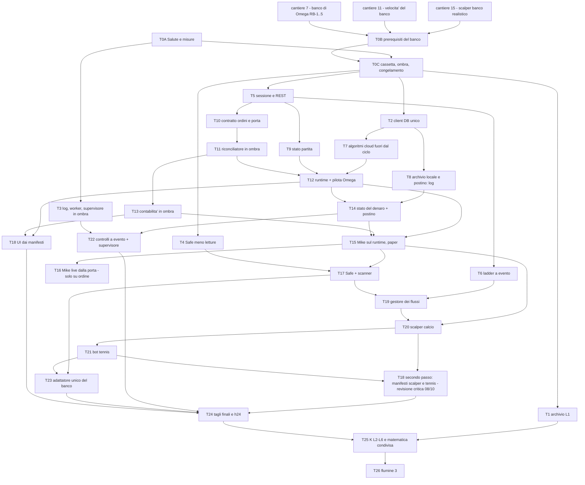

# 05 - PIANO DI MIGRAZIONE (08/10/2026)

Autore: delegato di SINTESI (Opus 5.5). Solo documento: nessun codice, nessun commit. Struttura obiettivo: `04_ARCHITETTURA_OBIETTIVO.md`
(04). Stesse fonti e stesse sigle di 04 (A..K = schede in `03_SCHEDE_COMPONENTI/`, 00, 01, 02, 07, P0210 =
`PIANO_OTTIMIZZAZIONE_GLOBALE_2026-10-02.md`, CANT = `AUDIT_2026-10-08/SPECIFICHE_CANTIERI_CLOUD_2026-10-08.md`, PSB =
`PROCESSO_STANDARD_BOT.md`). Le decisioni dell'utente sono citate come `U-nn` e sono tutte nella sezione 8.

Il piano assorbe P0210 (fasi 0-1-2 decise dall'utente il 02/10) e non contraddice i cantieri in corso nel cloud (CANT, in
particolare 11 velocita' del banco e 15 scalper sotto il banco realistico): quei cantieri sono PREREQUISITI della tappa 0, non
lavoro di questo piano.

---------------------------------------------------------------------------------------------------

## 0. Le regole di ogni tappa (valgono su tutte e non si ripetono)

1. **Il guscio**: il componente nuovo nasce accanto al vecchio, dietro un interruttore `ARCH_<COMPONENTE>[_<BOT>]` con valori
   `vecchio | ombra | nuovo`, default `vecchio` (04 §8). In `ombra` il nuovo calcola e confronta, non scrive ordini ne' righe. [revisione critica 08/10] Rettifica: «righe» = righe delle tabelle VERE sulle
   chiavi del vecchio scrittore. Le tappe che in ombra devono scrivere (T8, T13, T14) scrivono SOLO su tabelle d'ombra
   (`<tabella>_ombra`, stessa forma) o su chiavi additive dichiarate (T13 `pnl_reale_oggi_ombra`); due scrittori sulla stessa chiave
   sono vietati (R02, R21 di `08_REVISIONE_CRITICA.md`).
   Il vecchio si cancella solo nella tappa di taglio, dopo l'ombra a zero divergenze (H §6 passo 9).
2. **Criterio di «fatto» comune** (P0210 «Regole del programma»; CANT §0 regole 4-5; `CLAUDE.md`):
   (a) `python -m pytest Betfair/ -q -p no:cacheprovider` 0 rossi; `frontend/`: `npx vitest run` 0 rossi e
   `npx tsc -p tsconfig.app.json --noEmit` 0 errori (mai `@ts-ignore`/`any` per zittire);
   (b) replay di TUTTI i bot toccati dal punto d'ingresso unico `python -m Betfair.stream.backtest.certifica <bot> ...` con
   `--ombra <cassetta congelata>`: **0 divergenze** a tutti i livelli della cassetta (decisione, ordine, fill, conto, riga_db,
   referto; H §4.3), tolleranze solo le 3 dichiarate (U-59); durata dichiarata all'utente prima del lancio, mai oltre 10 minuti
   senza dirlo (PSB §6.9);
   (c) ogni test nuovo falsificato (mutazione -> rosso, numero di rossi nel referto, ripristino con lo sha del file: CANT §0 regola 5);
   finti con chiavi e tipi identici al vero (PSB §7 n.27);
   (d) le voci di PSB §6 e §7 indicate nella tappa sollecitate o dichiarate ⊘ con causa;
   (e) referto «Salute» di 24 h uguale o migliore (T0A); parita' paper/live verde dove il componente tocca un bot;
   (f) il coordinatore PC rilegge il diff, rilancia test e replay di persona, prova mutazioni proprie e firma (regola 5 di
   `betfair-bot-standard`); riga di checkpoint in `CRONOSTORIA.md`.
3. **Un componente alla volta, mai due tappe sullo stesso file insieme** (P0210); un commit per tappa (o per passo), mai
   `git add -A`, `git fetch` + merge prima del commit, mai rebase ne' push forzato.
4. **Strategia intoccabile**: le tappe che spostano codice di strategia lo spostano IDENTICO; prova con l'impronta della strategia
   (`ARCHITETTURA_2026-10/strumenti/e1/e1_impronta_strategia.py confronta` = 0 differenze, E1 §5.1; estesa agli altri bot in T0C).
   Ogni divergenza di condotta trovata durante una tappa si SCRIVE e si porta all'utente, non si corregge (CANT §0 regola 2).
5. **Paper e live**: nessuna tappa cambia la modalita' di un bot; il passaggio a live di un componente nuovo avviene solo per
   ordine esplicito dell'utente, dopo avergli ricordato lo stato di certificazione sul replay (PSB, regola 1 dello standard).
6. **Migrazioni SQL**: le scrive il coordinatore in `migrations/`, le applica l'utente. Nessun processo nuovo senza permesso.
   L'app la riavvia l'utente, mai con posizioni aperte (P0210).

### 0.1 Chi fa cosa: cloud o PC

| Capacita' | Cloud (sessione remota) | PC dell'utente |
|---|---|---|
| Codice, test Python, vitest, tsc | si' | si' (verifica) |
| Replay calcio 35760084, 35797769 (`registrazioni_banco/`) | si' (scompattate in `_live_raw/` nel container, `CRONOSTORIA.md:5023`) | si' |
| Replay tennis (35790089, 35794049, 35795993) | **no**: «nessuna registrazione tennis qui» (`CRONOSTORIA.md:5023`); si' solo dopo U-44 (copie nel repo) | si' (`~/Desktop/tennis_rec`, `registro_bot.py:53`) |
| DB Supabase (letture per misure, ombra su dati veri, migrazioni) | **no**: «niente DB» (`CRONOSTORIA.md:5023`) | si' (migrazioni applicate dall'utente) |
| App accesa (misure di 24 h, ombra su giornate reali, prove a schermo, `npm run build`) | **no**: «niente app» (idem) | si' (l'app la avvia e la riavvia l'utente) |
| Verifica e firma | - | coordinatore PC (regola 5) |

Regola pratica: il cloud costruisce e certifica sul calcio; il PC misura, fa l'ombra sulle giornate reali, i replay tennis, applica
le migrazioni (utente), verifica e firma.

---------------------------------------------------------------------------------------------------

## 1. TAPPA 0 (prima di toccare qualunque componente): Salute + prerequisiti + congelamento

### T0A - Fase 0 del 02/10: il modulo «Salute» e le misure che mancano

- **Obiettivo**: avere i numeri di partenza che oggi non esistono (CPU, RAM, crescita, eta' del feed, tempi d'ordine, richieste al
  cloud per tabella, riconnessioni) e un referto giornaliero da confrontare a ogni tappa (P0210 Fase 0; 07 «Cosa non ho potuto
  misurare» punti 1-8; I §7).
- **Voci di 01**: `C-053` (tempi d'ordine, gia' esistente: si legge), `G-045` (aggiunta la vitalita' dei raccoglitori); nessuna voce
  spostata.
- **File toccati**: NUOVO `Betfair/monitor/` (contatori in memoria agganciati ai client DB e Betfair esistenti, `psutil`, una riga
  ogni 30 s per servizio in `monitor_metrics` - migrazione - , pagina «Salute» nella UI, referto in `AUDIT_MONITOR/`: P0210);
  agganci delle misure mancanti (07 §2.4): `Betfair/stream/raw_listener.py:211` (`rx`), `runner.py:745` (`ts_pub_ms` e `pt` nel
  payload `ladder`), `local_channel.py:180,673` (`ricevuto_ms`), handler di `flumine.baseflumine` che stampa `latency` (oggi perso
  dal formato `runner.py:3150`), `emesso_ms` nei `params` di Omega e Safe (`omega_service.py:2838,2879`, `safe_strategy/execution.py:1810`,
  07 §3.3); lettura di `connectionsAvailable` anche per scanner/tennis/scalper (A D7); vitalita' dei raccoglitori (max data per
  tabella, G §7).
- **Interruttore**: `MONITOR_SALUTE=0|1`; spento nel banco per costruzione (P0210). Le marche `rx`/`ts_pub_ms` sono campi in piu',
  a campione per i log dei bot (07 §2.4 punto 5).
- **Ombra**: non serve (solo misura); il banco deve restare identico con il monitor spento.
- **Fatto quando**: criterio comune (a)-(c),(f); referto di 24 h con app accesa (sul PC) con le grandezze di I §7: processi, riavvii
  non pianificati, CPU, RAM (crescita fra 2a e 24a ora), richieste al cloud al giorno, log al giorno, re-login, eta' del feed per
  partita con soldi, scarto dell'orologio; 30 ordini paper con `LIVE_TEMPI_ORDINE=1` letti con `leggi_tempi_ordine.py` (C §7, 07 §3.3).
  PSB §6.8 (referto riproducibile).
- **Ritorno**: `MONITOR_SALUTE=0`; le marche sono campi additivi (nessuno li legge per decidere).
- **Stima**: ~500-700 righe nuove + ~40 righe di agganci in 7 file; 2-3 giorni (P0210 dava 1 giorno al solo modulo).
- **Rischi**: un contatore nel percorso caldo costa tempo -> contatori in memoria, scrittura ogni 30 s fuori dal ciclo; il log di
  httpx e' l'unica misura delle richieste al DB (I D7): non abbassare il livello dei log prima che il monitor conti (U-65).
- **Chi**: cloud scrive codice e test; PC: migrazione `monitor_metrics` (utente), 24 h con app accesa, sincronizzazione dell'orologio
  di Windows (U-62: oggi +844 ms, w32time fermo, 07 1e: senza questo ogni latenza contro `pt` e' falsata di ~0,84 s).
- **[revisione critica 08/10] Misure aggiunte** (R04, R12, R13, R14, R16 di 08): (1) nel percorso dell'ordine la marca prima/dopo il `fsync` del diario
  (`motore_ordini.py:1424`), p50/p99/max dentro L6 (04 §7 L6b); (2) le grandezze L15-L19 di 04 §7 con gli obiettivi provvisori di I §7,
  confermati o corretti a fine baseline: da qui il criterio comune (e) e' «entro gli obiettivi», non solo «uguale o migliore»; (3) il
  contatore di transazioni/ora per conto; (4) nella «Salute»: orario attivo e riavvii pendenti di Windows Update, versioni di
  Python/pacchetti/Electron/Node contro il manifesto di T0C (versioni bloccate fino a T26, U-84). Accendere la sincronizzazione dell'ora
  (U-62) fa saltare l'orologio di ~0,84 s all'indietro: farlo con l'app ferma o con tutti i bot flat (R16).

### T0B - Prerequisiti del banco (lavoro gia' assegnato o da decidere; senza di loro i riferimenti cambiano sotto i piedi)

- **Obiettivo**: un banco veloce, realistico e con i finti giusti PRIMA di congelarlo (H §6 passo 1).
- **Contenuto**: (1) **cantiere 15** chiuso: nuovo riferimento dello scalper calcio col banco realistico (`ATTRAVERSAMENTO`), B2 e CP4
  spiegati, `--scenari tutti` su 35797769 e 35760084, numeri in `AUDIT_2026-10-08/riferimenti/` (CANT 15; oggi la cartella non esiste,
  H D7); stesso controllo per gli altri bot (CANT 15 punto 4); (2) **cantiere 11** chiuso: certificazione completa di ogni bot entro
  300 s (tetto 600) con referto identico (oggi Mike 728,4 s, scalper 6.916 s su 47 replay, media under 4.081,6 s, Omega 35797769 33 min:
  H §7); (3) **cantiere 7** chiuso (RB-1..RB-5 del banco di Omega: conflazione che perde lo stato CLOSED, finestre dei candidati, eta'
  in tempo di mercato, paper di Omega col runner, cache empiriche azzerate fra scenari, PSB §7 n.37); (4) **finto di Omega con la firma
  del vero**: `DbMemoriaOmega.aggregates(..., mode)` (`Betfair/omega/tools/replay_registrazioni.py:609,615` contro `omega_db.py:777,787`),
  referto prima/dopo, cosi' la baseline di Omega nasce senza il CRITICAL «paper e live SOMMATI» (E2 difetto 5; U-32; PSB §7 n.21, n.27);
  (5) **registrazioni**: copia compressa di 3-5 partite tennis in `registrazioni_banco/` (U-44) e scelta di registrazioni calcio
  COMPLETE aggiuntive per Mike, oggi certificato su UNA partita con 7 stati mai visti (E1 D11, U-27); (6) **documenti non tracciati**
  committati (`SPEC_STRATEGIA_S.md`, `TENNIS_BOT_DOSSIER.md`, `ESECUZIONE_LIVE.md`, `SAFE_STRATEGY_DOSSIER.md`: il registro e
  `CLAUDE.md` li citano come spec, `git ls-files` = 0; K punto 8, U-37).
- **Voci di 01**: nessuna spostata.
- **Fatto quando**: referti dei cantieri verificati dal coordinatore PC (CANT §0 regola 9); tempi entro il tetto; il CRITICAL di Omega
  sparito con referto prima/dopo spiegato riga per riga.
- **Ritorno**: ogni cantiere e' un commit separato (CANT §0 regola 3).
- **Stima**: i cantieri 15, 11, 7 sono gia' in corso nel cloud (non contati qui); punti (4)-(6): ~100 righe, 2-3 giorni.
- **Rischi**: il cantiere 11 tocca il banco: dopo di lui va rifatta ogni baseline (H §4.4: «un riferimento vale SOLO se prodotto dal
  banco in congelamento»). Per questo T0C viene DOPO.
- **Chi**: cloud (cantieri, finto di Omega, calcio); PC (tennis, scelta delle registrazioni con `validate_recordings.py`, commit dei
  documenti su ordine dell'utente, verifica).

### T0C - Cassetta, determinismo e CONGELAMENTO dei riferimenti (H §4.3-4.4, §6 passi 2-6)

- **Obiettivo**: un metro che non cambia durante la migrazione. Il confronto di ogni tappa e' «nuovo di oggi contro cassetta
  congelata», a costo di un solo replay (H §4.3).
- **Passi**: (1) **congelare il banco**: nessun commit su `Betfair/stream/backtest/**`, sui 6 adattatori e sui 7 moduli di controlli
  durante la migrazione di un componente, salvo «nuova baseline completa dichiarata» (H §6 passo 2); (2) **cassetta** nel banco
  (`cassetta.py`: JSON Lines canonico con i 6 `kind` di 04 §3.8, agganci a `_Ponte._giro` `banco_comune.py:2954-3030`,
  `MercatoFlumine.place_order_live:651`, `cancel_order_live:833`, `place_submin_live:932`, `SpecchioOrdini._riga:359`,
  `SimulatedOrder._update_matched`, `pnl_betfair:1421`, `DbMemoria.insert_trade/update_trade/upsert_event/log` `:287-318`) con prova
  di innocuita': referto identico esclusi i tempi (`righe_senza_tempi:525`); (3) **`ombra.py` + `TOLLERANZE.md`** (`certifica <bot>
  <evento> --ombra <cassetta>` esce != 0 a divergenza) con la falsificazione di H §4.3 (soglia di un tick, importo 0,01, istante 1 ms,
  decisione tolta, `ok` invertito, colonna DB cambiata, controllo K spento: ognuna rossa; identita' = 0 divergenze; un byte della
  cassetta cambiato = hash rosso); (4) **determinismo**: ogni baseline prodotta DUE volte con lo stesso comando, 0 divergenze; se no,
  reperto e niente congelamento (H §6 passo 4); (5) **baseline per bot** col codice di oggi (durate dichiarate: dopo il cantiere 11
  entro 300 s ciascuna); (6) **impronte**: impronta della strategia per OGNI bot (oggi esiste solo per Mike, 386 voci, E1 §5.1),
  insieme di chiavi di `stats` e dei `kind` del diario per bot (D §6 passo 0), conteggi per tabella del cloud (T2 in sola lettura),
  fotografie UI POPOLATE (J §5.2 punto 1), golden Python/TS gia' esistenti (`omegaUscita.golden.json`, `bandaStrategia.golden.json`).
- **Manifesto** (`ARCHITETTURA_2026-10/riferimenti_congelati/MANIFEST.json`, solo aggiunta; per voce: percorso, byte, sha256, comando
  esatto con `--worker`/`--trasporto`/`--ogni-ms`, commit, versioni). `certifica --verifica-congelati` ricalcola gli hash a ogni tappa.
  Elenco preciso (H §4.4, hash misurati l'08/10):

  **A. Software e versioni**: commit del repo `f26a490e` (da sostituire col commit di congelamento); `banco_comune.py` ultimo commit
  `b5547eb8`, blob `d1887913da35`; flumine **2.13.11**, betfairlightweight **2.23.2**, Python **3.13.3** (`.venv`); hash di
  `requirements.txt`; `_IMPRONTA_CHIUSURA_FLUMINE` = `43ee8df005fd9454e18a7f8f24e66787bf3aa042f6564a64d4f037fc8539e57c`
  (`banco_comune.py:1642`); `pip freeze` completo (da produrre al congelamento).

  **B. Registrazioni** (sha256):

  | Partita | File | sha256 |
  |---|---|---|
  | 35760084 (calcio, COMPLETE) | `registrazioni_banco/35760084/35760084.raw.jsonl.gz` | `6523b03ca307c94e06046dc90c89c2532c8efd77992a60fd2f83702b0879f4fb` |
  | | `.scores.jsonl.gz` | `ff334d75ff176e04f1b47db0fd20ec332c9faafc2b90b3d97ce388e1b2a1f8e7` |
  | | `.timeline.jsonl` | `31dc7de976327d2896f08e2a764dd5074c2ed1c41efe93518c82a7428d31c8cf` |
  | | `_live_raw/35760084/35760084.raw.jsonl` | `8037bac2504ed1ef3c58147bbcd216c5628c36725f81672b03a098b0f96dcda8` |
  | | `_live_raw/35760084/35760084.scores.jsonl` | `6910bcab3fbba9840270ac1171891760feb8ba08d56868abc1e09d6df3df998f` |
  | 35797769 (calcio) | `registrazioni_banco/35797769/35797769.raw.jsonl.gz` | `5814fcd6391f01edd3feaeda8a260686f00c799d00795d1d420674d3468b902c` |
  | | `.scores.jsonl.gz` | `a0348577ffb72728129d76bde47b2040700e0a6ab91e04d72fc63ff5deefe7e6` |
  | | `.timeline.jsonl` | `7a92a5c7b0c56a1bcb161520e7ef814e358109595513f9d5c9cba544661a055a` |
  | | `_live_raw/35797769/35797769.raw.jsonl` | `c11894abd1a6ead302e622395bb21d76c2f9c4cee31dfbf5ee4c7ad594ba5883` |
  | | `_live_raw/35797769/35797769.scores.jsonl` | `28c3de961f2f27164930da494ebca35e533f51c1552c24905a0bc02d65d931c5` |
  | 35790089 (tennis: pro, scalper, swing) | `Desktop/tennis_rec/20260707/35790089/35790089.raw.jsonl` | `ffb2a523544e17d55767a67ce8f582a710dd99a1cc2d322a45f045d8b00d942b` |
  | | `.score.jsonl` | `99edcc184e68e368035395c41b07c76b321528ab41fdf991a55800e76db38d25` |
  | 35794049 (tennis FLB) | `.raw.jsonl` | `3d5ed00f255146a0028b8e726459cfb3ac374c0c9f7cfccc986a4368de4737aa` |
  | | `.score.jsonl` | `e0cb019bb816f2027d9a34f16102e3f8e15a728574fea5ee10b084d076f2a56e` |
  | 35795993 (tennis, safe_tennis) | `.raw.jsonl` | `35bceb13cd1d393b2d3f8cb7f8c0800ae2bf21123a8b7dd2dd1e0aaa67dadd9b` |
  | | `.score.jsonl` | `e9b7c928dae4ad8c882363b62b785328c3d0bfa2a7556b8a9ec9eae86e313e4c` |

  Le 22 partite di Safe calcio e le registrazioni aggiuntive di T0B punto 5 si aggiungono con l'hash calcolato al congelamento
  (`_live_raw/` e `tennis_rec/` NON sono sotto git: l'hash e' l'unica garanzia, H §4.4).

  **C. Comandi e referti di oggi** (sono la STORIA: il riferimento sono le cassette del passo 5):

  | Bot | Comando | Referto esistente | sha256 |
  |---|---|---|---|
  | Mike | `certifica mike 35760084 --scenari tutti` | `AUDIT_2026-10-02/replay/mike_tutti_MASTER_FINALE.txt` | `11f45a309f45cb517386c93dd06e83e1cd526d0a3fe2ec294788a6063fd1a149` |
  | Mike (canale) | `certifica mike 35760084 --scenari base --trasporto canale` | `mike_base_riavvio_stantio_MASTER_parita.txt` | `4924927b7ab9c6f842e0b55c69ca56e5a79ccefea9c741aacea87dca91b75a6f` |
  | Omega | `certifica omega 35760084 --scenari base` | `omega_base_MASTER_parita.txt` | `7efb782b46c17f65e689e383a6c4e59b01ff5ef915005bd123476daf76116374` |
  | Omega | `certifica omega 35760084 --scenari tutti` | `AUDIT_2026-10-07/omega_apertura_35760084/replay/DOPO_35760084_tutti.txt` | `e95996bfa9def89132bc2bf4100159223863c0a2179071753c461e3f96cb8be6` |
  | Omega | `certifica omega 35797769 --scenari tutti` | `DOPO_35797769_tutti.txt` | `43f3b8dc6880d0d91fb7cb17b2bb8cbdb3a4a3676478215d2a64f3a2331d9915` |
  | Safe | `certifica safe_base ... --scenari tutti` (22 partite) | `AUDIT_2026-10-04/replay/safe_base_tutti_PUNTE_MULTIPLE.txt` | `91f85fbcccf79d4d70a30cb09bb20b64579b99bf8c2fdf0422c4ed61188a5930` |
  | Safe | `certifica safe_base 35760084 --scenari rapidi --trasporto entrambi` | `safe_base_rapidi_entrambi_PUNTE_MULTIPLE.txt` | `a862e88f9f0c2595646018d0a7795cdf3f3eb69d7113f44995e9972e11a90e97` |
  | Scalper calcio | `certifica scalper_calcio 35797769 --scenari tutti` (prima del 08/10) | `AUDIT_2026-10-08/banco_attraversa/calcio_prima_tutti.txt` | `ab2a493b7e11d5614e8afcf59541f180d922e7f5441674ded0f56604839b4706` |
  | Scalper calcio | `... --scenari base,paper,chiusura-abbinata-in-parte,rifiuti-betfair,sniper-paper` | `calcio_dopo_5.txt` | `aedce4a721f02b02e58b07f94c08f351884fe440ea11d07558dc54b87d8bec46` |
  | Tennis pro | `certifica tennis_pro 35790089 --scenari tutti` | `tennis_dopo.txt` | `b28c45f52252e8d877eb8a812edf429af0af58f286f66b97a86206dfb4269ec1` |
  | Tennis FLB | `certifica tennis_flb 35794049 ...` (6 replay) | `AUDIT_2026-10-04/replay/tennis_flb_35794049_TETTO.txt` | `7743dc9638e97e8c08739d57c1e1849a535eff024dc52def85bc8f942959732b` |

  Ai referti si aggiungono al congelamento: `safe_tennis` 35795993, `tennis_scalper` e `tennis_swing` 35790089, le 5 sintetiche di Mike
  (`Betfair/mike/tools/synth_mike.py`), sniper, theta e media under (scenari separati, `scalper/tools/replay_registrazioni.py:135-146`).
- **Voci di 01**: nessuna spostata (si aggiungono `--ombra`, `--congela`, `--verifica-congelati`: H §4.1).
- **Fatto quando**: cassetta innocua (referti identici esclusi i tempi su Mike `base`, Omega `base`, Safe `base`, scalper `base`,
  tennis_pro `tutti`); falsificazione dell'ombra tutta rossa; determinismo 0 divergenze su ogni baseline; manifesto con tutte le voci
  A-B-C; impronta della strategia per i 5 bot; PSB §6.7, §6.8, §6.9; §7 n.35 (test mai visto rosso), n.37 (cache azzerate).
- **Ritorno**: `--ombra`/`--congela` sono flag in piu'; il commit di congelamento e' un tag (H §6).
- **Stima**: `cassetta.py` ~250, `ombra.py` ~450, `congela.py` ~200 righe nuove (H §4.5) + ~600 righe di test (H §4.5); 3-4 giorni
  piu' il tempo macchina delle baseline (due volte ciascuna).
- **Rischi**: baseline non deterministica (si capisce prima di congelare); registrazione sostituita fuori dal repo (l'hash la scopre);
  Mike su una sola partita (T0B punto 5; le sintetiche entrano nel riferimento).
- **Chi**: cloud (cassetta, ombra, baseline calcio); PC (baseline tennis, determinismo ripetuto sul PC, firma del manifesto).

---------------------------------------------------------------------------------------------------

## 2. Le tappe

Ordine: prima cio' che non tocca decisioni e riduce il rischio (T1-T4), poi il nucleo Betfair e i dati (T5-T9), poi la porta degli
ordini e il runtime con un bot pilota (T10-T14), poi i bot uno alla volta in ordine di rischio (T15-T21), poi i tagli (T22-T26).
Il grafo e' nella sezione 3. Ogni tappa dichiara le voci di `01_FUNZIONALITA.md` che SPOSTA; la tabella completa voce -> tappa e'
nella sezione 4.

### T1 - Archiviazione del codice morto con prova piena (K lotto L1) e documenti

- **Obiettivo**: togliere dal codice vivo 24 moduli (3.440 righe) a zero importatori, zero lanciatori, zero stringhe, zero `__main__`
  (K §4.2 L1), con `archivio/INDICE.md`.
- **Voci di 01**: nessuna (codice senza funzionalita' raggiungibile, K §5).
- **File toccati**: `git mv` dei 24 moduli di `s02_morti.txt` (gruppo A meno i 2 con runbook) in `archivio/`.
- **Interruttore**: nessuno (non raggiunti da nulla, K §6 punto 2).
- **Ombra**: chiusura di raggiungibilita' prima/dopo (AST + stringhe dai workflow, da `desktop/main.js:419,427,469,480`, da
  `avvio_app.py`/`watchdog.py`, da `registro_bot.py:66,133`): insieme identico meno i file archiviati (K §5 punto 1).
- **Fatto quando**: criterio comune; `python -m compileall` dei pacchetti; falsificazione: spostare di proposito un modulo VIVO (es.
  `value_engine/devig.py`) rende rossi lo script di chiusura e `pytest` (K §5 punto 7). PSB §6/§7: ⊘ con causa «nessun codice di bot».
- **Ritorno**: `git revert` del commit di lotto. **Stima**: 0 righe scritte, 3.440 spostate; 1 giorno. **Rischi**: import dinamici
  (502 voci in `k02_import_dinamici.txt`, nessuna cita i lotti: da riconfermare). **Chi**: cloud; decisione U-71.

### T2 - G1: un client del DB, timeout e ritento per profilo; registro delle tabelle e riconciliazione in sola lettura

- **Obiettivo**: una politica di errore di rete per tutto (oggi due client, quattro politiche, 213 `.execute()` senza ritento, runner a
  timeout 120 s: G §1.1); misurare in sola lettura quanto oggi «manca» fra cloud e fonti (G §6 passi 1-2).
- **Voci di 01**: `G-001..G-008`, `D-060`, `K-012`.
- **File toccati**: `db_client.py` (riuso di `classifica_guasto_rete`, `con_ritentativi`: oggi solo nella catena backfill), `tennis_db.py:54-77`
  (client parallelo e `_exec_retry`), `Betfair/stream/net_retry.py`; NUOVI `Betfair/nucleo/dati/{registro.py, riconcilia.py, cloud.py}`.
- **Interruttore**: `ARCH_DATI_CLIENT=vecchio|nuovo` per processo (`usa_timeout_bot()` di oggi e' gia' cosi', `db_client.py:33-70`).
- **Ombra**: `riconcilia` legge e confronta senza scrivere (count e hash per tabella del giorno prima).
- **Fatto quando**: criterio comune; test con client VERO su `httpx.MockTransport` (come `test_catchup_rete_2026_10_08.py`, `CRONOSTORIA.md`
  08/10); falsificazione (errore 4xx ritentato -> rosso; 57014 ritentato -> rosso, G-004). PSB §7 n.18 (scrittura fallita mai warning).
- **Ritorno**: interruttore. **Stima**: ~450 righe del client unico (G §4.6) + 250 registro + 200 riconcilia; ~300 righe tolte; 2-3 giorni.
- **Rischi**: il ritento delle INSERT di log senza `uid` duplica (G §3 punto 4): in T2 si ritenta SOLO cio' che e' idempotente (upsert).
- **Chi**: cloud (codice, test con transport finto); PC (riconcilia sul DB vero, sola lettura).
- **[revisione critica 08/10] Consegna aggiunta** (R23 di 08): il registro `SpecTabella` ha UNA riga per ciascuna delle 89 tabelle di 00 §0 (scrittore
  oggi, scrittore domani, regime, ritardo massimo, verifica, `rev_colonna`, `dipende_da`: 04 §3.7); test che rifiuta una tabella scritta
  dal codice (`.table(`/RPC) ma assente dal registro, falsificato togliendo una riga; ritardi approvati con U-86.

### T3 - I1: log ruotati, worker del banco a richiesta, supervisore in ombra

- **Obiettivo**: fermare 1,1 GB di log in 8 giorni dal worker (80% di `_logs/`, 07 §5.2) e le ~16.900 SELECT/giorno a vuoto; preparare il
  supervisore senza togliere i watchdog (I §6 passi 1-3).
- **Voci di 01**: `I-008`, `I-045`, `G-015`, `H-036`.
- **File toccati**: `desktop/main.js:307-352,386-399` (scrittura dei log senza contropressione, I D5), `Betfair/stream/backtest/worker.py`
  (102), livello di `flumine`/`httpx` a WARNING SOLO nel worker del banco (dopo T0A, U-65); NUOVO `Betfair/supervisore/` in sola osservazione.
- **Interruttore**: `SUPERVISORE=ombra` (legge pid e stato dei 9 watchdog, non li gestisce: I §6 passo 1); worker a richiesta con U-63.
- **Ombra**: 24 h di confronto supervisore/realta'.
- **Fatto quando**: criterio comune; test di contratto delle funzioni pure `classify_exit`, `next_backoff` (stessi valori per 5 rc x 4
  uptime, I §5), falsificazione cambiando `lock_grace_sec`; log del worker <= 1 MB per replay (I §7); «Applica bot» invariato nei risultati.
- **Ritorno**: livello di log e `spawnRunner` del worker ripristinati. **Stima**: supervisore ~420 righe (in ombra), log ~60; 3-4 giorni.
- **Rischi**: la riga `RUNNING` orfana se il worker muore (oggi gia' cosi', H D9): aggiungere il recupero. **Chi**: cloud scrive; PC prova (app).

### T4 - Meno letture del DB senza cambiare decisioni (Safe «passo 0», E3 §6 passo 2)

- **Obiettivo**: Safe da 232,3 a ~60 richieste/min stimate (E3 §6): una lettura di `control` per giro (oggi 2, `bot_service.py:10839-10850` e
  `run_once` 10132), una lista dei trade riusata (oggi 4 SELECT vicine, `:1119, 2092, 6711, 8250`), `fail_stale_processing` solo ogni N s
  (oggi UPDATE incondizionato, `:2688-2693`), battito ogni 10 s o a cambio (E3 §3.2).
- **Voci di 01**: nessuna spostata (tocca `E3-030`, `E3-042` nella stessa funzione).
- **File toccati**: `Betfair/safe_strategy/bot_service.py` (~60-120 righe), `bot_db.py` (~20).
- **Interruttore**: `ARCH_SAFE_LETTURE=vecchio|nuovo`. **Ombra**: non serve: il replay e' il confronto.
- **Fatto quando**: criterio comune; replay completo di Safe (22 partite) e `safe_tennis` identici; conteggio con `m04_chiamate_db.py` prima/dopo
  (sul PC); PSB §6.3 (servizio intero), §7 n.20 (battito vivo non e' coda utilizzabile), n.23 (stats riscritte).
- **Ritorno**: interruttore. **Stima**: ~150 righe toccate; 2-3 giorni. **Rischi**: un bot con posizioni vive al riavvio dell'app (riavvio a
  cura dell'utente, U-38). **Chi**: cloud scrive e certifica sul calcio; PC: `safe_tennis`, misura del traffico, firma.

### T5 - A1: una sessione Betfair per processo e un client REST solo (A P1-P2)

- **Obiettivo**: un custode per processo (oggi 12 `build_client(login=True)` + 6 `BetfairClient()`, la sessione `rest` del runner calcio senza
  keepAlive: A §1.7 reperto, D6) e un solo punto per le chiamate REST (chunk, pause, limiti di peso 200 punti e 3 concorrenti, 02 §3.2).
- **Voci di 01**: `A-001..A-019`, `A-021`, `A-022`, `A-040`, `A-071`, `A-078`, `A-081`, `D-012`, `E2-088`, `E3-S17`, `I-048`.
- **File toccati**: `Betfair/stream/auth.py` (294, diventa `nucleo/betfair/sessione.py`), `Betfair/client.py` (426 -> ~120 sopra gli endpoint
  di betfairlightweight, A §4.2), `odds_refresh.py`, `refresh_worker.py`, i punti di login di `runner.py:2618-2620`, `tennis_runner.py:3122`,
  `safe_strategy/service.py:3367`, `omega_market.py:62-150`, `omega_service.py:8541`; `_poll_books_rest`, `poll_books`.
- **Interruttore**: `ARCH_SESSIONE=vecchio|ombra|nuovo` (A P1 `SESSIONE_UNICA`).
- **Ombra**: un giorno di conteggio `keepAlive`/`relogin` vecchio contro nuovo; per `rest.py` le due fonti in parallelo per 1 ora, differenza
  = 0 sui campi `best back/lay` di `safe_strategy_scan` e `board` (A §6).
- **Fatto quando**: criterio comune; nessun login in piu' del previsto (contatore del monitor); falsificazione: `call_mutating` che ritenta
  -> rosso (`omega_market.py:89-112`: i soldi non si ritentano); PSB §7 n.20, §6.6.
- **Ritorno**: interruttore; vecchio codice intatto fino al taglio. **Stima**: -349 righe (A §4.3: 1.082 -> 733); 3-4 giorni.
- **Rischi**: rinnovo della sessione dello stream senza ricostruire il framework non verificato in flumine (A §6 rischio c): resta la
  ricostruzione di oggi. Prova dal vivo della sessione `rest` dopo 20 min solo con U-06. **Chi**: cloud scrive; PC prova (Betfair vero).

### T6 - A2: ladder a ogni cambio e DB fuori dal thread del ladder (A P3)

- **Obiettivo**: chiudere il gap L-02 (ladder a 200 ms contro i 20 ms di Bet Angel, 02 §6.2) senza cambiare cio' che ricevono i bot.
- **Voci di 01**: `A-052..A-056`, `A-069`, `G-014`, `J-078`, `J-084`.
- **File toccati**: `runner.py:573-757` (helper e `ladder_worker`), `tennis_runner.py:200-275,1455-1507`, `ladder_canale.py` (169), `stream/db.py:650-710`;
  NUOVO `nucleo/betfair/ladder.py` (helper gemelli 113+76 -> ~115, A §4.3).
- **Interruttore**: `ARCH_LADDER=vecchio|ombra|nuovo`.
- **Ombra**: due publisher per 1 giornata; confronto delle firme SHA-1 `ladder_signature` a ogni passo e `updated_ms` crescente (A §5 punto 2).
- **Fatto quando**: firma identica al 100%; latenza `ts_pub_ms - pt` <= oggi (T0A) e push a ogni cambio con minimo 20 ms; `localTransport.test.ts`,
  `canaleRunner.test.ts`, `localChannel.test.ts` verdi senza modifica + test del topic `ladder` su 3 registrazioni; falsificazione: togliere
  l'ordinamento per `selection_id` in `ladder_signature` -> rosso (A §5 punto 6). PSB §6.5, §7 n.9, n.33.
- **Ritorno**: interruttore. **Stima**: ~-120 righe; 2-3 giorni. **Rischi**: piu' messaggi al canale (tetto di 64 invii in volo,
  `local_channel.py:176`): misurato in ombra. **Chi**: cloud (calcio), PC (tennis, prova a schermo).

### T7 - G2: algoritmi del cloud fuori dal ciclo (prefetch e repliche, 04 §6.3)

- **Obiettivo**: zero RPC sincrone nel ciclo di decisione di Omega (oggi `_minute_table`/`_empirical_table`, `omega_service.py:1432,1444,1556,1565`)
  e dossier di Mike precalcolato, senza cambiare un valore ne' una scadenza (G §4.4).
- **Voci di 01**: `G-010`, `G-024`, `G-026`, `G-033..G-036`, `D-018`, `D-019`, `E3-026`.
- **File toccati**: `omega_service.py:1305-1380, 1397-1565` (solo l'accesso ai dati, non la selezione), `mike/dossier.py:66-171` (accesso),
  `omega_db.py:1040-1081, 736-776`, `mike/db.py:580-647`, `stream/db.py:231-262`; NUOVO `nucleo/dati/cache_cloud.py` (~300 righe).
- **Interruttore**: `ARCH_PREFETCH_<BOT>=vecchio|ombra|nuovo`.
- **Ombra**: la replica risponde e CONFRONTA con l'RPC (che si chiama ancora); differenze riga per riga = reperto (G §6 passo 3).
- **Fatto quando**: replica = RPC per ogni `league_id` (righe `get_omega_ht_ft`/`get_omega_minute_ft`), stessi `lambda_home/away`, `rho`, `p4_pre`,
  `p_under35_cal` per `fixture_id` (G §5); replay di Omega e Mike identici col finto alimentato dalla replica; test «rete finta che rifiuta
  tutto»: il banco resta identico (E2 §7); falsificazione (cache senza scadenza -> rosso il test delle 04:00 UTC; la scadenza di Mike
  «mai» e di Omega «6 h» restano: U-53). PSB §6.1, §7 n.37.
- **Ritorno**: interruttore. **Stima**: ~300 nuove, ~150 toccate; 3-4 giorni. **Rischi**: prefetch prima del pg_cron delle 04:00 UTC
  (rilettura dopo `built_at`). **Chi**: cloud (codice, banco); PC (confronto contro le RPC vere).

### T8 - G3: archivio locale e postino per i soli LOG (rischio minimo: nessuna decisione li legge)

- **Obiettivo**: il primo uso del postino su tabelle append-only (G §6 passo 4): `*_activity`, `live_alerts`, `betfair_live_journal`,
  `betfair_live_audit`, `signal_history`, `theta_confirm_requests`, `live_run_log`.
- **Prerequisito**: migrazione `uid UUID UNIQUE` sulle 10 tabelle di log (U-50, applicata dall'utente).
- **Voci di 01**: `G-013`; la funzione «diario» (`D-050`) resta la stessa, cambia solo il trasporto (spostata in T12).
- **File toccati**: NUOVI `nucleo/dati/{archivio.py (~450), postino.py (~400)}`; `mike/db.py:71-81`, `omega_db.py:61-72`, `bot_db.py:77-90`,
  `tennis_db.py` (activity), `scalper_session.py:709,859,1075,1699,1936,2064`, `stream/db.py:644,697,988` (insert dei log).
- **Interruttore**: `ARCH_POSTINO_LOG=vecchio|ombra|nuovo`.
- **Ombra**: la vecchia insert resta; il postino scrive su una tabella d'ombra o con `uid` e `ON CONFLICT DO NOTHING`; confronto notturno per
  `(giorno, kind, event_id)` +/- 0 (G §5).
- **Fatto quando**: 0 record persi su processo ucciso a meta' (prova `os._exit`, 07 §6.1); 0 duplicati sul ritento; cloud fermo -> coda che cresce
  e allarme `postino_offline`; riga rifiutata da un CHECK -> `dead_letter` visibile (G §5 falsificazioni 1-5). PSB §6.5, §7 n.18, n.27.
- **Ritorno**: interruttore (la vecchia scrittura resta fino a T24). **Stima**: ~850 nuove, ~80 toccate; 4-5 giorni.
- **Rischi**: crescita della coda in offline lungo (tetto di disco + allarme). **Chi**: cloud scrive; PC (migrazione, ombra notturna sul DB).
- **[revisione critica 08/10] Rettifiche e prove aggiunte** (R06, R08, R21, R24 di 08): (1) l'ombra scrive SOLO su tabelle d'ombra: la via «con `uid` e
  `ON CONFLICT DO NOTHING`» sulla tabella vera aggiunge una riga per evento (la insert vecchia non porta lo stesso `uid`) e il confronto
  +/- 0 fallirebbe per costruzione; (2) 23503 (chiave esterna) e' transitorio con tetto, poi `dead_letter` con allarme; ordine padre ->
  figlio da `dipende_da` (04 §3.7); (3) prova sotto carico: replay a cadenza reale con scrittore e postino accesi contro spenti, L2/L6 p99
  non peggiori oltre la variabilita' fra due esecuzioni identiche, altrimenti U-82; (4) riga JSONL troncata da un crash: si scarta e si
  segnala, non e' un `dead_letter`; (5) le prove dichiarate mancanti in 04 §6.1 (checkpoint fuori dal percorso; due file, U-55) si fanno
  qui, prima di T14.

### T9 - B: un servizio dello stato della partita (calcio, poi tennis)

- **Obiettivo**: lo stato della partita calcolato UNA volta (minuto, fase, gol, rossi, `ko_ms`, eta' in tre parti, fonte vera) e
  pubblicato a evento; via i 9 ricalcoli del minuto, le 4 copie di `_ko_epoch_ms`, i 5 relay (B §3).
- **Voci di 01**: `B-001..B-037`, `B-044`, `B-045`, `B-047`, `B-049..B-053`, `A-070`, `A-082`, `A-083`, `D-014..D-017`, `D-020`,
  `E3-S07`, `E3-S08`, `E5-060`, `E5-061`, `G-011`.
- **File toccati**: `Betfair/stream/scores/` (989), `betfair_inplay.py`, `safe_strategy/service.py:1698-1905, 3258-3320` (poll IPS e
  `apply_score_state`), `tennis_scalper/tennis_score.py` (265 -> `nucleo/stato_partita/adattatori/ips_tennis.py`), `runner.py` (score_worker
  ~120), `tennis_runner.py` (~85, `:1645`), `api_football.py`, `poller.py`.
- **Interruttore**: `ARCH_STATO_PARTITA=vecchio|ombra|nuovo` (B §6 `STATO_PARTITA_SERVIZIO`, sul modello di `PUNTEGGI_CANALE`).
- **Ombra**: il servizio nuovo confronta ogni stato (minuto, gol, fase, eta') con la riga di `live_now`/`tennis_live_now`; discrepanze nel
  referto, mai usate per decidere (B §6).
- **Fatto quando**: per OGNI riga dei sidecar `.scores.jsonl` di 35760084 e 35797769: `minuto/gol/rossi/fase` = `parse_score_dict`
  (`betfair_inplay.py:50`) e `tempo_da_stato_ips` (`atlante_v4.py:550`); `TennisScore.key()` = `parse_tennis_scores`; `EsitoFlusso`
  = `flusso_prezzi.valuta` per ogni tick; `eta.punteggio_s` = `score_age_sec` (`scan_feed.py:506`): 100% righe identiche (B §5); replay di tutti
  i bot identici; falsificazioni B §5 (1)-(4); PSB §6.1 (punteggi col ritardo di produzione 2-3 s), §6.2, §6.7.
- **Ritorno**: interruttore. **Stima**: -1.210 righe (04 §10: 2.755 -> ~1.325 meno le regole di freschezza che restano); 4-5 giorni.
- **Rischi**: lo scanner serve 4 bot: un errore li ferma tutti (B §6 rischio a) -> ombra lunga, taglio per ultimo del lato scanner; la
  condizione 11 non si indebolisce; `live_now` ha consumatori UI (stessa forma). Lo scalper che legge come gli altri cambia solo la
  fonte: U-11. **Chi**: cloud (calcio); PC (tennis, ombra su giornate reali).

### T10 - C1: il contratto degli ordini, una porta generica, una definizione dei minimi .it

- **Obiettivo**: `nucleo/ordini/contratto.py` con i tipi di 04 §3.4 e un adattatore da/verso `valida_comando` (nessun cambio di
  comportamento); i tre `porta_ordini.py` ereditano da una `PortaCanale` generica (aggiungere, non togliere: C §6 passo 1); una sola
  definizione delle taglie .it (oggi 5 posti, 28 file: C §3 punto 2).
- **Voci di 01**: `C-001..C-010`, `C-020..C-037`, `C-040..C-044`, `C-048`, `C-049`, `C-074`, `G-025`.
- **File toccati**: `motore_ordini.py` (2.434: spostato, non ridotto), `safe_strategy/porta_ordini.py` (784), `omega/porta_ordini.py` (237),
  `mike/porta_ordini.py` (224), `trading/{minimi_it,submin,controls,freno_rifiuti}.py`, `live_order_build.py`, `tennis_scalper/condotta_ordini.py`
  (solo `size_legale`), le 3 copie della coda flumine nei moduli DB (`mike/db.py:650-693`, `omega_db.py:586-696`, `bot_db.py:987-1044`).
- **Interruttore**: `ARCH_ORDINI_PORTA=vecchio|nuovo` per attore; gli interruttori di oggi (`*_ORDINI_VIA_CANALE`, spenti di serie) li accende
  SOLO l'utente, uno alla volta (C §6 passo 4).
- **Ombra**: la stessa `RichiestaOrdine` produce la stessa sequenza di `EventoOrdine` su `EsecutorePaper` e `EsecutoreBanco` (C §5).
- **Fatto quando**: test di contratto C §5 (1)-(4) (dedup per ref dopo riavvio; finto Betfair con chiavi e tipi veri, `banco_comune.py:1024-1028`);
  parita' coda/canale del banco (`CRONOSTORIA.md:4964`) mantenuta; minimi: test che confronta le 5 definizioni di oggi con quella unica su una griglia
  di importi (lo scalper ha 2,00 EUR contro 1,00 delle altre strade: divergenza da portare all'utente se emerge, C §3 punto 2); falsificazioni C §5
  (togliere dedup, togliere `da_seq`, `ok` all'esito ignoto, ritento in `call_mutating`). PSB §6.4, §7 n.1-7, n.10, n.33.
- **Ritorno**: interruttore per attore. **Stima**: +450 righe di contratto, porte 1.245 -> 740, coda flumine -200; 3-4 giorni.
- **Rischi**: doppio ordine nella finestra di passaggio (dedup per ref falsificato). **Chi**: cloud; PC (prova su Betfair in paper).
- **[revisione critica 08/10] Prove aggiunte** (R07, R13 di 08): (1) i consumatori di `EventoOrdine` controllano la contiguita' di `seq` e chiedono `da_seq`
  al buco: test con un push scartato di proposito (verde) e con il controllo tolto (rosso); (2) contatore delle transazioni/ora UNO per
  conto nella porta (`ordini/controlli.py`) con il tetto di oggi (`config_stream.py:256-262`), test che lo somma su piu' attori.

### T11 - C2: un riconciliatore in ombra accanto ai nove di oggi

- **Obiettivo**: `ordini/riconciliazione.py` confronta diario + blotter + order stream con il conto e produce `StatoOrdine`/`PosizioneConto`
  SENZA scrivere; i riconciliatori dei bot (R4 Omega `reconcile_pending` 128 + 87, R5 Safe, R6 Mike 560: C §3) restano attivi (C §6 passo 2).
- **Voci di 01**: `C-050`, `C-052`, `C-054`, `C-055`, `D-045`, `D-046`, `D-054`, `F-016`, `G-012`.
- **File toccati**: NUOVI `ordini/{riconciliazione.py (~450), specchio.py}`; lettura da `reconcile_worker.py`, `esiti_ordini_canale.py` (850),
  `omega_market.py:1445-1794` (letture del conto, 350 -> riconciliazione).
- **Interruttore**: `ARCH_RICONCILIA=ombra|nuovo` per bot.
- **Ombra**: confronto automatico per `ref` e `StatoOrdine` contro R4/R5/R6; ogni divergenza e' un reperto, partendo dai due gia' scritti
  (Omega doppia chiusura sul ripiego > 20 s; Safe numeri dell'ordine vero sulla riga Over: `CRONOSTORIA.md:4833`, C §3 punto 7).
- **Fatto quando**: confronto vuoto su almeno N giornate con ordini (N deciso con l'utente: oggi la base reale e' di 4 ordini live del runner,
  07 §3.2); scenari C §5 punto 4 («esito ignoto», «ordine esterno dal sito», «sul conto non nello specchio», «specchio senza conto», «riavvio
  con ordine in volo»); PSB §6.4, §7 n.4, n.6, n.7, n.36.
- **Ritorno**: e' gia' in ombra; il taglio di R4/R5/R6 avviene nelle tappe dei bot. **Stima**: ~650 nuove; 4-5 giorni + calendario dell'ombra.
- **Rischi**: base reale quasi nulla (C §6 passo 2): servono giornate paper con ordini. **Chi**: cloud (codice, banco); PC (ombra su giornate).

### T12 - D1 + E2: il contratto del runtime e il pilota Omega

- **Obiettivo**: `Betfair/runtime/` (cicli, controllo, comandi, persistenza, diario, battito, arresto, avvio, lock, registro) e il test generico
  `test_plugin_contratto.py` con un plugin finto a chiavi e tipi del vero (D §6 passo 1); Omega primo bot migrato (S piu' piccolo fra i polling,
  1.763 righe, 12,2 richieste/min, nessun giro veloce: D §6 passo 2). Prima si rompe il ciclo `execution.py` <-> `omega_service.py` (E2 R1).
- **Voci di 01**: `E2-001..E2-040`, `E2-042..E2-050`, `E2-058..E2-087`, `E2-089..E2-095`, `E2-105`, `D-002`, `D-008`, `D-009`, `D-011`, `D-013`,
  `D-021..D-027`, `D-029..D-031`, `D-034..D-042`, `D-044`, `D-047`, `D-049..D-053`, `D-055..D-057`, `D-062`, `D-063`, `D-069`, `B-040`, `B-042`,
  `B-043`, `I-035`, `I-041`, `I-043`.
- **File toccati** (E2 §6): `omega_model.py` + `omega_empirical.py` -> `nucleo/modello/` con RE-EXPORT dai vecchi percorsi (Mike, Safe e banco
  restano verdi); `omega_market.py` spezzato fra `nucleo/betfair` e `nucleo/ordini` (U-33); `omega_config.py` -> `bots/omega/parametri.py` (87 chiavi,
  genera i default TS e il catalogo del banco); strategia estratta come funzioni pure `(stato, libri, partita, orologio, p, prematch) -> EsitoGiro`;
  `plugin.py` (~350) al posto di `omega_service.py:1-1137, 7752-8936`; `avvio_app.py:173-215` (uscite MANUALI derivate dal Plugin, non per nome);
  `registro_bot.py:244-253`.
- **Interruttore**: `ARCH_RUNTIME_OMEGA=vecchio|ombra|nuovo` (D §6 `RUNTIME_OMEGA`).
- **Ombra**: 2-3 giorni di partite reali in paper: il vecchio opera, il nuovo confronta (D §6 passo 3); nel banco: confronto decisione per decisione
  (stesso `StatoPartita`+`Libro`+`Prematch` -> stesso `EsitoGiro`, stessa cella, stesso prezzo, stesso stake, stessi scartati con gli stessi numeri:
  E2 §5.2); per lo scheletro: stesse chiavi di `stats`, sequenza dei `kind`, esito di `ferma_al_nuovo_avvio` (D §5 punto 2).
- **Fatto quando**: impronta della strategia di Omega = 0 differenze; `certifica omega 35760084 --scenari tutti` e `35797769` identici alla cassetta
  (riferimenti di forma: `apertura` 467 decisioni / 2 azioni / 482.034 tick; `tutti` 20/20 OK 0 violazioni: E2 §5.2); falsificazioni di E2 §5.4
  (`v3_k_minimo` 1,11 -> 1,10; `v3_p_max_pct` 2 -> 3; distanza minima gol; uscite fail-open; cella gia' bancata; `aggregates(mode)` ignorato) e di D §5
  (reset MANUALE tolto; stato non ricostruibile; `_AO.richiesto()` tolto); test di Omega (39+35 file Python, 17 frontend) verdi; PSB §6.3, §6.4, §6.5,
  §6.6, §7 n.19, n.21, n.22, n.23, n.25, n.33, n.34, n.37.
- **Ritorno**: `ARCH_RUNTIME_OMEGA=vecchio` senza toccare DB ne' tabelle (D §6). **Stima**: runtime ~3.510 righe nuove (D §4.4, contate una volta per
  tutti), plugin Omega ~350, `parametri.py`; 7-9 giorni + 2-3 giorni di ombra.
- **Rischi**: 11,1k righe di `tools/` e 27k di test importano i vecchi percorsi (E2 R4) -> shim; il replay non esercita il percorso per modalita'
  finche' T0B punto 4 non e' fatto (E2 R2); «OK» non basta (regressione del 29/09 vista solo dal numero di azioni, E2 R3): conta la cassetta.
- **Chi**: cloud (contratto, plugin, banco calcio); PC (ombra paper su partite vere, firma). Il live di Omega solo con ordine dell'utente.

### T13 - F: la contabilita' unica in ombra

- **Obiettivo**: UN lettore del conto, UNA `giornata()`, UNA commissione, UN green, UNO stop (con la base di OGGI: lordo, U-48) (F §4).
- **Voci di 01**: `F-001..F-015`, `F-020..F-043`, `C-082`, `D-028`, `D-043`, `D-048`, `D-061`, `E1-048`, `E2-051..E2-057`, `E3-038`, `G-022`, `G-044`,
  `I-047`.
- **File toccati**: `reconcile_worker.py:140-280, 488-1250`, `trading/daily_pnl.py` (142), `daily_stop_worker.py` (508), `saldo_evento.py` (252),
  `stream/db.py:953-1118`, `mike/regolato_conto.py` (359) e regolamento di `mike/service.py` (868), `omega_service.py:4971-5424`,
  `omega_engine.py:791-852`, `safe_strategy/execution.py:2686-3100`, `trading/greenup.py`.
- **Interruttore**: `ARCH_CONTABILITA=vecchio|ombra|nuovo` per bot (F §6 `CONTABILITA_NUOVA`).
- **Ombra**: il nuovo scrive in una chiave additiva JSONB (`pnl_reale_oggi_ombra`, nessuna migrazione, come PNL_UNICO del 04/10); confronto per
  giornata, per bot e per partita, > 0 centesimi = differenza (F §6).
- **Fatto quando**: 5 giornate live consecutive a zero differenze + replay identici (F §6 passo 2); test esistenti verdi senza cambiare i numeri
  attesi (`test_pnl_unico_conto_2026_10_04.py` e gli altri 11 di F §5); riferimento del 04/10: conto netto -5,15 = Mike -5,68 + a mano +0,53;
  test nuovi F §5 (griglia del green al centesimo, una commissione, stop lordo vs netto documentato, `giornata()` = RPC `get_*_daily`, contratto
  Python <-> TS) falsificati. PSB §6.5, §7 n.21 (dato assente non e' zero).
- **Ritorno**: interruttore; le tabelle non cambiano forma. **Stima**: backend ~4.600 -> ~2.540 (F §4.4 senza relitto e frontend); 4-5 giorni +
  5 giornate di ombra.
- **Rischi**: `Decimal` cambia gli arrotondamenti (la griglia lo cattura); la giornata unica cambia numeri visibili (U-47); lo stop netto e la
  commissione unica sono decisioni (U-48, U-49). **Chi**: cloud (codice, banco); PC (ombra sulle giornate, conto vero).
- **[revisione critica 08/10] Aggiunte** (R10, R20 di 08): (1) `CambioGiorno` nasce qui (temporizzatore della contabilita', Europe/Rome) e passa al
  supervisore in T22; test di `giornata()` sui giorni di 25 e 23 ore (25/10/2026, 28/03/2027) con partite a cavallo dell'ora ripetuta,
  falsificato con un calcolo «+24 h»; (2) le «5 giornate live» dipendono dall'utente (i bot li accende solo lui) e T13 precede T15:
  alternativa in U-85.

---------------------------------------------------------------------------------------------------

### T14 - G4: lo stato del denaro in locale (WAL FULL) e il postino per ordini, posizioni e trade, un bot alla volta

- **Obiettivo**: nessun `insert_trade` sincrono con id dal cloud (oggi senza rete un bot NON puo' aprire una posizione, G §1.1); specchio,
  posizioni, regolati, richieste d'ordine e trade nascono in `stato_denaro` e arrivano al cloud dal postino (G §6 passo 5).
- **Prerequisito**: `trade_uid` sulle 3 tabelle di trade (U-50, migrazione dell'utente).
- **Voci di 01**: `C-051`, `G-016..G-018`, `G-020`, `G-021`, `G-031`, `I-039`.
- **File toccati**: `stream/db.py:773-1189` (specchio, posizioni, regolati, heartbeat), `mike/db.py:175-288`, `omega_db.py:75-280`, `bot_db.py:91-264`,
  `tennis_db.py:532-640`, le chiamate sparse di `scalper_session.py`, `live_order_worker.py`, `reconcile_worker.py`, `risk_engine_worker.py` (107
  punti, G perimetro); `nucleo/dati/archivio.py` (regime `stato_denaro`).
- **Interruttore**: `ARCH_STATO_DENARO_<BOT>=vecchio|ombra|nuovo`; ordine Mike, Omega, Safe, tennis (G §6 passo 5).
- **Ombra**: la scrittura diretta resta; il postino scrive le STESSE righe sulle stesse chiavi; `riconcilia` notturno (count, hash di chiave e
  `updated_at`) per tabella (G §5).
- **Fatto quando**: per ogni bot: banco identico prima/dopo; servizio ucciso con posizioni aperte in paper -> riparte, ricostruisce, 0 ordini doppi
  (04 §4.5; P0210 fase 1 blocco 1); cloud fermo -> `insert_trade` locale riesce e la coda cresce (G §5 falsificazione 4); `riconcilia` vuoto per 5
  notti. PSB §6.3, §6.5, §6.6, §7 n.18, n.19, n.21, n.22.
- **Ritorno**: interruttore per bot; il cloud e' sempre completo grazie alla scrittura diretta tenuta fino a T24. **Stima**: ~600 righe toccate;
  5-6 giorni + 5 notti di ombra.
- **Rischi**: divergenza locale/cloud (riconcilia e watermark); due file SQLite (U-55: misura `m06` con due file concorrenti prima della scelta).
- **Chi**: cloud (codice, banco); PC (migrazione, ombra sulle giornate, prova di uccisione in paper).
- **[revisione critica 08/10] Rettifiche** (R01, R02, R03, R06 di 08): (1) **identita' dei trade**: senza l'id del cloud cambierebbero il
  `customerOrderRef` `mike-t<id>` (`mike/porta_ordini.py:52`, `mike/certificazione.py:1476-1501`), la chiave esterna `closes_trade_id`
  (`mike_bot.sql:109`, `omega_cashout.sql:50`, `safe_strategy_bot.sql:73`) e il P&L per posizione (`mike/db.py:268-347`): T14 non parte
  per i trade senza U-80 (proposta: id riservati a blocchi, tutto identico); specchio e posizioni possono procedere; (2) **ombra**: il
  postino scrive su `<tabella>_ombra`, MAI sulle stesse chiavi della scrittura diretta (un upsert tardivo riporterebbe indietro lo stato
  che Omega rilegge fino a 20 s); al passaggio a `nuovo` upsert solo con `rev` crescente (04 §3.7); (3) **prima la riga, poi l'invio**
  (04 §4.1): «fatto quando» esteso con la prova di uccisione del bot fra scrittura e invio e fra invio e risposta (0 ordini doppi) e con
  ref e `closes_trade_id` identici alla cassetta; (4) ordine padre -> figlio fra tabelle da `dipende_da`.

### T15 - E1: Mike sul runtime comune, in PAPER

- **Obiettivo**: Mike come `Decisore` (decisione gia' pura: `engine.decide`, `mike/engine.py:3089`) senza cambiare una regola (E1 §6 passi 1-4).
- **Voci di 01**: `E1-001..E1-045`, `E1-047`, `E1-049..E1-051`, `E1-055`, `D-001`, `B-038`, `B-041`.
- **File toccati**: `mike/engine.py`, `feed.py`, `dossier.py`, `config.py` spostati identici in `bots/mike/strategia/` e `parametri.py`;
  `regole_di_conto.py` estratto da `service.py:4116-4211` come funzioni pure; `plugin.py` (codec dello stato ~260, `su_comando` ~120); il TS
  `MIKE_PARAM_FIELDS`/`MIKE_PARAM_DEFAULTS` (`mike.ts:441-608`) generato dal Python; `arresto_con_ordini` (`service.py:7315-7388`) nell'arresto comune.
- **Interruttore**: `ARCH_RUNTIME_MIKE=vecchio|ombra|nuovo`.
- **Ombra**: il plugin gira in parallelo al servizio vecchio in sola decisione, le due `Decision` confrontate a ogni giro (stesso `ctx`, stesso
  `snap`); almeno una giornata di partite in gioco (E1 §6 passo 3).
- **Fatto quando**: impronta della strategia 386 voci = 0 differenze (E1 §5.1); `certifica mike 35760084 --scenari tutti` (26 coppie) + 5
  sintetiche + `--trasporto canale` identici alla cassetta (forma dei numeri: `base` 52.082 tick / 5.246 decisioni / 6 azioni, P&L -14,17: E1 §5.2;
  i numeri sono confrontabili solo a parita' di comando e trasporto); 99 file di test verdi; parametri Python/TS 0 differenze (107 chiavi, test
  «TS allineato» falsificato); stati mai visti coperti dalle registrazioni aggiuntive (U-27) o dichiarati ⊘; PSB §6.1-§6.8 come in E1 §5.3, §7 n.33.
- **Ritorno**: interruttore; il servizio vecchio resta avviabile; nessuna migrazione SQL distruttiva (E1 §6). **Stima**: guscio di Mike
  8.727 -> ~2.350 (E1 §4.3, contato in D/C/F/G); colla 1.631 -> ~700; 4-5 giorni + 1 giornata di ombra.
- **Rischi**: `mike_events.ctx` deve restare leggibile dalla nuova versione (codec con le stesse chiavi; la UI legge `live`, `ctx`, `positions`,
  `dossier`, `mike.ts:175-330`); `ticks_between` importato dallo scalper (`mike/engine.py:33`) -> portato in `bots/_comune` identico prima.
- **Chi**: cloud (codice, banco calcio); PC (ombra, firma). Decisioni da chiudere prima: U-25, U-26 (parametri morti e «NON ATTIVO»).

### T16 - Mike LIVE dalla porta unica (solo su ordine dell'utente)

- **Obiettivo**: il live di Mike smette di passare dal REST diretto senza diario ne' dedup ne' kill-switch del runner (strada S3, C §1.1) e passa
  dal motore del runner come il paper: «live = paper nello stesso trasporto» (C §6 passo 3, `ESECUZIONE_LIVE.md:57-62`).
- **Voci di 01**: `E1-046`, `C-045`, `C-046`.
- **File toccati**: `mike/service.py:2195-2379` (punto di invio), `mike/porta_ordini.py`, `omega_market.py:704-830` (resta solo come ripiego se U-13).
- **Interruttore**: `MIKE_ORDINI_VIA_CANALE` (gia' nel codice, spento di serie) acceso SOLO dall'utente.
- **Ombra**: paper sullo stesso trasporto per un periodo deciso dall'utente; il live dopo che il paper conferma (PSB §4-§5).
- **Fatto quando**: replay certificato con ordini appoggiati sul motore; parita' paper/live (stesse azioni, stessi importi); il promemoria
  sullo stato di certificazione e' stato dato all'utente (regola 1 dello standard); PSB §6.4, §7 n.1-7, n.12, n.14, n.26.
- **Ritorno**: interruttore spento = REST di oggi. **Stima**: ~100 righe; 2-3 giorni + paper. **Rischi**: e' il cambio piu' pericoloso della
  migrazione (bet delay, `customerOrderRef` `mike-t<id>`, kill-switch: E1 §6 rischio a). **Chi**: PC (soldi veri); decisione U-18.

### T17 - E3: Safe sul runtime e lo scanner come componente a se'

- **Obiettivo**: Safe come `Decisore` con `fine_giro` (valuta tutte le partite insieme, D §4.1 fatto 4); lo scanner (`Betfair/scanner/`) pubblica
  `RigaFeed` sul canale 47336 come strada primaria, il DB come diario (E3 §6 passi 1, 3).
- **Voci di 01**: `E3-001..E3-025`, `E3-027`, `E3-030..E3-037`, `E3-039..E3-046`, `E3-S01`, `E3-S03..E3-S06`, `E3-S09..E3-S16`, `E3-S18`,
  `A-079`, `A-080`, `B-039`, `D-003`, `D-010`, `D-072`, `G-027`, `G-040`.
- **File toccati**: `safe_strategy/{engine,exits,risk,veto_campionati,selezione,pressure}.py` e `opportunity`, `tennis_opportunity`, `anomaly`,
  `combos`, `calibration`, `proposte_opportunita` spostati identici in `bots/safe/`; `bot_service.py` (11.136: ciclo e richieste al runtime, punti
  d'invio alla porta), `execution.py` (3 strade, C), `bot_db.py`; scanner: `service.py`, `scanner.py`, `db.py`, `canale_scan.py`.
- **Interruttore**: `ARCH_RUNTIME_SAFE=vecchio|ombra|nuovo`; `ARCH_SCANNER=vecchio|nuovo` (il DB resta ripiego, come `SAFE_BOT_LEGGE_CANALE`).
- **Ombra**: per N giorni il vecchio e il nuovo valutano le stesse righe, confronto automatico di `Segnale` e uscite; il vecchio e' l'unico che piazza (E3 §6 passo 1).
- **Fatto quando**: replay delle 22 partite e degli scenari (`base`, `cap-stretto`, `bot_fermo`, `esiti_ignoti`, `feed_stantio`, `riavvio`, `ordini`,
  `due_lay`, `manuale_e_bot`) identici alla cassetta; `safe_tennis` 35795993 identico; scanner: stessa `payload_signature` per le stesse sequenze di
  book; controlli `certificazione*.py` invariati; PSB §6.1-§6.9 e §7 n.8-16, 19, 21-26 come in E3 §5.
- **Ritorno**: interruttori. **Stima**: guscio Safe ~13.500 -> ~3.500 nella cartella (trasloco verso C, D, G: E3 §4.3); 7-9 giorni + ombra.
- **Rischi**: la UI valuta i segnali anche a bot fermo (E3 §6 rischio a: i `monitor` vanno pubblicati anche a bot fermo, U-35); lo sfasamento
  scanner/bot di 2,5-5,7 s ridotto e' un cambio di tempi da confrontare col replay (E3 §6 rischio b); `opportunity.py` eseguito due volte (U-36).
- **Chi**: cloud (calcio); PC (`safe_tennis`, ombra, firma).

### T18 - J: la UI dai manifesti e dal nucleo locale

- **Obiettivo**: un modello di stato per tutti i bot (`useBot`), parametri e testi dei `kind` generati, plancia a evento, P&L letto da `Giornata`
  (J §6 passi 1-6); le viste restano.
- **Voci di 01**: `J-004`, `J-005`, `J-014..J-077`, `J-079..J-083`, `J-086..J-091`, `J-093`, `J-101`, `A-084`, `A-085`, `E1-052..E1-054`,
  `E2-096..E2-104`, `E3-028`, `E3-029`, `E3-047..E3-055`, `E4-080..E4-083`, `E5-103..E5-105`, `E5-110..E5-118`, `F-050..F-059`.
- **File toccati**: `lib/{mike,safeBot,omega}.ts` (1.225 righe gemelle -> `nucleo/statoBot.ts` ~700), `useMike.ts`, `useSafeBot.ts`,
  `pages/Omega.tsx:274-301`, `useControlRoom.ts` (19 letture ogni 30 s -> `usePlancia`), fogli parametri (`MikeParamsSheet`, `OmegaParamsSheet`,
  `BotParamsSheet` 933, `TennisBotServiceParamsSheet`, `ScalperPanel`), `lib/{composizioneConto,composizioneObiettivo,posizioniChiuse,dailyHistory}.ts`,
  `pages/LivePnl.tsx`, `localTransport.ts`; `anteprima/` in `tools/` (U-70); `mockData.ts` e `FixtureSelector.tsx` (0 importatori) tolti.
- **Interruttore**: interruttori locali della UI come `ui.shell` (`lib/uiShell.ts:44`): `ui.plancia = nucleo | db`, `ui.stato_bot = nucleo | db`.
- **Ombra**: `StatoBot` nuovo confrontato a ogni giro con la proiezione dei vecchi `fetch*`; la plancia a evento confrontata col giro da 19 letture
  (`useControlRoom.ts:1378`): nessuna differenza di cifra per N giorni (J §6 passi 4-5).
- **Fatto quando**: fotografie esistenti identiche (`fotografia.test.tsx`, 99 istantanee) + fotografie POPOLATE di T0C identiche per ogni bot e
  stato (fermo, pre-partita, in gioco, errore, riconciliazione, uscita proposta, regolato); test «TS allineato» per ogni manifesto, falsificato;
  golden per `kind`; vitest 0 rossi, tsc 0 errori; PSB §6.5, §7 n.27-30, n.33, n.35, n.36.
- **Ritorno**: interruttori locali; tag git prima di ogni passo (come `pre-guscio-v2-2026-10-01`). **Stima**: -5.113 righe sicure (04 §10); 8-10 giorni.
- **Rischi**: casi limite scritti dopo incidenti nelle pagine dei bot (J §6 rischio a): il golden li protegge solo se la fixture li contiene;
  nucleo giu' -> «dato non disponibile», mai uno stato congelato (`localTransport.ts:11-14`); `npm run build` lo fa l'utente, mai con posizioni
  aperte. Il motore di Safe nel browser resta finche' U-35 (D-J1). **Chi**: cloud (codice, vitest, tsc); PC (build, prove a schermo).

### T19 - A3: un gestore dei flussi con profili, un tee raw, lettori di canale comuni (A P4-P6)

- **Obiettivo**: una politica di riconnessione con `initialClk/clk`, una di salute, un tee raw per i due sport, un lettore di canale comune
  (A §6 passi 5-7); prima il tennis (1 connessione), poi il calcio (frammenti), poi lo scanner (profilo `scansione`).
- **Voci di 01**: `A-020`, `A-023..A-039`, `A-041..A-051`, `A-057..A-068`, `A-072..A-077`, `E3-S02`, `G-009`.
- **File toccati**: `frammenti_mercato.py` (665), `sottoscrizione_a_caldo.py`, `tennis_live/iscrizione_a_caldo.py`, `stream_muto.py` (292),
  `runner_lifecycle.py`, parte A di `setup_and_run` (`runner.py:2599-2850`, `tennis_runner.py:3121-3400`), `raw_listener.py`, `tennis_recorder.py`,
  `recorder.py`, `mercati_registrati.py`, `config_stream.py`, `safe_strategy/stream.py` (567), i 5 moduli di canale (`sveglia` -> `scan` -> `bot`
  -> `tennis` -> `esiti`, dal piu' semplice al piu' money: A §6 passo 7).
- **Interruttore**: `ARCH_FLUSSO_<SPORT>=vecchio|nuovo`. MAI due connessioni identiche in parallelo sul live (limite 10): l'ombra e' sul BANCO.
- **Ombra**: le 40 registrazioni `_live_raw/*` (1.071.944 messaggi) lette dal nuovo `GestoreFlussi` via `HistoricalStream` danno gli STESSI
  `MarketBook` campo per campo; tee raw byte per byte (+ `recmeta`); scenari di caduta e ripresa (`resubscribe`, frammento muto > 180 s, relogin con
  ordini vivi, `status:503`) con stessa uscita (A §5 punti 1, 4).
- **Fatto quando**: criterio comune; test esistenti portati (`test_frammenti_mercato_2026_09_28.py`, `test_stream_muto_cantiere_j_*`,
  `test_runner_lifecycle.py`); falsificazioni A §5 punto 6 (togliere `initialClk/clk` -> rosso; spegnere `connectionsAvailable` -> rosso; GBP->EUR
  alterato -> rosso); PSB §6.1, §6.6, §7 n.17, n.19, n.20, n.32.
- **Ritorno**: interruttore per sport. **Stima**: -1.000 righe circa (A §4.3: stallo -163, `setup_and_run` -250, tee -289, canali -300); 7-9 giorni.
- **Rischi**: `heartbeatMs`/`conflateMs` NON si toccano (cambiano i dati dei bot: U-01, U-02, U-03); `serialize_book` ha 8 consumatori col formato
  dict (A §6 rischio a): uno per uno. **Chi**: cloud (calcio, scanner sul banco); PC (tennis, prova dal vivo in paper).

### T20 - E4: scalper calcio (libreria comune, catalogo, condotta alla porta, ospite)

- **Obiettivo**: E4 §6 passi 1-4: `scalper_core` dalle 19 funzioni identiche, un catalogo dei parametri (oggi in 3 posti con valori diversi,
  E4 §3.4), la condotta d'uscita una volta (oggi 4 copie, E4 §7), il plugin `OspiteFlumine`; le classi flumine restano.
- **Prerequisito**: cantiere 15 chiuso (T0B) e decisione U-39 (`one_green_per_phase`).
- **Voci di 01**: `E4-001..E4-018`, `E4-020..E4-025`, `E4-030..E4-033`, `E4-040..E4-042`, `E4-050..E4-072`, `B-046`, `B-048`, `C-073`, `D-004`, `D-005`,
  `D-032`, `D-033`, `D-058`, `D-071`, `G-043`, `I-044`.
- **File toccati**: `scalper_bot.py`, `sniper_bot.py`, `theta_bot.py`, `media_under_bot.py` (strategia identica), `scalper_session.py` (`run_session`
  ~920 righe), `scalper_service.py`, `auto_mode.py`, `run_*`, `lib/scalper.ts`, `lib/mediaUnder.ts`; l'Atlante hazard fuori da `scalper/` verso
  `nucleo/modello/` (U-41).
- **Interruttore**: `engine=legacy|nuovo` nei `params` della riga `scalper_control` per partita (E4 §6 passo 4; nessun processo nuovo).
- **Ombra**: «cassetta delle decisioni» (registro append-only dei `place/cancel` con prezzo e importo) vecchio contro nuovo sullo stesso replay,
  differenza = 0 (E4 §5); poi paper con confronto automatico.
- **Fatto quando**: `certifica scalper_calcio 35797769 --scenari tutti` e 35760084 identici al NUOVO riferimento del cantiere 15; tick, decisioni,
  azioni, sequenza `(istante, selezione, lato, prezzo, importo, motivo)`, P&L, righe dello specchio, controlli sollecitati per ognuno dei 22 (E4 §5);
  catalogo confrontato con ctor + `VALIDATED_PARAMS` a ogni avvio in ombra (86 parametri); PSB §6.3, §6.4, §6.6 (S7 riavvio oggi mai sollecitato
  nei 5 scenari: da sollecitare), §7 n.8, 10, 12, 17, 19, 21, 22, 25, 27-31, 33, 36, 37.
- **Ritorno**: `engine=legacy` per partita; `git revert` per passo. **Stima**: -1.022 righe (parsing) + la quota calcio del maker comune;
  5-6 giorni.
- **Rischi**: differenze di sport nelle funzioni a somiglianza bassa (`_side_min` 0,15, `_size_direct_ok` 0,13, `_drive_flatten` 0,57): NON si
  uniscono senza U-40; l'ordine d'avvio dei thread dentro `run_session` (E4 §6 rischio b). **Chi**: cloud (calcio); PC (paper, firma).

### T21 - E5: i bot tennis (catalogo, regole, guscio unico, scalper tennis sul core)

- **Obiettivo**: E5 §6 passi 1-5: `catalogo_parametri.json` dai 147 `c.get(` (oggi 29 visibili in UI), regole estratte meccanicamente, guscio
  con ganci (FLB -> swing -> pro), scalper tennis su `scalper_core` (le 1.449 righe gemelle una volta), tennis sulla porta (`esecutore_tennis.py`
  e' gia' il primo passo, spento di serie).
- **Voci di 01**: `E5-001..E5-053`, `E5-062`, `E5-063`, `E5-070..E5-084`, `E5-100..E5-102`, `C-070..C-072`, `D-006`, `D-007`, `G-028..G-030`, `H-039`.
- **File toccati**: `tennis_scalper/{tennis_pro_bot,tennis_flb_bot,tennis_swing_bot,tennis_scalper_bot,condotta_ordini}.py`, `tennis_live/{tennis_live_order_worker,
  esecutore_tennis,guardie_tennis,chiusura_manuale,paper_execution,tennis_bot_service,auto_mode}.py`, `tennis_runner.py:126-131` (`_BOT_REGISTRY`),
  `lib/tennis.ts:719-848`, `tennis_replay/` in `bots/tennis/replay/`.
- **Interruttore**: `ARCH_REGOLE_TENNIS=vecchio|ombra|nuovo` (E5 §6 `TENNIS_REGOLE_V2`), lo accende solo l'utente.
- **Ombra**: vecchio e nuovo sulla stessa registrazione, confronto delle `Decisione` book per book (E5 §6 passo 2).
- **Fatto quando**: `certifica tennis_pro 35790089 --scenari tutti` (17 replay, ~19 s: E5 §5) e gli altri 3 bot identici alla cassetta (`base`
  5.216 tick / 5.212 decisioni / 0 azioni; `gate-aperto` 7 azioni; `bot-fermo` 2.483; `rifiuti-betfair` 2; `live` 7); test serie Python /
  catalogo / TS rosso se `50_000.0` e `50000` divergono; controlli B10 e CP2 del pro sollecitati o ⊘ con causa (E5 difetto 11); PSB §6, §7 n.19, n.33.
- **Ritorno**: interruttore. **Stima**: guscio -330 righe di codice, scalper tennis -1.449 di codice (04 §10); 5-6 giorni.
- **Rischi**: le funzioni dei gusci a somiglianza 0,28-0,59 si uniscono SOLO dopo U-43; le regole del 04-07/10 del calcio NON arrivano al tennis
  senza U-40; registrazioni su una sola macchina e un giorno (U-44). **Chi**: PC (registrazioni tennis), cloud dopo U-44.

### T22 - G5 + I2: comandi e controlli a evento, supervisore al posto dei watchdog

- **Obiettivo**: le letture di controllo/coda (391 su 707,5 richieste/min, 07 §4.2) diventano cache in memoria + sveglia dal canale + backstop
  1/s (G §6 passo 6; 04 §4.3); il supervisore sostituisce i 9 watchdog un servizio alla volta (I §6 passo 4).
- **Voci di 01**: `G-019`, `G-023`, `G-032`, `I-009..I-016`, `I-030..I-034`, `I-037`, `I-038`, `I-040`, `I-042`, `I-046`, `A-086`, `D-059`, `E5-120`, `K-013`.
- **File toccati**: `mike/db.py:59-90, 462-552`, `omega_db.py:49-72, 281-360`, `bot_db.py:62-90, 604-875`, `tennis_db.py:393-540`, `scalper_service.py:75-214`,
  `live_order_worker.py:498` (`get_live_settings`), `risk_engine_worker.py:1096,1173`; `desktop/main.js:229-575`, `ambiente_runner.js` (portato in Python
  con lo stesso test di contratto), `Betfair/stream/watchdog.py`; `betfair_tennis_odds.py` dentro lo scanner (U-64).
- **Interruttore**: `ARCH_CONTROLLO_<BOT>=vecchio|nuovo`; `SUPERVISORE=nuovo` per servizio.
- **Ombra**: il backstop a 1 s legge e confronta con la cache; il supervisore gestisce prima `backtest-worker`, poi scanner, poi i bot senza posizioni,
  per ultimi i runner (in finestra senza posizioni) (I §6 passo 4).
- **Fatto quando**: kill switch dalla UI visto dal bot entro 1 s (G §4.3 T05); la richiesta scritta dalla UI lavorata una sola volta; richieste al
  cloud dei servizi bot da 388/min verso <= 60/min (obiettivo D §7, misura col monitor); test delle funzioni pure del watchdog identici; crash
  fulmineo (< 5 s) con porta libera classificato crash e non «lock» (I §4.2 correzione b); nessun orfano (Job Object); referto di 24 h migliore.
  PSB §6.3, §6.6, §7 n.20, n.22, n.24.
- **Ritorno**: interruttori; `spawnRunner` resta nel repo fino al taglio. **Stima**: ~-600 righe (I §4.7) + ~-400 di letture ripetute; 3-4 giorni.
- **Rischi**: comportamento con cloud irraggiungibile (U-52); autorita' della configurazione (U-51). **Chi**: cloud scrive; PC (app, 24 h, firma).
- **[revisione critica 08/10] Aggiunte** (R05, R09, R10 di 08): (1) backstop con `rev` + `origine` (04 §4.3): test «comando locale non ancora nel mirror +
  backstop che legge il valore vecchio» -> vince il comando locale; filtro tolto -> rosso; (2) guardia del supervisore e Job Object
  secondo U-83 (04 §5.1): prova «supervisore ucciso con runner in paper con posizioni» -> i runner restano vivi e vengono adottati
  (oppure, se l'utente sceglie l'uccisione, ripartono ricostruendo, 04 §4.5); prova «finestra chiusa + supervisore ucciso» -> rilanciato
  entro il periodo del terzo livello; (3) il supervisore emette `CambioGiorno` (fino a qui lo fa la contabilita', T13), stesso istante,
  test sui giorni di cambio dell'ora.

### T23 - H2: un adattatore del banco sul contratto D

- **Obiettivo**: un ponte unico per `Decisore` e `OspiteFlumine` (oggi scritto 6 volte, H D1), una fonte degli scenari (`Scenario`), un modulo che
  importa flumine (`porta_flumine.py`, oggi 70 righe di import in 14 file) (H §6 passi 7-9).
- **Voci di 01**: `H-001..H-035`, `H-040..H-047`, `C-080`, `C-081`, `D-064..D-068`, `D-070`, `E1-056`, `E1-057`, `E2-106..E2-109`, `E5-090..E5-093`, `J-098`.
- **File toccati**: `banco_comune.py` spezzato in `nucleo/{mercato,motore,scanner,porta_flumine}.py` (stessi simboli riesportati), i 6 adattatori
  (14.114 righe -> ~10.655), `registro_bot.py`, `applica_bot.py:67,155`, `varianti_bot.py`; per bot `bots/<nome>/banco.py` (~30 righe).
- **Interruttore**: per bot, il registro sceglie adattatore vecchio o nuovo; pilota `safe_tennis` (17 scenari, 8,5 s), poi tennis (19 s), Safe calcio
  (254 s), Omega (433 s), Mike (728 s), ultimo lo scalper (H §6 passo 8).
- **Ombra**: `certifica <bot> --ombra` col NUOVO adattatore contro la cassetta prodotta col vecchio: 0 divergenze prima di cancellare il vecchio.
- **Fatto quando**: per ogni bot ombra a zero e firma di chi ha rieseguito (H §6 passo 9); test di identita' del banco verdi (H §5.1: 13 file);
  test di contratto dei finti contro le firme del vero (`DbMemoria`, `DbMemoriaOmega`), PSB §7 n.27; §7 n.8-16, n.31, n.35, n.37.
- **Ritorno**: il vecchio adattatore resta finche' l'ombra non e' a zero. **Stima**: -2.709 righe nette (H §4.5); 7-9 giorni.
- **Rischi**: il banco e' il metro: durante T23 non si migra nessun altro componente (H §6 passo 2). **Chi**: cloud (calcio); PC (tennis, firma).

### T24 - Tagli finali e indurimento h24 (P0210 fase 2)

- **Obiettivo**: togliere il vecchio dove l'ombra e' a zero da tempo e chiudere le decisioni h24: vecchie scritture dirette al cloud (G §6 passo 7),
  vecchi servizi e shim, la coda DB come strada d'esecuzione se U-12, specchio unico se U-16 (migrazione), Heartbeat API se U-17 (prima in ombra con
  timeout lunghissimo: C §6 passo 7), REST di emergenza secondo U-13, terminale vecchio secondo U-14, UI separata dai servizi e `APP_BOOT_ID` del
  supervisore se U-61, blocco della sospensione/avvio al login/ora di Windows se U-62, ricambio igienico per tutti i servizi solo se flat (U-66),
  albero di rotte unico se U-67.
- **Voci di 01**: `C-011..C-013`, `C-047`, `E2-041`, `I-003`, `I-036`, `J-002`, `J-003`, `J-006`, `J-096`, `K-016`.
- **File toccati**: i vecchi `_ciclo_persistente`/`main`/lock/arresto copiati (D §6 passo 7), `live_order_worker.py:3240-3450` (shim, 210 righe) e
  `_process_once` se U-12, `order_exec.py`/`order_worker.py` se U-14, `desktop/main.js:937`, `App.tsx:110-296`; migrazioni SQL dell'utente.
- **Interruttore**: ogni taglio e' preceduto dall'interruttore a `nuovo` da almeno il periodo di ombra della tappa d'origine.
- **Fatto quando**: criterio comune; replay di TUTTI i bot identici alla cassetta; referto Salute di 24 h migliore; scenario «Betfair giu' 5 minuti»
  (P0210 fase 2); riavvio notturno solo flat provato; PSB §6.6, §7 n.20, n.22, n.26.
- **Ritorno**: `git revert` del commit di taglio (il codice vecchio e' nella storia). **Stima**: 4-5 giorni. **Rischi**: un taglio prima che l'ombra
  sia stata davvero a zero (si controlla il registro dell'ombra). **Chi**: PC (h24, migrazioni, decisioni), cloud (codice).

### T25 - K lotti L2-L6, matematica condivisa, relitto Sheets

- **Obiettivo**: archiviare cio' che l'utente decide (K §4.2 L2-L6: 20.393 righe), accorpare `value_engine` (3 moduli vivi) e `dixon_coles` in
  `matematica_condivisa/` con parita' al bit, togliere dal workflow del lunedi' la riscrittura di `money_management.py` se U-74.
- **Voci di 01**: `K-018`, `K-024..K-026`, `K-031`, `K-038..K-043`, `F-070..F-073`, `G-039`.
- **File toccati**: lotti di K §4.2; `.github/workflows/weekly_poisson_calibration.yml:36-43,60`; import di `omega_model.py:261,720-721,893`,
  `live_engine_pro.py:26,274-275`, `opportunity.py:484`, `live_engine.py:57`; stringhe UI che citano i `.bat` (`MatchesList.tsx:278`, `betfair.ts:102`,
  `ManualPanel.tsx:362`, `HabitatCard.tsx:66`).
- **Ombra**: un ciclo completo dei workflow (una notte, 00:12-13:47 UTC) con confronto dei file generati (`dynamic_cal.json`, `dc_rho_by_league.json`
  identici byte per byte) (K §6 punto 3); confronto bit a bit di `dc_tau`, `score_matrix`, `lam_from_prematch`, `devig_pair`, `goal_timing.*` su una griglia.
- **Fatto quando**: chiusura di raggiungibilita' identica meno i file archiviati; replay `base`/`apertura` di Omega, Safe, Mike identici; suite
  dentro e fuori da `Betfair/` (20 test di radice, `Prediction/test_*`, `tactical_engine/tests/`, `Ai Engine/ai_engine/tests/`).
- **Ritorno**: `git revert` per lotto. **Stima**: 0 righe scritte; 2-3 giorni. **Rischi**: `sys.path.insert` a runtime (K-035) e script lanciati a mano
  che il repo non vede (K §4.3). **Chi**: cloud (workflow con `workflow_dispatch` prima del cron); decisioni U-71..U-78.

### T26 - flumine 3 (ULTIMA, con nuovo congelamento)

- **Obiettivo**: flumine 2.13.11 -> 3.x e betfairlightweight 2.23.2 -> 2.24.0 (P0210 «Aggiunte del 02/10 sera») toccando UN modulo
  (`porta_flumine.py`) e le costruzioni del runner (H §6 passo 10).
- **Voci di 01**: nessuna spostata.
- **Fatto quando**: NUOVO congelamento (le baseline cambiano per costruzione: «abbinamento passivo dinamico»); per ogni numero cambiato la distinzione
  scritta «piu' realistico / regressione»; interleaving con la migrazione di un componente VIETATO (H §6 passo 10).
- **Ritorno**: pin delle versioni in `requirements.txt`. **Stima**: 4-6 giorni (~44 costruzioni di Flumine/FlumineSimulation, 38 strategie, 33 punti
  del banco: P0210). **Rischi**: avvio diverso (stream creati a mano), parametri della simulazione rinominati. **Chi**: cloud + PC; decisione U-58.

---------------------------------------------------------------------------------------------------

## 3. Il grafo delle dipendenze fra tappe

Lavorabili in parallelo (domini di file disgiunti, regola «mai due blocchi sullo stesso file»): T1, T2, T3, T4 dopo T0; T6 con T7/T8;
T9 con T10; T13 con T12 (file diversi: contabilita' contro runtime); T18 (frontend) con T19-T21 (backend). Percorso critico:
T0 -> T5 -> T10 -> T11 -> T12 -> T15 -> T17 -> T19 -> T20 -> T21 -> T23 -> T24 -> T26.

**[revisione critica 08/10] Rettifica** (R17, R18, R19 di 08): (1) **T13 NON e' parallela a T12**: entrambe toccano `omega_service.py` (T12 `:1-1137,
7752-8936`; T13 `:4971-5424`) e `safe_strategy/execution.py` (T12 rompe il ciclo con `omega_service.py`; T13 `:2686-3100`): T13 dopo
T12; (2) **T6 NON e' parallela a T8**: entrambe toccano `stream/db.py` (T6 `:650-710`, T8 `:644,697,988`); T7 resta parallela a T6;
(3) **T18 in due passi**: il primo (Mike, Omega, Safe, plancia, contabilita') dopo T12 e T13; il secondo (manifesti di scalper e tennis:
voci `E4-080..E4-083`, `E5-103..E5-105`, `E5-110..E5-118`, che restano assegnate a T18 in sezione 4) dopo T20 e T21, che creano i
cataloghi; (4) **percorso critico corretto**: T0 -> T5 -> T10 -> T11 -> T12 -> **T14** -> T15 -> T17 -> T19 -> T20 -> T21 -> T23 -> T24
-> **T25** -> T26 (il grafo ha T12 -> T14 -> T15 e T24 -> T25 -> T26).

---------------------------------------------------------------------------------------------------

## 4. Identificatori di `01_FUNZIONALITA.md` -> tappa -> test di parita' (copre tutte le 970 voci)

Lettura: ogni identificatore di 01 compare in UNA riga. Gli intervalli `X-a..X-b` includono i soli identificatori che esistono in 01 (i buchi
di numerazione sono dei delegati, 01 «Avvertenze»). «RESTA» = la funzionalita' resta dove vive oggi, invariata, con il test di parita' indicato
(nessuna voce e' «persa»: chi resta e' dichiarato). Le voci [S] di strategia si spostano IDENTICHE (impronta = 0 differenze).

| Tappa | Identificatori di 01 | Test di parita' (oltre al criterio comune di 05 §0) |
|---|---|---|
| T0A | `C-053`, `G-045` | 30 ordini paper con `tempi_ordine` leggibili; vitalita' dei raccoglitori confrontata con la SELECT di G §1.5 |
| T2 | `G-001..G-008`, `D-060`, `K-012` | client vero su `httpx.MockTransport`; classificazione dei guasti identica (5xx/HTML/PGRST ritentati, 4xx e 57014 no) |
| T3 | `I-008`, `I-045`, `G-015`, `H-036` | `classify_exit`/`next_backoff` identiche (5 rc x 4 uptime); «Applica bot» stesso esito; log <= 1 MB per replay |
| T5 | `A-001..A-019`, `A-021`, `A-022`, `A-040`, `A-071`, `A-078`, `A-081`, `D-012`, `E2-088`, `E3-S17`, `I-048` | keepAlive/relogin contati 1 giorno vecchio vs nuovo; `best back/lay` identici 1 h su scan e board; `call_mutating` mai ritentato |
| T6 | `A-052..A-056`, `A-069`, `G-014`, `J-078`, `J-084` | `ladder_signature` identica a ogni passo, `updated_ms` crescente; test del topic `ladder` su 3 registrazioni |
| T7 | `G-010`, `G-024`, `G-026`, `G-033..G-036`, `D-018`, `D-019`, `E3-026` | replica = RPC riga per riga; stessi `lambda`, `rho`, `p4_pre`, `p_under35_cal` per fixture; banco identico con «rete che rifiuta tutto» |
| T8 | `G-013` | 0 persi su `os._exit`, 0 duplicati col ritento (`uid`); conteggio per `(giorno, kind, event_id)` +/- 0 |
| T9 | `B-001..B-037`, `B-044`, `B-045`, `B-047`, `B-049..B-053`, `A-070`, `A-082`, `A-083`, `D-014..D-017`, `D-020`, `E3-S07`, `E3-S08`, `E5-060`, `E5-061`, `G-011` | parser vecchio/nuovo 100% righe identiche sui sidecar; `EsitoFlusso` = `valuta` per tick; `eta.punteggio_s` = `score_age_sec` |
| T10 | `C-001..C-010`, `C-020..C-037`, `C-040..C-044`, `C-048`, `C-049`, `C-074`, `G-025` | stessa sequenza di `EventoOrdine` su Paper e Banco; dedup per ref dopo riavvio; griglia dei minimi .it contro le 5 definizioni di oggi |
| T11 | `C-050`, `C-052`, `C-054`, `C-055`, `D-045`, `D-046`, `D-054`, `F-016`, `G-012` | confronto per `ref` e `StatoOrdine` con R4/R5/R6 vuoto su N giornate; 5 scenari di C §5 punto 4 |
| T12 | `E2-001..E2-040`, `E2-042..E2-050`, `E2-058..E2-087`, `E2-089..E2-095`, `E2-105`, `D-002`, `D-008`, `D-009`, `D-011`, `D-013`, `D-021..D-027`, `D-029..D-031`, `D-034..D-042`, `D-044`, `D-047`, `D-049..D-053`, `D-055..D-057`, `D-062`, `D-063`, `D-069`, `B-040`, `B-042`, `B-043`, `I-035`, `I-041`, `I-043` | impronta di Omega = 0; `certifica omega` 35760084 e 35797769 `tutti` contro la cassetta; confronto decisione per decisione; chiavi di `stats` e `kind` uguali |
| T13 | `F-001..F-015`, `F-020..F-043`, `C-082`, `D-028`, `D-043`, `D-048`, `D-061`, `E1-048`, `E2-051..E2-057`, `E3-038`, `G-022`, `G-044`, `I-047` | 5 giornate live a 0 centesimi di differenza; test del P&L esistenti senza cambiare i numeri attesi; griglia del green al centesimo |
| T14 | `C-051`, `G-016..G-018`, `G-020`, `G-021`, `G-031`, `I-039` | `riconcilia` vuoto 5 notti; servizio ucciso con posizioni aperte: 0 ordini doppi; `insert_trade` locale riesce a cloud fermo |
| T15 | `E1-001..E1-045`, `E1-047`, `E1-049..E1-051`, `E1-055`, `D-001`, `B-038`, `B-041` | impronta 386 voci = 0; `certifica mike 35760084 --scenari tutti` + 5 sintetiche + `--trasporto canale` contro la cassetta; parametri Py/TS 0 differenze |
| T16 | `E1-046`, `C-045`, `C-046` | parita' paper/live sullo stesso trasporto; replay con ordini appoggiati sul motore |
| T17 | `E3-001..E3-025`, `E3-027`, `E3-030..E3-037`, `E3-039..E3-046`, `E3-S01`, `E3-S03..E3-S06`, `E3-S09..E3-S16`, `E3-S18`, `A-079`, `A-080`, `B-039`, `D-003`, `D-010`, `D-072`, `G-027`, `G-040` | 22 partite e scenari di Safe contro la cassetta; `safe_tennis` 35795993; `payload_signature` identica dello scanner |
| T18 | `J-004`, `J-005`, `J-014..J-077`, `J-079..J-083`, `J-086..J-091`, `J-093`, `J-101`, `A-084`, `A-085`, `E1-052..E1-054`, `E2-096..E2-104`, `E3-028`, `E3-029`, `E3-047..E3-055`, `E4-080..E4-083`, `E5-103..E5-105`, `E5-110..E5-118`, `F-050..F-059` | fotografie esistenti + popolate identiche; test «TS allineato» per manifesto; golden per `kind`; `StatoBot` = proiezione dei vecchi `fetch*` |
| T19 | `A-020`, `A-023..A-039`, `A-041..A-051`, `A-057..A-068`, `A-072..A-077`, `E3-S02`, `G-009` | stessi `MarketBook` campo per campo sulle 40 registrazioni via `HistoricalStream`; tee raw byte per byte; scenari di caduta e ripresa |
| T20 | `E4-001..E4-018`, `E4-020..E4-025`, `E4-030..E4-033`, `E4-040..E4-042`, `E4-050..E4-072`, `B-046`, `B-048`, `C-073`, `D-004`, `D-005`, `D-032`, `D-033`, `D-058`, `D-071`, `G-043`, `I-044` | cassetta delle decisioni vecchio/nuovo = 0; `certifica scalper_calcio` contro il riferimento del cantiere 15; catalogo = ctor + `VALIDATED_PARAMS` |
| T21 | `E5-001..E5-053`, `E5-062`, `E5-063`, `E5-070..E5-084`, `E5-100..E5-102`, `C-070..C-072`, `D-006`, `D-007`, `G-028..G-030`, `H-039` | `certifica tennis_pro/flb/swing/scalper` contro la cassetta; `Decisione` book per book; serie Python = catalogo = TS |
| T22 | `G-019`, `G-023`, `G-032`, `I-009..I-016`, `I-030..I-034`, `I-037`, `I-038`, `I-040`, `I-042`, `I-046`, `A-086`, `D-059`, `E5-120`, `K-013` | kill switch visto entro 1 s; richiesta lavorata una volta; ambiente del supervisore = `costruisciEnvRunner` chiave per chiave; referto 24 h |
| T23 | `H-001..H-035`, `H-040..H-047`, `C-080`, `C-081`, `D-064..D-068`, `D-070`, `E1-056`, `E1-057`, `E2-106..E2-109`, `E5-090..E5-093`, `J-098` | `certifica --ombra` col nuovo adattatore = 0 divergenze per ogni bot; test di identita' del banco (H §5.1) |
| T24 | `C-011..C-013`, `C-047`, `E2-041`, `I-003`, `I-036`, `J-002`, `J-003`, `J-006`, `J-096`, `K-016` | replay di tutti i bot identici dopo ogni taglio; scenario «Betfair giu' 5 minuti»; fotografie con l'albero di rotte unico (se U-67) |
| T25 | `K-018`, `K-024..K-026`, `K-031`, `K-038..K-043`, `F-070..F-073`, `G-039` | chiusura di raggiungibilita' identica meno gli archiviati; matematica al bit su una griglia; file del workflow identici byte per byte |
| RESTA | `E1-058`, `F-060`, `F-061`, `G-037`, `G-038`, `G-041`, `G-042`, `H-037`, `H-038`, `I-001`, `I-002`, `I-004..I-007`, `I-017..I-024`, `J-001`, `J-007..J-013`, `J-085`, `J-092`, `J-094`, `J-095`, `J-097`, `J-099`, `J-100`, `K-001..K-011`, `K-014`, `K-015`, `K-017`, `K-019..K-023`, `K-027..K-030`, `K-032..K-037`, `K-044..K-046` | migrazioni SQL invariate; parametri per bot nei bot; workflow e tabelle del cloud invariati (vitalita' in T0A); pagine d'archivio e desktop: fotografie esistenti invariate; suite fuori da `Betfair/` (K §5 punto 2) |

Tappe che non spostano voci: T0B, T0C (prerequisiti e metro), T1 (codice senza funzionalita'), T4 (stessa funzione, meno letture), T26 (libreria).
Il controllo di copertura e' ripetibile: estrarre gli identificatori di 01 con `grep -oE "^- (\*\*)?[A-K][0-9]?-[0-9S]+"` e quelli di questa tabella
espandendo gli intervalli; esito alla data di scrittura in sezione 9.

---------------------------------------------------------------------------------------------------

## 5. Stima totale (giorni e settimane) e confronto con il piano del 02/10

Unita' di misura: «giorno» = una giornata di lavoro della coppia coordinatore + delegati, verifica del PC compresa; P0210 («Metodo») stima
un blocco in 3-4 giorni e la fase 0 in 1 giorno. Le righe toccate sono quelle delle schede citate in ogni tappa. Non contati: i cantieri
15, 11, 7 gia' in corso nel cloud (prerequisiti di T0B) e il calendario delle ombre su giornate reali (indicato a parte).

| Tappa | Giorni di lavoro | Ombra di calendario (giornate reali) | Dove |
|---|---:|---|---|
| T0A Salute e misure | 2-3 | 24 h di referto con app accesa | cloud + PC |
| T0B prerequisiti del banco | 2-3 | - | cloud + PC |
| T0C cassetta, ombra, congelamento | 3-4 | - | cloud + PC |
| T1 archivio L1 | 1 | - | cloud |
| T2 client DB unico | 2-3 | - | cloud + PC |
| T3 log, worker, supervisore in ombra | 3-4 | 24 h | cloud + PC |
| T4 Safe meno letture | 2-3 | - | cloud + PC |
| T5 sessione e REST | 3-4 | 1 giorno | cloud + PC |
| T6 ladder a evento | 2-3 | 1 giornata | cloud + PC |
| T7 algoritmi cloud fuori dal ciclo | 3-4 | - | cloud + PC |
| T8 postino per i log | 4-5 | notti di riconcilia | cloud + PC |
| T9 stato partita | 4-5 | giornate di partite (calcio, poi tennis) | cloud + PC |
| T10 contratto ordini e porta | 3-4 | - | cloud + PC |
| T11 riconciliatore in ombra | 4-5 | N giornate con ordini paper | cloud + PC |
| T12 runtime + pilota Omega | 7-9 | 2-3 giorni di partite in paper | cloud + PC |
| T13 contabilita' in ombra | 4-5 | 5 giornate live | cloud + PC |
| T14 stato del denaro + postino | 5-6 | 5 notti | cloud + PC |
| T15 Mike sul runtime (paper) | 4-5 | 1 giornata | cloud + PC |
| T16 Mike live (solo su ordine) | 2-3 | periodo paper deciso dall'utente | PC |
| T17 Safe + scanner | 7-9 | N giorni | cloud + PC |
| T18 UI dai manifesti | 8-10 | N giorni di plancia in ombra | cloud + PC |
| T19 gestore dei flussi | 7-9 | - (ombra sul banco) | cloud + PC |
| T20 scalper calcio | 5-6 | paper | cloud + PC |
| T21 bot tennis | 5-6 | - | PC (cloud dopo U-44) |
| T22 controlli a evento + supervisore | 3-4 | 24 h per servizio passato al supervisore | cloud + PC |
| T23 adattatore unico del banco | 7-9 | - | cloud + PC |
| T24 tagli finali e h24 | 4-5 | 24 h | PC + cloud |
| T25 K L2-L6 e matematica | 2-3 | una notte di workflow | cloud |
| T26 flumine 3 | 4-6 | - | cloud + PC |
| **Totale** | **112-146 giorni di lavoro** | | |

**In settimane.** Lavorando su una linea sola: 22-29 settimane da 5 giorni. Con due linee (cloud costruisce e certifica sul calcio; PC misura,
fa le ombre, il tennis e firma) e le tappe parallele della sezione 3, conta il percorso critico (T0 -> T5 -> T10 -> T11 -> T12 -> T15 -> T17 ->
T19 -> T20 -> T21 -> T23 -> T24 -> T26): 61-80 giorni di lavoro, piu' le ombre di calendario che non si sovrappongono (T11 N giornate, T12 2-3
giorni, T15 1 giornata) = **circa 13-17 settimane** [coerenza 08/10: SUPERATO dalla rettifica qui sotto, ora 16-20]. Senza le parti che il 02/10 non comprendeva (T18 UI, T19-T21 flussi e tennis/scalper,
T23 banco unico, T25-T26) il sottoinsieme equivalente alle fasi 0-1-2 di P0210 (T0, T2-T4, T7, T8, T10-T15, T17, T22, T24) e' di 62-81 giorni
di lavoro, cioe' **8-10 settimane con due linee** [coerenza 08/10: SUPERATO dalla rettifica qui sotto, ora 10-12].

**[revisione critica 08/10] Rettifica delle settimane** (R19 di 08): il percorso critico scritto sopra salta T14 (5-6 giorni + 5 notti di ombra) e T25 (2-3),
e la somma delle sole tappe elencate da' 65-84 giorni, non 61-80. Con le stime della tabella: T0 (max(T0A, T0B) 2-3 + T0C 3-4 = 5-7) +
T5 3-4 + T10 3-4 + T11 4-5 + T12 7-9 + T14 5-6 + T15 4-5 + T17 7-9 + T19 7-9 + T20 5-6 + T21 5-6 + T23 7-9 + T24 4-5 + T25 2-3 + T26 4-6
= **72-93 giorni** = 14,4-18,6 settimane, piu' le ombre sul percorso (T11 N giornate, T12 2-3 giorni, T14 5 notti, T15 1 giornata):
**circa 16-20 settimane con due linee**. Il sottoinsieme delle fasi 0-1-2 del 02/10 non era chiuso per dipendenze: servono anche T5
(prerequisito di T10) e T9 (di T12), +7-9 giorni; il suo percorso critico T0 -> T5 -> T10 -> T11 -> T12 -> T14 -> T15 -> T17 -> T24 =
**42-54 giorni** + ombre = **circa 10-12 settimane**, non 8-10. Se T13 aspetta 5 giornate live (U-85) il calendario si allunga ancora.

**Confronto con le 5-6 settimane del 02/10** (P0210, «Metodo»): la stima di oggi e' circa il doppio per le stesse fasi. Le cause sono misurate:
(1) ogni tappa richiede i replay di TUTTI i bot toccati prima/dopo e oggi una certificazione completa costa 728 s per Mike, 6.916 s per lo
scalper, 33 min per Omega sulla 35797769 (H §7, CANT 11): finche' il cantiere 11 non le porta entro 300 s ogni tappa costa ore di macchina;
(2) il 02/10 non prevedeva il congelamento con cassetta e ombra (T0C), ne' la falsificazione dell'ombra (H §4.3); (3) le ombre su giornate reali
(paper) dipendono dal calendario delle partite e la base di ordini reali e' quasi nulla (4 ordini live del runner, 07 §3.2); (4) la regola «mai
due blocchi sullo stesso file» e la verifica di persona del PC su ogni tappa serializzano il lavoro sui file condivisi (`runner.py`,
`bot_service.py`, `omega_service.py`). La stima di P0210 resta valida come ordine di grandezza del solo lavoro di scrittura.

---------------------------------------------------------------------------------------------------

## 6. Rischi trasversali e mitigazioni

| # | Rischio | Dove nasce (fonte) | Mitigazione |
|---|---|---|---|
| R1 | Il metro cambia sotto i piedi (banco modificato durante una migrazione) | H §6 rischio b; i referti di oggi hanno date e banchi diversi (H §4.4) | T0C: congelamento con manifesto e hash; nessun commit su `Betfair/stream/backtest/**` durante un componente salvo nuova baseline completa; `--verifica-congelati` a ogni tappa |
| R2 | «OK» che nasconde una regressione | regressione di Omega del 29/09 vista solo dal numero di azioni (E2 difetto 11) | cassetta a 6 livelli con tolleranza zero (H §4.3); controlli mai sollecitati dichiarati (Mike 6/49, Omega 38/52, Safe 25/66, scalper 2/22, tennis pro 3/22, H §5.3) |
| R3 | Copertura sottile dei replay | Mike su UNA partita con 7 stati mai visti (E1 D11); tennis da un solo giorno su una sola macchina (E5 difetto 10) | registrazioni aggiuntive (U-27, U-44), sintetiche nel riferimento, `⊘` con causa scritta |
| R4 | Doppio ordine nella finestra di passaggio fra due strade | C §6 rischi | dedup per ref che sopravvive al riavvio (`motore_ordini.py:2342`) falsificato in T10; interruttori accesi uno alla volta dall'utente |
| R5 | Soldi veri su strada nuova | Mike live dal REST al motore (E1 §6 rischio a) | T16 separata, solo su ordine, dopo paper sullo stesso trasporto; promemoria della certificazione (regola 1 dello standard) |
| R6 | Divergenza locale/cloud con il postino | G §6 rischio a | `riconcilia` notturno, watermark `seq`, scrittura diretta tenuta fino a T24, `dead_letter` visibile (mai warning, PSB §7 n.18) |
| R7 | Un errore del runtime o dello scanner ferma piu' bot | B §6 rischio a; D §6 rischio d | 8 processi (04 §5.1); ombra lunga sullo scanner; taglio del lato scanner per ultimo |
| R8 | Importatori dei vecchi percorsi (strumenti e test) | 11,1k righe di `tools/` e 27k di test importano i percorsi di Omega (E2 R4) | RE-EXPORT dai vecchi percorsi fino al taglio; test di contratto «import vietati» solo a fine migrazione del componente |
| R9 | Accoppiamenti fra bot da sciogliere prima | Mike importa Omega e lo scalper, Safe importa Omega (D difetto 4, E1 D10, E2 difetto 1) | in T12 e T15 si portano prima in `nucleo/` o `bots/_comune/` le funzioni condivise, identiche |
| R10 | Cambiare l'ingresso dei bot senza volerlo | `conflateMs`/`heartbeatMs` (A §6 rischio b), freschezza (B §3.2), giro veloce (D decisione 5), cadenza del risk engine | nessun cambio di questi valori senza decisione (U-01, U-02, U-08, U-23, U-24); ogni divergenza di condotta si scrive e si porta all'utente |
| R11 | Misure falsate dall'orologio del PC | +844 ms, w32time fermo (07 1e) | T0A + U-62 prima di fissare obiettivi di latenza |
| R12 | Contesa delle 10 connessioni Stream | caso peggiore 10/10 (A §1.3) | ombra dei flussi solo sul banco (T19); `connectionsAvailable` letto dal supervisore prima di una sessione scalper |
| R13 | App riavviata con posizioni aperte | P0210, «Regole del programma» | ogni tappa integrata si attiva al riavvio dell'utente, mai con posizioni; ricambi solo se flat |
| R14 | Budget di macchina dei replay | H §7 | cantiere 11 prima (T0B); durata dichiarata prima di ogni lancio; nessun replay oltre 10 minuti senza dirlo |
| R15 | [revisione critica 08/10] Identita' dei trade e ref d'ordine legati all'id del cloud | `mike/porta_ordini.py:52`, `mike_bot.sql:109` (08 R01) | U-80; T14 non parte per i trade senza decisione |
| R16 | [revisione critica 08/10] Due scrittori sulla stessa chiave del cloud; split-brain del backstop | 05 T14 (ombra), 04 §4.3 (08 R02, R05) | tabelle d'ombra; `rev` monotono e `origine` (04 §3.7, §4.3) |
| R17 | [revisione critica 08/10] Coda di `fsync` e GIL nel percorso dell'ordine | C riga 73; 07 riga 125; E4 riga 153 (08 R04, R08) | misure in T0A e T8; U-81, U-82 |
| R18 | [revisione critica 08/10] Supervisore senza guardia a finestra chiusa; Job Object che abbatte i runner | I righe 81, 312, 437 (08 R09) | U-83; prove in T22 |
| R19 | [revisione critica 08/10] Giorni di 23/25 ore; finestra notturna che col tennis h24 non arriva | 04 §4.6 (08 R10, R11) | test sui giorni di cambio dell'ora (T13); regolamento continuo, eta' massima del ricambio |
| R20 | [revisione critica 08/10] Riavvio di Windows o aggiornamento di una libreria durante la migrazione | 05 T0C, T26 (08 R14) | versioni bloccate dal congelamento a T26; U-84; controllo nella «Salute» |

---------------------------------------------------------------------------------------------------

## 7. Cosa questo piano NON fa (per evitare equivoci)

- Non cambia nessuna strategia: soglie, stake, tetti, gambe, finestre, valori di serie restano; le divergenze trovate (es. `one_green_per_phase`
  `False` nel bot e `true` nella UI, E4 §3.4; parametri morti di Mike, E1 D7) sono decisioni U, non correzioni.
- Non accende ne' spegne bot, non cambia modalita' paper/live, non apre processi nuovi senza permesso.
- Non applica migrazioni SQL (le scrive il coordinatore, le applica l'utente: `uid`/`trade_uid` U-50, `monitor_metrics` T0A, specchio unico U-16).
- Non fonde mai scanner e runner sulla stessa connessione (A §4.1 punto 2) e non porta i motori del cloud in locale (04 §6.3).

---------------------------------------------------------------------------------------------------

## 8. DECISIONI PER L'UTENTE (elenco consolidato e deduplicato; servira' a `06_RIEPILOGO_PER_L_UTENTE.md`)

79 decisioni (U-01..U-79, sezioni 8.1-8.5; [coerenza 08/10] con le 7 di 8.6, U-80..U-86, il totale e' 86) raccolte dalle 15 schede, da 02 e da 04, fuse dove due schede chiedevano la stessa cosa (origini elencate). L'identificativo
`U-nn` e' stabile (04 e le tappe lo citano); l'ORDINE della tabella e' per urgenza: prima quelle che bloccano la tappa 0. «Se non decide» =
cosa fa il piano in assenza di risposta (mai un cambio di strategia per difetto).

### 8.1 Bloccano la tappa 0 (Salute, prerequisiti, congelamento)

| U | Origine | Decisione | Effetto | Proposta tecnica | Se non decide |
|---|---|---|---|---|---|
| U-62 | I dec. 2; 02 P-08, §7 punto 3; 07 1e | Sincronizzare l'ora di Windows (w32time), bloccare la sospensione, avvio al login | ogni latenza contro `pt` oggi e' falsata di ~0,84 s; senza PC sveglio niente h24 | servizio Ora attivo + controllo orario del supervisore (entro 100 ms); `powerSaveBlocker`; attivita' pianificata al login | le latenze di T0A si pubblicano con l'incertezza dichiarata (`orologio.py`); niente h24 garantito |
| U-32 | E2 dec. 4; H dec. 7 | Correggere il finto di Omega (`aggregates(..., mode)`) PRIMA del congelamento | i referti di Omega cambiano (sparisce il CRITICAL «paper e live SOMMATI») | correzione nel banco con referto prima/dopo spiegato | la baseline di Omega nasce col difetto (PSB §7 n.21 non coperto) |
| U-27 | E1 dec. 3; H dec. 5 | Autorizzare la baseline di Mike (oggi 12 min) e scegliere registrazioni COMPLETE aggiuntive | Mike oggi certificato su UNA partita, 7 stati mai visti | dopo il cantiere 11; scelta con `validate_recordings.py`; sintetiche nel riferimento | parita' di Mike provata su una sola partita, stati dichiarati ⊘ |
| U-44 | E5 D3 | Copiare 3-5 partite tennis compresse in `registrazioni_banco/` e registrare altre giornate | il banco tennis gira anche nel cloud | 35790089, 35794049, 35797566 (~5 MB) | il tennis si certifica solo sul PC (T21 solo PC) |
| U-37 | E3 dec. 3; K dec. 6 | Committare i 4 documenti non tracciati (`SPEC_STRATEGIA_S.md`, `TENNIS_BOT_DOSSIER.md`, `ESECUZIONE_LIVE.md`, `SAFE_STRATEGY_DOSSIER.md`) e aggiornare il testo superato della Base | registro e `CLAUDE.md` puntano a file presenti in ogni clone | commit su ordine; testo di `SPEC_STRATEGIA_S.md` allineato alla decisione del 25/09 (20-34) | il manifesto di T0C cita spec non versionate |
| U-59 | H dec. 6 | Approvare le 3 sole normalizzazioni dell'ombra (tempi; hash del codice; id d'orologio) | definisce «stessa identica cosa» | `TOLLERANZE.md` con falsificazione | ombra a tolleranza zero assoluta: rischio di falsi rossi sui tempi |
| U-60 | H dec. 8 | Misurare i 120 ms assunti per le letture REST nel banco o confermarli | ogni referto li eredita (`banco_comune.py:1844`) | misura con `storia_operazioni.py` sulle sole letture | resta l'assunzione per tutta la migrazione (dichiarata nel manifesto) |

**DECISE dall'utente il 09/10/2026: tutte e 7 SI'** (U-60: misurare). Stato dei lavori: `AVANZAMENTO.md`.

### 8.2 Servono per le tappe T1-T8

| U | Origine | Decisione | Effetto | Proposta tecnica | Se non decide |
|---|---|---|---|---|---|
| U-71 | K dec. 1 | Archiviare L1 (24 moduli, 3.440 righe, prova piena) | -3.440 righe vive | `git mv` in `archivio/` con indice (T1) | T1 salta; nessun effetto sui bot |
| U-63 | I dec. 3; H dec. 2 | Worker del banco a richiesta invece che h24 | -16.900 SELECT/giorno a vuoto, -1,1 GB di log | lanciato dal supervisore su richiesta `PENDING` (T3) | resta h24; si ruotano solo i log |
| U-65 | I dec. 5 | Livello WARNING per flumine/httpx (solo dopo il monitor di T0A) | log da 348 MB/h a ~1 MB per replay | solo nel worker del banco prima, poi ovunque | log come oggi |
| U-38 | E3 dec. 4 | Confermare il «passo 0» di Safe (meno letture nello stesso giro) | ~232 -> ~60 richieste/min; nessuna decisione cambia | T4 con replay completo | T4 salta; traffico invariato |
| U-06 | A dec. 5 | Prova dal vivo: la sessione `rest` del runner calcio scade dopo 20 min senza keepAlive? | conferma il reperto di A §1.7 | prova in paper sul PC | T5 risolve comunque col custode unico |
| U-53 | G dec. 4; B dec. 1 (parte) | Scadenze delle cache gemelle della tabella HT->FT: Mike mai, Omega 6 h | uniformarle e' un cambio di comportamento | il piano le TIENE diverse (T7) | restano diverse |
| U-50 | G dec. 1 | Migrazione `uid` su 10 tabelle di log e `trade_uid` su 3 di trade | il postino puo' ritentare senza duplicare | scritta dal coordinatore, applicata dall'utente | T8 e T14 non partono |
| U-55 | G dec. 6 | Due file SQLite (denaro FULL / vivo NORMAL) | checkpoint dell'uno non blocca l'altro | dopo la misura `m06` con due file concorrenti | un file solo con due regimi di commit |
| U-54 | G dec. 5 | Conservazione di `scalper_activity` (93.068 righe), `api_call_log` (2,75 M), `live_market_snapshots` (2,4 GB) | spazio cloud (52 GB, margine 4-6 GB) | archiviare/ruotare, nessuna tabella persa | crescita come oggi |

### 8.3 Servono per le tappe T9-T14 (nucleo, porta, runtime, contabilita')

| U | Origine | Decisione | Effetto | Proposta tecnica | Se non decide |
|---|---|---|---|---|---|
| U-08 | B dec. 1 | Allineare le 6 soglie di freschezza (15-180 s) o lasciarle per bot | cambia il rischio di ogni bot | restano per bot nei file di strategia; il nucleo da' le eta' | invariate |
| U-09 | B dec. 2 | `_is_fresh(None) = True` di Omega e' voluto? | piu' permissivo delle altre regole | nessuna proposta: e' strategia | invariato |
| U-10 | B dec. 3 | Ripiego API-Football solo a circuito aperto (oggi dopo UN fallimento) | meno chiamate, ripiego piu' tardo | circuito con soglia (T9) | come oggi |
| U-11 | B dec. 4 | Lo scalper legge il punteggio come gli altri (oggi fino a ~29-34 s) | stesso numero, meno ritardo: cambia la tempistica | `iscrivi` dal servizio (T9) | lo scalper legge come oggi |
| U-12 | C D-C1 | La coda DB come strada di esecuzione dal PC | -650 righe, -202 letture/min | solo trasporto del sito; il PC usa il canale | resta come oggi (T24 non la toglie) |
| U-13 | C D-C2 | REST di emergenza per Safe/Omega live con runner giu' | oggi live diverso dal paper (condizione 2) | fermarsi come in paper, oppure ripiego dichiarato dietro la porta | ripiego di oggi |
| U-14 | C D-C3 | Terminale vecchio (`order_exec`, coda `betfair_order_requests`, pannello multi trade) | -555 righe se non usato | attore `desktop` sulla porta oppure archivio | resta (T24 non lo tocca) |
| U-15 | C D-C4; D dec. 4 | Scalper e tennis restano nel loro flumine con controlli comuni (non sulla porta) | meno rischio, meno parita' | SI' (04 S8) | si assume SI' |
| U-19 | D dec. 1 | Una politica per il «controllo illeggibile» (oggi Mike salta il giro, Omega gestisce 300 s, Safe protezione) | divergenza di sicurezza | proposta: gestione delle posizioni sempre, nessuna apertura | ogni bot tiene la sua politica come parametro del plugin |
| U-20 | D dec. 2 | Granularita' di paper/live (oggi globale, per strategia, per sessione, per bot) | modello unico | `Modo` per (bot, variante, partita) senza cambiare i default | ognuno come oggi |
| U-21 | D dec. 3 | Registro dello scalper: una voce o quattro (maker, sniper, theta, media) | menu del banco e UI | quattro voci, un plugin | una voce come oggi |
| U-22 | D dec. 4 | Confermare che i bot flumine restano ospitati come sono | riscriverli toccherebbe la strategia | SI' | si assume SI' |
| U-23 | D dec. 5 | Estendere il giro veloce di Safe a Mike e Omega | cambia la temporizzazione delle loro decisioni | capacita' del runtime, spenta per Mike/Omega | spento |
| U-29 | E2 dec. 1; K dec. 7 | Motori legacy v1/v2 di Omega (1.023 righe, 14+20 parametri in UI) | ritirarli toglie il kill-switch `strategy_version=2` | spostati in `legacy_v2_v1/` (T12) | restano attivi e spostati |
| U-30 | E2 dec. 2 | Obiettivo giornaliero 250 EUR con stake fisso 1 EUR anche per V3: voluto? | osservazione | nessuna | invariato |
| U-31 | E2 dec. 3 | Allineare i default duplicati di `omega_v3.py:115,899` a `omega_config` | cambia solo cio' che calcolano gli strumenti | allineare | invariati |
| U-33 | E2 dec. 5 | Spezzare `omega_market.py` (usato da 3 bot) fra nucleo Betfair e porta ordini | file piu' condiviso del sistema | dopo T10, con RE-EXPORT | resta in `omega/` con shim |
| U-34 | E2 dec. 6 | Testi dei `kind` di attivita' generati da una tabella unica | un testo per kind | generati con gli stessi testi di oggi (golden) | restano scritti a mano |
| U-47 | F D2 | UNA giornata (partita) ovunque, conto per regolamento dichiarato | cambia numeri visibili | giorno della partita, Europe/Rome | 4 definizioni come oggi |
| U-48 | F D3 | Stop di conto lordo o netto | cambia quando scatta lo stop | nessuna (rischio) | lordo come oggi |
| U-49 | F D4 | Commissione unica anche per Omega e scalper | puo' toccare il target netto della media under | una regola documentata | due regole come oggi |
| U-51 | G dec. 2 | Autorita' della configurazione: locale o cloud | serve sapere se si comanda senza PC | locale + backstop cloud 1/s | cloud autorita', backstop obbligatorio |
| U-52 | G dec. 3 | Kill switch con cloud irraggiungibile | sicurezza | ultimo valore noto + allarme dopo N s | comportamento di oggi (`live_order_worker.py:498`) |

### 8.4 Servono per le tappe dei bot (T15-T21)

| U | Origine | Decisione | Effetto | Proposta tecnica | Se non decide |
|---|---|---|---|---|---|
| U-25 | E1 dec. 1; K dec. 7 | Due parametri morti di Mike (`ko_green_retry_s`, `event_loss_cap_pct`) | renderli attivi = cambiare strategia | toglierli dal foglio, accettati dal backend | restano etichettati |
| U-26 | E1 dec. 2 | `last_entry_ticks_above`: il motore lo legge, la UI dice «NON ATTIVO» | una descrizione e' falsa | correggere il testo della UI | invariato, divergenza dichiarata |
| U-28 | E1 dec. 5 | Ridurre le letture a riposo di Mike senza ordine specifico | nessuna decisione cambia | si' (T15/T22) | invariate |
| U-18 | C D-C7; E1 dec. 4 | Mike live dalla porta unica: quando | sposta il rischio piu' alto | dopo T15 e paper, su ordine (T16) | live REST come oggi |
| U-35 | E3 dec. 1; J D-J1 | Togliere il motore di Safe dal browser (`safeStrategy.ts`) | a bot fermo senza scanner i segnali non si ricalcolano | il bot/scanner pubblica i `monitor` anche a bot fermo | il motore TS resta |
| U-36 | E3 dec. 2 | Dove vive `opportunity.py` (oggi eseguito da scanner e bot) | una esecuzione | nello scanner, il bot legge | due esecuzioni |
| U-39 | E4 D1; J D-J5 | Un solo valore di serie di `one_green_per_phase` (bot `False`, UI `true`) | e' strategia | il catalogo prende quello in produzione (UI) | catalogo con la divergenza dichiarata |
| U-40 | E4 D2; E5 D6 | Unire il maker calcio/tennis e portare al tennis le regole del 04-07/10 | cambia la strategia del tennis | unire solo le 19 identiche | solo le identiche |
| U-41 | E4 D3 | Atlante hazard (6.038 righe) fuori da `scalper/` | Mike/Omega/Safe non dipendono dallo scalper | in `nucleo/modello/` (T20) | resta in `scalper/` |
| U-42 | E4 D5 | Theta (classico EV-, solo raccolta dati) nel guscio nuovo | nessuno | resta identico | resta identico |
| U-43 | E5 D1 | Versione giusta delle funzioni divergenti dei gusci tennis | correzioni in un posto solo | si unisce solo il banale senza risposta | solo `_cancel`, `_emit`, `check_market_book` |
| U-45 | E5 D4 | Mostrare in UI piu' dei 29 parametri tennis su 147 | solo visibilita' | campo `in_ui` nel catalogo | 29 come oggi |
| U-46 | E5 D5 | Il dossier tennis invecchiato smette di essere la spec | spec dal codice | `COSA_FA.md` di `bots/tennis/` | resta citato |
| U-64 | I dec. 4; E5 D7 | Assorbire ponte tennis e `tennis-odds` (48 login/giorno) | -2 processi, -48 login | nel runner tennis / thread dello scanner | restano |
| U-01 | A dec. 1 (parte); 02 P-01, §7 punto 1 | Scanner a conflate 1000 ms (competitor 0-20 ms) | cambia l'ingresso di Mike, Safe, Omega | replay sul banco prima di decidere | 1000 ms come oggi |
| U-02 | A dec. 1 | `heartbeatMs` esplicito su tutti gli stream | uniforma il «muto», cambia la frequenza dei messaggi | nessuna senza replay | invariato |
| U-03 | A dec. 2 | `TENNIS_STREAM_CONFLATE_MS` morto: togliere o collegare | collegarlo cambia i dati dei bot tennis | togliere | resta morto |
| U-04 | A dec. 3 | Chiedere a Betfair 1.000 mercati per connessione | meno connessioni, margine sul 10/10 | richiesta amministrativa | 10/10 controllato |
| U-05 | A dec. 4 | Whitelist `LIVE_MARKET_TYPES` (-39% mercati) | riduce la registrazione | non cambiata dal piano | invariata |
| U-07 | A dec. 6 | Scanner sul gestore comune dei flussi | ripresa `initialClk` per lo scanner; ~-1.300 righe | si' in T19, profilo `scansione` | scanner con il suo pool |
| U-24 | 02 O-04, §7 punto 5; 04 contraddizione 5 | Risk engine (stop/trailing) a evento invece che a ciclo (0,15 s nell'app) | cambia quando scatta uno stop | nessuna senza replay | ciclo come oggi |

### 8.5 Servono per i tagli e dopo (T18, T23-T26)

| U | Origine | Decisione | Effetto | Proposta tecnica | Se non decide |
|---|---|---|---|---|---|
| U-16 | C D-C5 | Specchio unico ordini calcio+tennis (migrazione SQL) | un writer, una vista | colonna `sport` | due tabelle |
| U-17 | C D-C6; 02 P-09 | Heartbeat API (Betfair cancella gli ordini LIMIT del CONTO se manca il battito) | protegge da processo morto, ma vale per tutto il conto e il sito | proprietario unico nella porta, prima in ombra con timeout lungo | nessun heartbeat |
| U-61 | I dec. 1 | Finestra separata dai servizi; `APP_BOOT_ID` nato col supervisore | cambia «riavvio dell'app = bot spenti» | pulsante «Ferma tutto e riparti da zero» | chiudere la finestra spegne tutto |
| U-66 | I dec. 6 | Riavvio notturno solo flat, anche con posizioni paper | ricambio igienico per tutti i servizi | guardia `runner.py:1267` estesa | solo i runner, come oggi |
| U-67 | J D-J2 | Guscio grafico v2 definitivo | toglie l'albero di rotte doppio | dopo la conferma | due alberi |
| U-68 | J D-J3 | Togliere il fallback `ParamsSheet.tsx` (348 righe) | se la migrazione v2 e' ovunque | si' | resta |
| U-69 | J D-J4 | UI usata anche fuori dall'exe (browser) | serve il ripiego Supabase di ladder/ordini | «solo desktop» | ripiego resta |
| U-70 | J D-J6 | `anteprima/` fuori da `src/` in `tools/` come fixture | perimetro pulito | si' (T18) | resta in `src/` |
| U-56 | H dec. 1 | Backtest Automatico (853 righe, secondo percorso flumine) | -853 righe | dietro un plugin o ritirato | resta |
| U-57 | H dec. 3 | `replayBotCatalogo.ts` (11.099 righe generate) nel repo o servito dal registro | diff piu' leggibili | JSON generato al volo | resta nel repo |
| U-72 | K dec. 2 | L2: `tmp_smoke_stack.py`, `cleanup_reset.py` | -170 righe | archiviare se non usati a mano | restano |
| U-73 | K dec. 3 | L3: 41 script manuali senza citazioni | -6.836 righe | uno per uno (tenere gli attrezzi di emergenza) | restano |
| U-74 | K dec. 4; F D1 | L4: fogli Google e relitto `money_management` (riscritto ogni lunedi' dal workflow) | -6.328 righe, workflow senza Step 2 | archiviare se i fogli non servono | restano, e il commit settimanale continua |
| U-75 | K dec. 5; E5 D2 | L5: ricerca tennis (1.164 righe) fuori dal pacchetto di produzione | perimetro pulito | in `laboratorio/` | resta |
| U-76 | E4 D4; K L6 | L6: `laboratorio/scalper_lab` (61% copia della produzione), `football_data_scraper`, `sql/*.py` | -6.127 righe; PSB §7 n.31 | archiviare | restano in sola lettura |
| U-77 | K dec. 8 | `Telegram bot/`: le Edge Functions sono in uso? | 3.071 righe | archiviare se non deployate | resta |
| U-78 | K dec. 9 | `market_intelligence/` (uso non fatale, cache a mano) | 2.513 righe + 25.009 di JSON | tenerla con un lanciatore o archiviarla | resta |
| U-79 | K §4.1; 04 §2.1 | Spostare i raccoglitori e i motori ML in `cloud/` | ordine delle cartelle | ultimo, con i workflow aggiornati | restano in radice |
| U-58 | H dec. 4; P0210 | flumine 3: dopo la parita' di tutti i componenti o prima di tutti | cambia i numeri dei replay | DOPO (T26) | DOPO |

### 8.6 Aggiunte dalla revisione critica (08/10) [revisione critica 08/10]

| U | Origine | Decisione | Effetto | Proposta tecnica | Se non decide |
|---|---|---|---|---|---|
| U-80 | 08 R01 | Identita' dei trade senza il cloud nel percorso: id riservati a blocchi dalla sequenza del cloud (hi-lo) oppure nuova chiave `trade_uid` con ref nuovo | hi-lo: `mike-t<id>`, `closes_trade_id` e P&L per posizione IDENTICI; `trade_uid`: migrazione, ref nuovo, doppio formato in lettura durante la transizione | hi-lo; a blocco esaurito e rete assente, come oggi (nessuna apertura) | T14 non toglie l'insert sincrono dei trade (specchio e posizioni passano comunque al postino); L11 di oggi resta per i trade |
| U-81 | 08 R04 | Supporto del diario write-ahead degli ordini: JSONL+fsync di oggi o `stato_denaro` WAL FULL | laboratorio: fsync max 0,24-0,89 s contro WAL FULL max 67-180 ms (04 §6.1) | decidere DOPO la misura di T0A sul disco vero | diario di oggi |
| U-82 | 08 R08 | Se scrittore e postino peggiorano L2/L6 p99 nel runner: drenaggio rallentato a lotti o postino in un processo separato | il processo separato e' un processo nuovo: serve il tuo permesso | prima il drenaggio rallentato; processo separato solo se non basta | drenaggio rallentato |
| U-83 | 08 R09 | Guardia del supervisore e Job Object | con uccisione dei figli: nessun orfano, ma un crash del supervisore abbatte i runner con posizioni; senza: i figli vanno adottati | nessuna uccisione + adozione + Utilita' di pianificazione ogni minuto | T22 non passa i runner al supervisore (restano i watchdog di oggi) |
| U-84 | 08 R14 | Windows Update (orario attivo, rinvio dei riavvii) e versioni bloccate (Python, pacchetti, Electron, Node) fino a T26 | un riavvio forzato ferma l'h24 con posizioni; un aggiornamento cambia il metro dei replay | orario attivo + riavvii solo a mano con bot flat; versioni dal manifesto di T0C | Windows puo' riavviare il PC da solo; il manifesto controlla comunque le versioni |
| U-85 | 08 R20 | Ombra della contabilita' (T13): 5 giornate LIVE consecutive, oppure giornate con regolamenti reali anche manuali + replay | T13 precede T15: senza giornate live il percorso si ferma | giornate con regolamenti reali di qualunque fonte (`manuale_sito`, `manuale_app`, 04 §3.6) + replay identici | T13 aspetta 5 giornate live |
| U-86 | 08 R23; G §4.3 | Approvare i ritardi massimi verso il cloud per tabella (G li dichiara «proposta») | definisce «non manca nulla» e gli allarmi del postino | valori di G §4.3, una riga per ciascuna delle 89 tabelle nel registro di T2 | valori di G come proposta |

Conteggio: 7 (8.1) + 9 (8.2) + 23 (8.3) + 21 (8.4) + 19 (8.5) = **79 decisioni** ([revisione critica 08/10] piu' le 7 di 8.6 = **86**). Fuse (stessa domanda da piu' schede): U-01/02 (A, 02),
U-15/22 (C, D), U-17 (C, 02), U-18 (C, E1), U-27 (E1, H), U-29 (E2, K), U-32 (E2, H), U-35 (E3, J), U-37 (E3, K), U-39 (E4, J), U-40 (E4, E5),
U-63 (I, H), U-64 (I, E5), U-74 (K, F), U-75 (K, E5), U-76 (E4, K). Non sono decisioni ma informazioni per l'utente: E3 dec. 5 (`base_control_exit`
nasce spenta, copertura dei dati non misurata).

---------------------------------------------------------------------------------------------------

## 9. Cosa ho verificato di persona / cosa non ho potuto verificare

Verificato:
- **Copertura delle 970 voci di 01**: script usa-e-getta fuori dal repo (`%TEMP%/cop05/cop.py`, sola lettura) che estrae gli identificatori dalle
  righe `- X-nnn` di `01_FUNZIONALITA.md` (971 identificatori: `A-013` e `A-014` stanno sulla stessa riga) ed espande gli intervalli della tabella
  di sezione 4 limitandoli agli identificatori esistenti. Esito: **971 coperti, 0 mancanti, 0 assegnati a due tappe, 0 inesistenti**.
- Le cadenze dell'app (`desktop/ambiente_runner.js:69,75`: coda ordini e risk engine 0,15 s) contro i default (`config_stream.py:229,311`: 1,0 s);
  la cadenza a riposo di Mike (`mike/config.py:350`, `mike/service.py:4255-4266`); i limiti del cloud dalla cronostoria del 07/10
  (`CRONOSTORIA.md:5023`: niente DB, niente app, nessuna registrazione tennis).
- Gli hash, i comandi e le versioni di T0C sono copiati da H §4.4 (misurati dal delegato H l'08/10), non ricalcolati da me.

NON verificato:
- Le stime in giorni sono mie, ancorate all'unita' di P0210 (3-4 giorni per blocco) e alle righe delle schede; non sono misure.
- Le righe toccate per tappa sono quelle delle schede (calcoli, non prototipi).
- Che le registrazioni tennis su `~/Desktop/tennis_rec` abbiano ancora gli hash di H (fuori dal repo, non ricalcolati).
- La durata reale delle baseline dopo il cantiere 11 (in corso).
- Nessun replay, nessuna suite, nessun processo eseguito (regole del brief).
